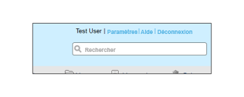
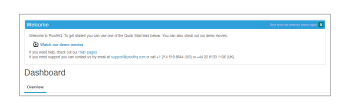

# Branding du site [!DNL Workfront Proof] - Avancé

>[!IMPORTANT]
>
>Cet article fait référence à la fonctionnalité du produit autonome [!DNL Workfront Proof]. Pour plus d’informations sur la relecture dans [!DNL Adobe Workfront], voir [Relecture](../../../review-and-approve-work/proofing/proofing.md).

Le branding avancé est disponible pour les formules Select et Premium et est inclus dans le tarif de la formule.

Pour plus d’informations sur le banding de base, qui comprend la page de connexion, les notifications par e-mail et les épreuves, voir [Branding du site  [!DNL Workfront Proof] ](../../../workfront-proof/wp-acct-admin/branding/brand-wp-site.md).

Les options de branding avancé comprennent la personnalisation des domaines suivants :

* Couleur de l’en-tête et du texte
* En-tête de l’application web
* Couleur de la barre de menu et du texte
* Zone d’accueil du tableau de bord et zone de démarrage rapide
* Texte du pied de page
* Icône Favicon
* Titre de la page
* Liens d’aide

Les sections suivantes décrivent plus en détail le branding avancé :

## Vue d’ensemble du branding avancé

Vous trouverez la section [!UICONTROL Configuration du branding] dans l’onglet de votre page [Paramètres du compte](https://support.workfront.com/hc/en-us/sections/115000912147-Account-Settings). Pour appliquer les modifications à votre compte, vérifiez que l’option Branding est définie sur [!UICONTROL Activé] (1).

Veuillez consulter la section ci-dessous pour obtenir des informations plus détaillées sur la configuration des options de branding avancé (2-14).

## Configuration du branding avancé

Vous pouvez appliquer le branding aux zones suivantes de [!DNL Workfront Proof] :

* [Application web](#web-application)
* [En-tête](#header)
* [Liens d’en-tête](#header-links)
* [Barre latérale](#sidebar)
* [Zone d’accueil](#welcome-box)
* [En-têtes de section](#section-headers)

### Application web {#web-application}

Vous avez le choix entre trois options de branding pour l’en-tête de l’application web (2) :

* Image de marque dans l’en-tête
* Votre nom de compte dans l’en-tête
* Si vous désactivez le branding, le logo [!DNL Workfront Proof] reste dans l’en-tête de l’application web.

Image de marque - Redimensionnée à une taille maximale de 550 x 90 px. Vous pouvez utiliser des fichiers JPG, GIF ou PNG, et les arrière-plans transparents sont pris en charge.

Nom du compte - Repris des détails de votre compte et affiché en caractères blancs. Le nom de votre compte peut comporter jusqu’à 60 caractères (y compris les espaces et les signes de ponctuation).

### En-tête {#header}

Dans ce champ (3), vous pouvez définir l’arrière-plan de l’en-tête et choisir une couleur unie ou une image d’arrière-plan.

Couleur - Ici, comme dans tous les autres champs de branding de la configuration du modèle de couleurs, vous pouvez soit saisir une valeur de couleur hexadécimale de votre choix, soit utiliser un sélecteur de couleur pratique (un clic sur le champ de texte ouvre la fenêtre contextuelle). La couleur d’arrière-plan par défaut de l’en-tête est #232d2e.

Image d’arrière-plan - Peut être combinée avec l’image de marque.

* Vous pouvez utiliser des fichiers JPG, GIF ou PNG. Pour les fichiers transparents, un arrière-plan blanc s’affiche.
* La hauteur de l’en-tête est de 96 px et l’image chargée ne sera pas redimensionnée pour l’option [!UICONTROL Pas de répétition].
* L’image d’arrière-plan est placée en haut à gauche.

### Liens d’en-tête {#header-links}

Dans ce champ (4), vous pouvez modifier la couleur du nom d’utilisateur ou d’utilisatrice et la couleur des liens dans le menu d’en-tête visible dans le coin supérieur droit de votre compte.

### Barre latérale {#sidebar}

Choisissez des couleurs pour la barre de menu (5) et la police de caractères du menu (6) pour personnaliser votre barre latérale.

>[!NOTE]
>
>Lorsque vous pointez la couleur, elle s’ajuste automatiquement en ajoutant une valeur Hex constante à la couleur de la barre de menu sélectionnée.

La couleur du bouton Nouvelle épreuve ne peut pas être personnalisée.

### Zone d’accueil {#welcome-box}

Dans ce champ (7), vous pouvez définir la couleur de la zone de bienvenue qui s’affiche sur la page du tableau de bord.

### En-têtes de section {#section-headers}

Ces champs vous permettent de personnaliser l’arrière-plan (8) et la couleur de la police (9) des en-têtes de section sur les pages [[!UICONTROL Paramètres du compte]](https://support.workfront.com/hc/en-us/sections/115000912147-Account-Settings).

**Pied de page**

Dans ce champ (10) de la configuration du branding, vous pouvez composer un pied de page qui sera affiché au bas de toutes les pages du compte. Vous pouvez utiliser l’éditeur WYSIWYG intégré ou simplement coller votre propre conception.

>[!NOTE]
>
>Vous ne pouvez pas modifier le code HTML dans l’éditeur de texte du pied de page, mais vous pouvez coller une conception copiée (y compris tous les liens et toutes les images).

**Favicon et titre de page**

Vous pouvez personnaliser la présentation de vos pages [!DNL Workfront Proof] dans les navigateurs en définissant votre propre image favicon (fichier .ICO) (11) et votre titre de page (12) - ceux-ci seront affichés dans les en-têtes des onglets/fenêtres des navigateurs pour toutes les pages du compte.

>[!NOTE]
>
>Votre favicon sera également affiché dans les en-têtes des fenêtres de visionneuse [!DNL Workfront Proof] pour toutes les épreuves créées sur votre compte.

**Liens d’aide**

Vous pouvez personnaliser vos propres liens d’aide afin de diriger vos utilisateurs et utilisatrices ainsi que vos réviseurs et réviseuses vers votre propre contenu. Pour activer cette fonctionnalité, définissez l’option [!UICONTROL Liens d’aide] (13) sur Activé et ajoutez vos liens dans les champs suivants (14). Vous pouvez configurer jusqu’à quatre liens et ils seront disponibles :

* dans le menu [!UICONTROL En-tête] sous le lien [!UICONTROL Aide] ;
  

* dans le panneau [!UICONTROL Aide] de la barre latérale [!UICONTROL Visionneuse] [!DNL Workfront Proof].
  

Moyennant un supplément, les clientes et clients des plans Entreprise ont également la possibilité de personnaliser entièrement les éléments suivants :

* Personnaliser entièrement les pages de destination (par exemple, les pages de connexion et de déconnexion, la page de mot de passe oublié)
* Personnaliser entièrement le domaine

Pour en savoir plus sur les options de branding supplémentaires, contactez-nous à l’adresse sales.team@workfront.com.

<!--
<h2 data-mc-conditions="QuicksilverOrClassic.Draft mode">Custom Domains</h2>
-->

<!--

Our Select and Premium plans include the option to purchase a fully-branded domain. This means that you can customize your URL as well as all links included in notification emails.&nbsp;

-->

<!--

For more information, please see&nbsp;<a href="../../../workfront-proof/wp-acct-admin/branding/configure-branded-domain-in-wp.md" class="MCXref xref">Configure a branded domain in Workfront Proof</a>.

-->

<!--
<h2 data-mc-conditions="QuicksilverOrClassic.Draft mode">Custom Page Branding</h2>
-->

<!--

Custom branding of the Workfront Proof pages is a paid service and by default&nbsp;includes full customization of the following:

-->

<!--
  <li data-mc-conditions="QuicksilverOrClassic.Draft mode"><a href="https://app.proofhq.com/login">Log in/landing page</a> </li>
  -->

<!--
  <li data-mc-conditions="QuicksilverOrClassic.Draft mode"><a href="https://app.proofhq.com/logout">Logout page</a> </li>
  -->

<!--
  <li data-mc-conditions="QuicksilverOrClassic.Draft mode"><a href="https://app.proofhq.com/login/password">Forgot password page</a> </li>
  -->

<!--
<h3 data-mc-conditions="QuicksilverOrClassic.Draft mode">Design Elements</h3>
-->

<!--

Please create your design&nbsp;in&nbsp;a .PSD file with all the elements placed in the separate layers - this will allow us to prepare the scalable pages for you.

-->

<!--

There are no particular restrictions on the .PSD files, and the look and layout of the pages is completely up to you. However please make sure that the key elements are included in your design:

-->

<!--

<strong>Login Page</strong>    

-->

<!--

<strong>Logout page</strong>    

-->

<!--

<strong>Forgot password</strong>    

-->

<!--

<strong>Inactivity alert</strong>    

-->

<!--

<strong>Invalid email address</strong>    

-->

<!--

<strong>Inactivity and incorrect email address</strong>    

-->

<!--
<note type="note">
&nbsp;The separate designs for the alerts are not required. If you'd like us to leave the default style of the messages, as shown on the screencasts above, please let us know. The team will match the colors with your design.
</note>
-->

<!--

If you'd like to have placeholder text in the text fields, please include this in your designs.

-->

<!--
<note type="note">
The wording of the alerts cannot be changed as these are the system messages.
</note>
-->

<!--

<strong>2. Fonts</strong> 

-->

<!--

Please make sure that the text is not rasterized but kept as the text layers, unless you want the particular elements to be displayed as images on your landing pages.

-->

<!--

If you use custom fonts in your design, please make sure to include the following font files: EOT + .TTF + OTF + SVG + WOFF for support in all browsers.

-->

<!--
<note type="note">
&nbsp; You need to hold an appropriate license, which allows implementing your selected fonts on the web pages.
</note>
-->

<!--

If you use the standard and widely available fonts, the font files are not required. Please see the following lists for reference:

-->

<!--
  <li data-mc-conditions="QuicksilverOrClassic.Draft mode"><a href="http://www.w3schools.com/cssref/css_websafe_fonts.asp">Websafe fonts listed in the standard Font families</a> </li>
  -->

<!--
  <li data-mc-conditions="QuicksilverOrClassic.Draft mode"><a href="https://www.google.com/fonts">Open Source Google fonts</a> </li>
  -->

<!--

<strong>3. Screen resolution</strong> 

-->

<!--

We support 1024x768 screen resolution (1366x768 for wide screens) and upwards. However, for the landing pages designs we do recommend using higher resolution for the better results on the various screens. The best practice would be to determine what screen resolution is the most common on your users' machines and prepare a slightly bigger design.

-->

<!--

<strong>4. Browsers compatibility</strong> 

-->

<!--

The newer browsers generally don't require any custom code to display the pages properly. However, if your users have the older browser versions installed on their machines some code adjustments may be needed.

-->

<!--

By default we do prepare the pages compatible with the following browsers:

-->

<!--
  <li data-mc-conditions="QuicksilverOrClassic.Draft mode">Internet Explorer 9+</li>
  -->

<!--
  <li data-mc-conditions="QuicksilverOrClassic.Draft mode">Safari 6.x+</li>
  -->

<!--
  <li data-mc-conditions="QuicksilverOrClassic.Draft mode">Chrome 22+ *</li>
  -->

<!--
  <li data-mc-conditions="QuicksilverOrClassic.Draft mode">Firefox 15+ *</li>
  -->

<!--

* Preferred browsers 

-->

<!--
<note type="note"> Workfront Proof will not design your custom pages, the PSD files must be supplied by you, but if you have any questions, please contact our Support team.
</note>
-->
