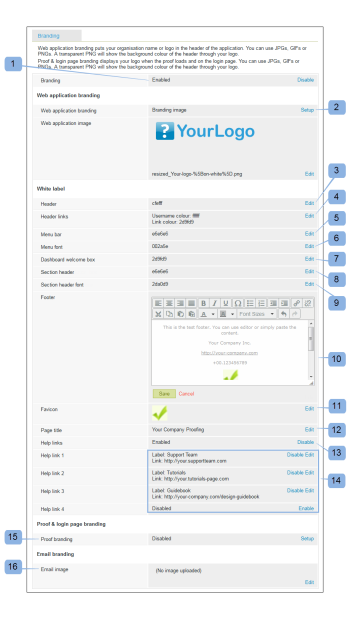
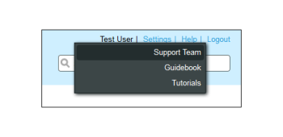

# Marque le site [!DNL Workfront Proof] - Avancé

>[!IMPORTANT]
>
>Cet article fait référence à la fonctionnalité du produit autonome [!DNL Workfront Proof]. Pour plus d&#39;informations sur la vérification à l&#39;intérieur de [!DNL Adobe Workfront], voir [Proofing](../../../review-and-approve-work/proofing/proofing.md).

La valorisation de marque avancée est disponible sur les plans Select et Premium et est incluse dans le coût du plan.

Pour plus d’informations sur l’identité graphique de base, qui inclut la page de connexion, les notifications électroniques et les bons à tirer, voir [Marque du [!DNL Workfront Proof] site](../../../workfront-proof/wp-acct-admin/branding/brand-wp-site.md).

Les options de branding avancées incluent la personnalisation des zones suivantes :

* Couleur d’en-tête et de texte
* En-tête de l&#39;application web
* Barre de menus et couleur du texte
* Zone de bienvenue du tableau de bord et zone de démarrage rapide
* Texte du pied de page
* Favicon
* Titre de la page
* Liens d’aide

Les sections suivantes décrivent plus en détail les marques avancées :

## Présentation de la marque avancée

Vous trouverez la section [!UICONTROL Configuration de la marque] dans l’onglet de votre page [Paramètres du compte](https://support.workfront.com/hc/en-us/sections/115000912147-Account-Settings). Pour appliquer les modifications à votre compte, assurez-vous que l’option Valorisation de marque est définie sur [!UICONTROL Activé] (1).

Consultez la section ci-dessous pour plus d’informations sur la configuration des options de branding avancées (2-14).

## Configuration avancée de la marque

Vous pouvez marquer les zones suivantes de [!DNL Workfront Proof] :

* [Application web](#web-application)
* [En-tête](#header)
* [Liens d’en-tête](#header-links)
* [Barre latérale](#sidebar)
* [Zone de bienvenue](#welcome-box)
* [En-têtes de section](#section-headers)

### Application web {#web-application}

Vous avez le choix entre trois options de branding pour l’en-tête de l’application web (2) :

* Image de marque dans l’en-tête
* Votre nom de compte dans l’en-tête
* Si vous désactivez l’identité graphique, le logo [!DNL Workfront Proof] restera dans l’en-tête de l’application web.

Image de marque : redimensionne la taille maximale à 550 x 90 pixels. Vous pouvez utiliser des GIFs, des  ou des PNG JPG les arrière-plans transparents sont pris en charge.

Nom du compte : extrait des détails du compte et affiché à l’aide d’une police blanche. Le nom de votre compte peut contenir jusqu’à 60 caractères (espaces et signes de ponctuation inclus).

### En-tête {#header}

Dans ce champ (3), vous pouvez définir l’arrière-plan de l’en-tête et choisir une couleur unie ou une image d’arrière-plan.

Couleur : ici, comme dans tous les autres champs de valorisation de marque de la configuration du modèle de couleurs, vous pouvez saisir une valeur de couleur hexadécimale de votre choix ou utiliser un sélecteur de couleurs pratique (lorsque vous cliquez sur le champ de texte pour ouvrir la fenêtre contextuelle). La couleur d’arrière-plan de l’en-tête par défaut est #232d2e.

Image d’arrière-plan : peut être combinée à l’image de marque.

* Vous pouvez utiliser des GIFs, des  ou des PNG JPG : pour les fichiers en transparence, une couleur d’arrière-plan blanche s’affiche.
* La hauteur de l’en-tête est de 96 px et l’image chargée ne sera pas redimensionnée pour l’option [!UICONTROL Aucune répétition] .
* L’image d’arrière-plan est positionnée en haut à gauche.

### Liens d’en-tête {#header-links}

Dans ce champ (4), vous pouvez modifier la couleur et la couleur du nom d’utilisateur des liens dans le menu En-tête visible dans le coin supérieur droit de votre compte.

### Barre latérale {#sidebar}

Sélectionnez les couleurs de la barre de menus (5) et de la police de menus (6) pour personnaliser la barre latérale.

>[!NOTE]
>
>La couleur de survol s’ajuste automatiquement en ajoutant une valeur hexadécimale constante à la couleur de la barre de menus sélectionnée.

La couleur du bouton Nouveau BAT ne peut pas être personnalisée.

### Zone de bienvenue {#welcome-box}

Dans ce champ (7), vous pouvez définir la couleur de la zone de bienvenue qui s’affiche sur la page Tableau de bord .

### En-têtes de section {#section-headers}

Ces champs vous permettent de personnaliser l’arrière-plan (8) et la couleur de police (9) des en-têtes de section sur les pages [[!UICONTROL Paramètres du compte]](https://support.workfront.com/hc/en-us/sections/115000912147-Account-Settings).

**Pied de page**

Dans ce champ (10) de la configuration Valorisation de marque, vous pouvez composer un pied de page qui s&#39;affichera au bas de toutes les pages du compte. Vous pouvez utiliser l’éditeur WYSIWYG intégré ou simplement coller votre propre conception.

>[!NOTE]
>
>Vous ne pouvez pas modifier l’HTML dans l’éditeur de texte de pied de page, mais vous pouvez coller une conception copiée (comprenant tous les liens et les images).

**Favicon et titre de la page**

Vous pouvez personnaliser la présentation de vos [!DNL Workfront Proof] pages dans les navigateurs en définissant vos propres images favicon (fichier .ICO) (11) et le titre de la page (12). Ceux-ci s’afficheront dans les en-têtes des onglets/fenêtres des navigateurs pour toutes les pages du compte.

>[!NOTE]
>
>Votre favicon s’affichera également dans les en-têtes des fenêtres de visionneuse [!DNL Workfront Proof] pour tous les bons à tirer créés sur votre compte.

**Liens d’aide**

Vous pouvez personnaliser vos propres liens d’aide pour diriger vos utilisateurs et réviseurs vers votre propre contenu. Pour activer cette fonction, définissez l’option [!UICONTROL Liens d’aide] (13) sur Activé et ajoutez vos liens dans les champs suivants (14). Vous pouvez configurer jusqu’à quatre liens qui seront disponibles :

* dans le menu [!UICONTROL En-tête] sous le lien [!UICONTROL Aide]
  

* dans le panneau [!UICONTROL Aide] de la barre latérale [!DNL Workfront Proof] [!UICONTROL Visionneuse]
  

Pour des frais supplémentaires, les clients qui bénéficient d’un abonnement Entreprise ont également la possibilité de personnaliser entièrement les éléments suivants :

* Personnalisez entièrement vos landing pages (par exemple, pages de connexion et de déconnexion, page de mot de passe oublié).
* Personnalisation complète de votre domaine

Contactez-nous à l’adresse sales.team@workfront.com pour en savoir plus sur les autres options de branding.

<!--
<h2 data-mc-conditions="QuicksilverOrClassic.Draft mode">Custom Domains</h2>
-->

<!--

Our Select and Premium plans include the option to purchase a fully-branded domain. This means that you can customize your URL as well as all links included in notification emails.&nbsp;

-->

<!--

For more information, please see&nbsp;<a href="../../../workfront-proof/wp-acct-admin/branding/configure-branded-domain-in-wp.md" class="MCXref xref">Configure a branded domain in Workfront Proof</a>.

-->

<!--
<h2 data-mc-conditions="QuicksilverOrClassic.Draft mode">Custom Page Branding</h2>
-->

<!--

Custom branding of the Workfront Proof pages is a paid service and by default&nbsp;includes full customization of the following:

-->

<!--
  <li data-mc-conditions="QuicksilverOrClassic.Draft mode"><a href="https://app.proofhq.com/login">Log in/landing page</a> </li>
  -->

<!--
  <li data-mc-conditions="QuicksilverOrClassic.Draft mode"><a href="https://app.proofhq.com/logout">Logout page</a> </li>
  -->

<!--
  <li data-mc-conditions="QuicksilverOrClassic.Draft mode"><a href="https://app.proofhq.com/login/password">Forgot password page</a> </li>
  -->

<!--
<h3 data-mc-conditions="QuicksilverOrClassic.Draft mode">Design Elements</h3>
-->

<!--

Please create your design&nbsp;in&nbsp;a .PSD file with all the elements placed in the separate layers - this will allow us to prepare the scalable pages for you.

-->

<!--

There are no particular restrictions on the .PSD files, and the look and layout of the pages is completely up to you. However please make sure that the key elements are included in your design:

-->

<!--

<strong>Login Page</strong>    

-->

<!--

<strong>Logout page</strong>    

-->

<!--

<strong>Forgot password</strong>    

-->

<!--

<strong>Inactivity alert</strong>    

-->

<!--

<strong>Invalid email address</strong>    

-->

<!--

<strong>Inactivity and incorrect email address</strong>    

-->

<!--
<note type="note">
&nbsp;The separate designs for the alerts are not required. If you'd like us to leave the default style of the messages, as shown on the screencasts above, please let us know. The team will match the colors with your design.
</note>
-->

<!--

If you'd like to have placeholder text in the text fields, please include this in your designs.

-->

<!--
<note type="note">
The wording of the alerts cannot be changed as these are the system messages.
</note>
-->

<!--

<strong>2. Fonts</strong> 

-->

<!--

Please make sure that the text is not rasterized but kept as the text layers, unless you want the particular elements to be displayed as images on your landing pages.

-->

<!--

If you use custom fonts in your design, please make sure to include the following font files: EOT + .TTF + OTF + SVG + WOFF for support in all browsers.

-->

<!--
<note type="note">
&nbsp; You need to hold an appropriate license, which allows implementing your selected fonts on the web pages.
</note>
-->

<!--

If you use the standard and widely available fonts, the font files are not required. Please see the following lists for reference:

-->

<!--
  <li data-mc-conditions="QuicksilverOrClassic.Draft mode"><a href="http://www.w3schools.com/cssref/css_websafe_fonts.asp">Websafe fonts listed in the standard Font families</a> </li>
  -->

<!--
  <li data-mc-conditions="QuicksilverOrClassic.Draft mode"><a href="https://www.google.com/fonts">Open Source Google fonts</a> </li>
  -->

<!--

<strong>3. Screen resolution</strong> 

-->

<!--

We support 1024x768 screen resolution (1366x768 for wide screens) and upwards. However, for the landing pages designs we do recommend using higher resolution for the better results on the various screens. The best practice would be to determine what screen resolution is the most common on your users' machines and prepare a slightly bigger design.

-->

<!--

<strong>4. Browsers compatibility</strong> 

-->

<!--

The newer browsers generally don't require any custom code to display the pages properly. However, if your users have the older browser versions installed on their machines some code adjustments may be needed.

-->

<!--

By default we do prepare the pages compatible with the following browsers:

-->

<!--
  <li data-mc-conditions="QuicksilverOrClassic.Draft mode">Internet Explorer 9+</li>
  -->

<!--
  <li data-mc-conditions="QuicksilverOrClassic.Draft mode">Safari 6.x+</li>
  -->

<!--
  <li data-mc-conditions="QuicksilverOrClassic.Draft mode">Chrome 22+ *</li>
  -->

<!--
  <li data-mc-conditions="QuicksilverOrClassic.Draft mode">Firefox 15+ *</li>
  -->

<!--

* Preferred browsers 

-->

<!--
<note type="note"> Workfront Proof will not design your custom pages, the PSD files must be supplied by you, but if you have any questions, please contact our Support team.
</note>
-->
