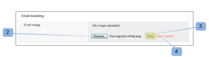

# Personnaliser le branding du site [!DNL Workfront Proof]

>[!IMPORTANT]
>
>Cet article fait référence aux fonctionnalités du produit autonome [!DNL Workfront] Proof. Pour plus d’informations sur la relecture dans [!DNL Adobe Workfront], voir [Relecture](../../../review-and-approve-work/proofing/proofing.md).

En tant qu’administrateur ou administratrice de [!DNL Workfront Proof], vous pouvez personnaliser votre compte [!DNL Workfront Proof] pour vous offrir, ainsi qu’à vos utilisateurs et utilisatrices, une expérience plus personnalisée.

Le branding de base du compte est disponible avec toutes les formules, sans frais supplémentaires.

Pour plus d’informations sur le branding avancé, qui comprend le branding de l’en-tête, de la barre de menu, du tableau de bord, etc., consultez [Personnaliser le branding du site  [!DNL Workfront Proof]  - avancé](../../../workfront-proof/wp-acct-admin/branding/brand-wp-site-advanced.md). Le branding avancé n’est disponible que pour les formules Select et Premium.

Les sections suivantes expliquent comment personnaliser le branding de différents aspects du site [!DNL Workfront] Proof :

## Activer le branding sur la page de connexion [!DNL Workfront Proof]

Pour activer le branding sur votre compte, procédez comme suit :

1. Connectez-vous à [!DNL Workfront Proof] en tant qu’administrateur ou administratrice de [!DNL Workfront Proof].
1. Cliquez sur **[!UICONTROL Paramètres du compte]** dans le coin supérieur droit de l’interface [!DNL Workfront Proof].

   Pour plus d’informations sur les différents paramètres de compte que vous pouvez configurer, consultez [Paramètres du compte.](https://support.workfront.com/hc/en-us/sections/115000912147-Account-Settings)

1. Cliquez sur l’onglet **[!UICONTROL Paramètres]**.
1. Dans la section **[!UICONTROL Branding]**, cliquez sur **[!UICONTROL Activer]**. (1)

   

   L’image de branding apparaît maintenant sur votre page de connexion.

   >[!NOTE]
   >
   >L’image de branding n’apparaît pas sur votre page de connexion si vous accédez à [!DNL Workfront] Proof via l’URL principale de connexion. Par exemple, `https://www.proofhq.com/login`. Elle ne s’affiche que si vous accédez à la page de connexion via votre sous-domaine personnalisé ou votre domaine entièrement personnalisé. Pour accéder à votre page de connexion personnalisée, il vous suffit de saisir l’URL de votre compte dans votre navigateur. Par exemple, `http://<yoursubdomain>.proofhq.com.` <!--For more information about fully branded domains, see "Fully Branded Domains" in the article [Configure a branded domain in [!DNL Workfront Proof]](../../../workfront-proof/wp-acct-admin/branding/configure-branded-domain-in-wp.md).-->

   

## Activer le branding des épreuves

Pour ajouter votre propre image de branding à la page de [!UICONTROL chargement de l’épreuve] de chaque épreuve créée dans votre compte, procédez comme suit :

1. Connectez-vous à [!DNL Workfront Proof] en tant qu’administrateur ou administratrice de [!DNL Workfront Proof].
1. Cliquez sur **[!UICONTROL Paramètres du compte]** dans le coin supérieur droit de l’interface [!DNL Workfront Proof].

   Pour plus d’informations sur les différents paramètres de compte que vous pouvez configurer, consultez [Paramètres du compte.](https://support.workfront.com/hc/en-us/sections/115000912147-Account-Settings)

1. Cliquez sur l’onglet **[!UICONTROL Paramètres]**.
1. Dans la section **[!UICONTROL Branding]**, cliquez sur **[!UICONTROL Configuration]** à côté de **[!UICONTROL Branding des épreuves]**. (1)

   

1. Dans le menu déroulant, sélectionnez **[!UICONTROL Image de branding]**.
Si vous sélectionnez **[!UICONTROL Désactiver]**, le logo [!DNL Workfront Proof] apparaît sur la page de chargement de l’épreuve.

1. Cliquer sur **[!UICONTROL Enregistrer]**. (3)

   

1. Cliquez sur **[!UICONTROL Modifier]** pour sélectionner l’image de branding (4).

   Vous pouvez utiliser des JPG, des GIF ou des PNG. La transparence est prise en charge. La taille d’image recommandée est de 150 x 300 px. Votre image sur les pages de connexion et de déconnexion sera redimensionnée à ces dimensions.

   

1. Sélectionnez l’image que vous souhaitez charger. (5)
1. Cliquer sur **[!UICONTROL Enregistrer]**.

   Votre image de branding apparaît désormais sur la page de chargement de chaque épreuve créée dans votre compte.

   

## Personnaliser le branding des notifications par e-mail

Vous pouvez configurer votre image de branding pour qu’elle soit incluse dans les notifications par e-mail envoyées aux personnes réviseuses. Cette image est redimensionnée à la taille maximale de 90 x 550 px.

Pour configurer l’image de branding des e-mails, procédez comme suit :

1. Connectez-vous à [!DNL Workfront Proof] en tant qu’administrateur ou administratrice [!DNL Workfront Proof].
1. Cliquez sur **[!UICONTROL Paramètres du compte]** dans le coin supérieur droit de l’interface [!DNL Workfront Proof].

   Pour plus d’informations sur les différents paramètres de compte que vous pouvez configurer, consultez [Paramètres du compte.](https://support.workfront.com/hc/en-us/sections/115000912147-Account-Settings)

1. Sélectionnez l’onglet **[!UICONTROL Paramètres]**.
1. Dans la section **[!UICONTROL Branding]**, cliquez sur **[!UICONTROL Modifier]** en regard de l’image de l’application E-mail (1).
   

1. Sélectionnez l’image que vous souhaitez utiliser pour le branding des e-mails (2)

   Si un branding des e-mails est déjà configuré et que vous souhaitez le désactiver, cliquez sur **[!UICONTROL Effacer]**. (4)

   

1. Cliquer sur **[!UICONTROL Enregistrer]**.

   L’image apparaît désormais sur tous les e-mails de notification d’épreuve. (3)

   

<!--
<h2 data-mc-conditions="QuicksilverOrClassic.Draft mode">Custom Sub-Domains</h2>
-->

<!--

You can add your brand name to your Workfront Proof account URL. For example, your URL might look like this:

-->

<!--

<strong>http://yoursubdomain.proofhq.com</strong> 

-->

<!--

This customization is also included in all your proof links, as well as in the 'From' email address for your proof notifications.

-->

<!--

For more information on how to set up a branded sub-domain, see <a href="../../../workfront-proof/wp-acct-admin/branding/configure-branded-domain-in-wp.md" class="MCXref xref">Configure a branded domain in Workfront Proof</a>

-->

## Supprimer des boutons et des liens via l’API

Si vous créez une épreuve via l’API [!DNL Workfront Proof], vous pouvez supprimer les boutons et les liens, et créer vos propres liens personnalisés.

Voir API [[!DNL Workfront Proof] ](https://api.proofhq.com/) pour plus d’informations.
