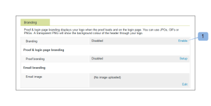
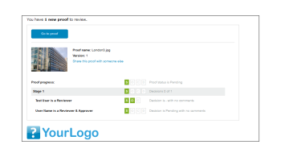

# Marque le site [!DNL Workfront Proof]

>[!IMPORTANT]
>
>Cet article fait référence à la fonctionnalité du produit autonome [!DNL Workfront] BAT. Pour plus d&#39;informations sur la vérification à l&#39;intérieur de [!DNL Adobe Workfront], voir [Proofing](../../../review-and-approve-work/proofing/proofing.md).

En tant qu&#39;administrateur [!DNL Workfront Proof], vous pouvez personnaliser votre compte [!DNL Workfront Proof] pour vous offrir, ainsi qu&#39;à vos utilisateurs, une expérience plus personnalisée.

L’identité graphique de base du compte est disponible sur tous les plans sans frais supplémentaires.

Pour plus d’informations sur l’identité graphique avancée, qui inclut l’identité graphique de l’en-tête, de la barre de menus, du tableau de bord, etc., voir [Marque du  [!DNL Workfront Proof] site - avancé](../../../workfront-proof/wp-acct-admin/branding/brand-wp-site-advanced.md). La marque avancée est disponible uniquement sur les formules Select et Premium .

Consultez les sections suivantes pour plus d’informations sur la manière de marquer divers aspects du site [!DNL Workfront] Proof :

## Activation de la valorisation de la marque sur la page de connexion [!DNL Workfront Proof]

Pour activer l’identité graphique de votre compte :

1. Connectez-vous à [!DNL Workfront Proof] en tant qu’administrateur [!DNL Workfront Proof].
1. Cliquez sur **[!UICONTROL Paramètres du compte]** dans le coin supérieur droit de l’interface [!DNL Workfront Proof].

   Pour plus d’informations sur les différents paramètres de compte que vous pouvez configurer, voir [Paramètres du compte.](https://support.workfront.com/hc/en-us/sections/115000912147-Account-Settings)

1. Cliquez sur l’onglet **[!UICONTROL Paramètres]** .
1. Dans la section **[!UICONTROL Marque]**, cliquez sur **[!UICONTROL Activer]**. (1)

   

   L’image de marque apparaît désormais sur votre page de connexion.

   >[!NOTE]
   >
   >L&#39;image de marque n&#39;apparaît pas sur votre page de connexion si vous y accédez via l&#39;URL de connexion principale [!DNL Workfront] du Bon à tirer. Par exemple, `https://www.proofhq.com/login`. Il s’affiche uniquement si vous accédez à la page de connexion par l’intermédiaire de votre sous-domaine personnalisé ou de votre domaine entièrement de marque. Pour accéder à votre page de connexion personnalisée, saisissez simplement l’URL de votre compte dans votre navigateur. Par exemple, `http://<yoursubdomain>.proofhq.com.` <!--For more information about fully branded domains, see "Fully Branded Domains" in the article [Configure a branded domain in [!DNL Workfront Proof]](../../../workfront-proof/wp-acct-admin/branding/configure-branded-domain-in-wp.md).-->

   

## Activation de la valorisation de marque sur les bons à tirer

Pour ajouter votre propre image de marque à la page [!UICONTROL BAT loading] de chaque BAT créé dans votre compte :

1. Connectez-vous à [!DNL Workfront Proof] en tant qu’administrateur [!DNL Workfront Proof].
1. Cliquez sur **[!UICONTROL Paramètres du compte]** dans le coin supérieur droit de l’interface [!DNL Workfront Proof].

   Pour plus d’informations sur les différents paramètres de compte que vous pouvez configurer, voir [Paramètres du compte.](https://support.workfront.com/hc/en-us/sections/115000912147-Account-Settings)

1. Cliquez sur l’onglet **[!UICONTROL Paramètres]** .
1. Dans la section **[!UICONTROL Marque]**, cliquez sur **[!UICONTROL Configuration]** en regard de **[!UICONTROL Marque de BAT]**. (1)

   

1. Dans le menu déroulant, sélectionnez **[!UICONTROL Image de marque]**.
Si vous sélectionnez **[!UICONTROL Désactiver]**, le logo [!DNL Workfront Proof] apparaît sur la page de chargement du BAT.

1. Cliquer sur **[!UICONTROL Enregistrer]**. (3)

   

1. Cliquez sur **[!UICONTROL Modifier]** pour sélectionner l’image de marque (4).

   Vous pouvez utiliser des GIFs, des  ou des fichiers PNG JPG. La transparence est prise en charge. La taille d’image recommandée est de 150 x 300 pixels. Votre image sur les pages de connexion et de déconnexion sera redimensionnée selon ces dimensions.

   

1. Sélectionnez l’image à télécharger. (5)
1. Cliquer sur **[!UICONTROL Enregistrer]**.

   Votre image de marque s’affiche désormais sur la page de chargement du BAT de chaque BAT créé dans votre compte.

   

## Notifications par e-mail de marque

Vous pouvez configurer votre image de marque pour qu’elle soit incluse dans les notifications électroniques envoyées aux réviseurs. Cette image est redimensionnée à la taille maximale de 90 x 550 pixels.

Pour configurer la valorisation de marque des emails :

1. Connectez-vous à [!DNL Workfront Proof] en tant qu’administrateur [!DNL Workfront Proof].
1. Cliquez sur **[!UICONTROL Paramètres du compte]** dans le coin supérieur droit de l’interface [!DNL Workfront Proof].

   Pour plus d’informations sur les différents paramètres de compte que vous pouvez configurer, voir [Paramètres du compte.](https://support.workfront.com/hc/en-us/sections/115000912147-Account-Settings)

1. Cliquez sur l’onglet **[!UICONTROL Paramètres]** .
1. Dans la section **[!UICONTROL Marque]** , cliquez sur **[!UICONTROL Modifier]** en regard de l’image de l’application de messagerie (1).
   

1. Sélectionnez l’image à utiliser pour personnaliser les emails. (2)

   Si une marque d&#39;email est déjà configurée et que vous souhaitez la désactiver, cliquez sur **[!UICONTROL Effacer]**. (4)

   

1. Cliquer sur **[!UICONTROL Enregistrer]**.

   L’image apparaît désormais sur tous les emails de notification de BAT. (3)

   

<!--
<h2 data-mc-conditions="QuicksilverOrClassic.Draft mode">Custom Sub-Domains</h2>
-->

<!--

You can add your brand name to your Workfront Proof account URL. For example, your URL might look like this:

-->

<!--

<strong>http://yoursubdomain.proofhq.com</strong> 

-->

<!--

This customization is also included in all your proof links, as well as in the 'From' email address for your proof notifications.

-->

<!--

For more information on how to set up a branded sub-domain, see <a href="../../../workfront-proof/wp-acct-admin/branding/configure-branded-domain-in-wp.md" class="MCXref xref">Configure a branded domain in Workfront Proof</a>

-->

## Suppression des boutons et des liens via l’API

Si vous créez un BAT via l’API [!DNL Workfront Proof], vous pouvez supprimer des boutons et des liens et créer vos propres liens personnalisés.

Voir [[!DNL Workfront Proof] API](https://api.proofhq.com/) pour plus d’informations.
