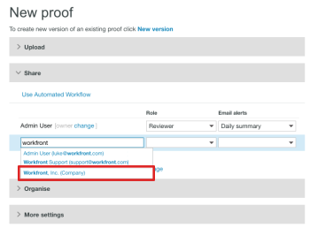

# Partage d’éléments avec un partenaire dans [!DNL Workfront Proof]

>[!IMPORTANT]
>
>Cet article fait référence à la fonctionnalité du produit autonome [!DNL Workfront Proof]. Pour plus d&#39;informations sur la vérification à l&#39;intérieur de [!DNL Adobe Workfront], voir [Proofing](../../../review-and-approve-work/proofing/proofing.md).

Si vous avez une relation [!DNL Workfront Proof] de partenaire avec une autre organisation (un client ou un autre service de votre entreprise, par exemple), vous pouvez partager des bons à tirer, des fichiers, des dossiers et des coordonnées avec le partenaire. Pour plus d’informations sur les relations de partenaire, voir [Gestion d’une relation de partenaire entre des comptes Workfront Proof](../../../workfront-proof/wp-acct-admin/partner-accounts/manage-partner-relationship-between-wp-accts.md).

## Partage d’éléments avec un partenaire

Tenez compte des points suivants lors du partage d’éléments avec un partenaire :

* Vous pouvez choisir un utilisateur d’un compte partenaire comme propriétaire d’un BAT uniquement s’il s’agit d’un nouveau BAT que vous créez. Vous ne pouvez pas le faire pour un BAT existant ou une nouvelle version d’un BAT.
* Lorsque vous partagez un article avec un partenaire, vous transmettez les droits d’édition du BAT aux responsables et administrateurs du compte du partenaire. Les superviseurs et administrateurs du compte dans lequel le BAT a été créé ne disposent plus de droits d&#39;édition sur le BAT (y compris le créateur du BAT). Pour plus d’informations sur les autorisations dans [!DNL Workfront] BAT, voir [Profils d’autorisations de BAT dans [!DNL Workfront] BAT](../../../workfront-proof/wp-acct-admin/account-settings/proof-perm-profiles-in-wp.md).
* Le BAT est stocké dans le compte où le BAT est détenu (et non dans le compte où il a été créé).
* L&#39;identité graphique du BAT provient du compte sur lequel le BAT est détenu (et non du compte sur lequel le BAT a été créé).

## Partage d’articles avec un partenaire

Une fois que vous avez accepté une relation avec un partenaire, vous pouvez facilement partager des éléments, tels que des dossiers, des fichiers et des bons à tirer avec lui.

1. Commencez à partager un BAT ou un fichier.\
   Pour plus d’informations sur le partage, voir [Partage d’un bon à tirer dans [!DNL Workfront Proof]](../../../workfront-proof/wp-work-proofsfiles/share-proofs-and-files/share-proof.md) [Partage de fichiers dans [!DNL Workfront Proof]](../../../workfront-proof/wp-work-proofsfiles/share-proofs-and-files/share-files.md) et [Partage de dossiers dans [!DNL Workfront Proof]](../../../workfront-proof/wp-work-proofsfiles/organize-your-work/share-folders.md).

1. Dans la section **[!UICONTROL Partager]** de la page [!UICONTROL Nouveau Bon à tirer] ou [!UICONTROL Nouveau fichier], le nom de votre partenaire apparaît lorsque vous commencez à saisir le nom dans le champ de saisie automatique, comme si vous partagiez avec un autre utilisateur du système.\
   

## Comment désigner un utilisateur dans un compte partenaire comme propriétaire du BAT

Si vous avez configuré des relations de partenaire avec d’autres comptes [!DNL Workfront Proof], vous pouvez sélectionner un utilisateur d’un compte de partenaire pour être le propriétaire de votre BAT.

>[!NOTE]
>
>Vous ne pouvez sélectionner un utilisateur dans un compte Partner que si les conditions suivantes sont remplies :
>
>* Il n’existe aucun champ personnalisé
>* Aucun dossier n’a été sélectionné
>* Aucune balise n’a été appliquée
>

Pour faire en sorte qu&#39;un utilisateur d&#39;un compte partenaire soit propriétaire d&#39;un BAT :

1. Sur la page [!UICONTROL New Proof] , cliquez sur le lien **[!DNL Change]** . (1)\
   

1. Sélectionnez un utilisateur d&#39;un compte Partner comme propriétaire du BAT. (2)\
   
