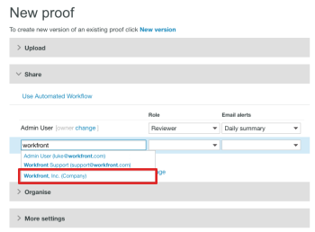
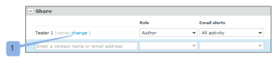
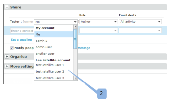

# Partager des éléments dans le cadre d’un partenariat dans [!DNL Workfront Proof]

>[!IMPORTANT]
>
>Cet article fait référence aux fonctionnalités du produit autonome [!DNL Workfront Proof]. Pour plus d’informations sur la relecture dans [!DNL Adobe Workfront], voir [Relecture](../../../review-and-approve-work/proofing/proofing.md).

Si vous disposez d’un partenariat [!DNL Workfront Proof] avec une autre organisation (par exemple un client ou une cliente ou un autre service de votre entreprise), vous pouvez partager des épreuves, des fichiers, des dossiers et des coordonnées dans le cadre de ce partenariat. Pour plus d’informations sur les relations de partenariat, voir la section [Gérer une relation de partenariat entre des comptes Workfront Proof](../../../workfront-proof/wp-acct-admin/partner-accounts/manage-partner-relationship-between-wp-accts.md).

## À propos du partage d’éléments dans le cadre d’un partenariat

Tenez compte des éléments suivants lorsque vous partagez des éléments dans le cadre d’un partenariat :

* Vous pouvez choisir une personne d’un compte partenaire comme propriétaire d’une épreuve, mais uniquement s’il s’agit d’une nouvelle épreuve que vous créez. Vous ne pouvez pas procéder ainsi pour une épreuve existante ou pour une nouvelle version d’une épreuve.
* Lorsque vous partagez un élément dans le cadre d’un partenariat, vous transférez les droits de modification de l’épreuve aux équipes de supervision et d’administration du compte partenaire. Les équipes de supervision et d’administration du compte dans lequel l’épreuve a été créée ne disposent plus de droits de modification sur l’épreuve (cela concerne également la personne qui l’a créée). Pour plus d’informations sur les autorisations dans [!DNL Workfront] Proof, voir la section [Profils d’autorisations sur les épreuves dans  [!DNL Workfront]  Proof](../../../workfront-proof/wp-acct-admin/account-settings/proof-perm-profiles-in-wp.md).
* L’épreuve est stockée dans le compte où elle est détenue (et non dans le compte où elle a été créée).
* L’image de marque de l’épreuve provient du compte où l’épreuve est détenue (et non du compte où elle a été créée).

## Partager des éléments dans le cadre d’un partenariat

Lorsque vous disposez d’une relation acceptée dans le cadre d’un partenariat, vous pouvez facilement partager des éléments tels que des dossiers, des fichiers et des épreuves.

1. Commencez à partager une épreuve ou un fichier.\
   Pour plus d’informations sur le partage, voir les sections [Partager une épreuve dans  [!DNL Workfront Proof]](../../../workfront-proof/wp-work-proofsfiles/share-proofs-and-files/share-proof.md), [Partager des fichiers dans  [!DNL Workfront Proof]](../../../workfront-proof/wp-work-proofsfiles/share-proofs-and-files/share-files.md) et [Partager des dossiers dans  [!DNL Workfront Proof]](../../../workfront-proof/wp-work-proofsfiles/organize-your-work/share-folders.md).

1. Dans la section **[!UICONTROL Partager]** de la page [!UICONTROL Nouvelle épreuve] ou [!UICONTROL Nouveau fichier], le nom de votre partenaire apparaît lorsque vous commencez à saisir le nom dans le champ à remplissage automatique, comme si vous effectuiez un partage avec une autre personne du système.\
   

## Faire d’une personne dans un compte partenaire la personne propriétaire de l’épreuve

Si vous avez établi des relations de partenariat avec d’autres comptes [!DNL Workfront Proof], vous pouvez sélectionner une personne d’un compte partenaire qui deviendra la personne propriétaire de votre épreuve.

>[!NOTE]
>
>Vous ne pouvez sélectionner une personne d’un compte partenaire que si les conditions suivantes sont remplies :
>
>* Il n’existe pas de champs personnalisés.
>* Aucun dossier n’a été sélectionné.
>* Aucune balise n’a été appliquée.
>

Pour faire d’une personne d’un compte partenaire la personne propriétaire d’une épreuve, procédez comme suit :

1. Sur la page [!UICONTROL Nouvelle épreuve], cliquez sur le lien **[!DNL Change]**. (1)\
   

1. Choisissez une personne d’un compte partenaire pour en faire la personne propriétaire de l’épreuve. (2)\
   
