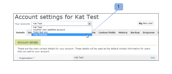

# Gestion d’un compte satellite dans [!DNL Workfront Proof]

>[!IMPORTANT]
>
>Cet article fait référence aux fonctionnalités du produit autonome. [!DNL Workfront Proof]. Pour plus d’informations sur la vérification à l’intérieur [!DNL Adobe Workfront], voir [Vérification](../../../review-and-approve-work/proofing/proofing.md).

Comme [!DNL Workfront Proof] administrateur, vous pouvez gérer un compte satellite configuré sur le compte de votre entreprise.

## Mise à jour des informations de facturation

Pour afficher et gérer les détails de facturation de votre compte satellite :

1. Accédez au [!UICONTROL Facturation] page.
1. Ouvrez le menu déroulant en haut de la page (1), puis choisissez le compte satellite approprié. (2)

   Pour plus d’informations, voir [Le [!DNL Workfront Proof] [!UICONTROL Facturation] Page](../../../workfront-proof/wp-billingsettings/manage-your-billing/wp-billing-page.md).

   

## Mise à jour des informations du compte

Pour afficher et gérer les paramètres du compte Satellite :

1. Accédez à [!UICONTROL Paramètres du compte] en haut de la page.
1. Cliquez sur le bouton **[!UICONTROL Vos comptes]** dans le menu déroulant, puis sélectionnez le compte satellite approprié. (1)
1. Cliquez sur l’onglet approprié pour gérer le paramètre Compte du compte Satellite.

