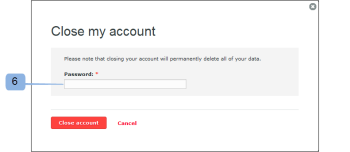

# Fermer votre compte [!DNL Workfront Proof]

>[!IMPORTANT]
>
>Cet article fait référence à la fonctionnalité du produit autonome [!DNL Workfront Proof]. Pour plus d’informations sur la relecture dans [!DNL Adobe Workfront], voir [Relecture](../../../review-and-approve-work/proofing/proofing.md).

Une fois les étapes de cette section effectuées, votre compte sera fermé immédiatement. Toutes les données de votre compte seront supprimées et ne pourront pas être restaurées.

Nous essayons continuellement d’améliorer notre produit. Si vous souhaitez fermer votre compte, nous vous serions reconnaissants de bien vouloir prendre quelques minutes et nous faire savoir comment nous pouvons nous améliorer.

Vous pouvez nous contacter via [!DNL support@proofhq.com] avec vos commentaires ; tout retour d’expérience est le bienvenu.

1. Ouvrez la page [!UICONTROL Facturation] dans votre compte. Pour ce faire, ouvrez le menu [!UICONTROL Paramètres] et sélectionnez **[!UICONTROL Facturation]** (1).

   Pour plus d’informations sur la page de facturation, consultez la section [Page de facturation de  [!DNL Workfront]  Proof](../../../workfront-proof/wp-billingsettings/manage-your-billing/wp-billing-page.md).

   

1. Cliquez sur le bouton **[!UICONTROL Fermer le compte]** (3).

   

1. Sélectionnez le motif de fermeture du compte. (4)
1. Confirmez votre décision en cliquant sur **[!UICONTROL Enregistrer]**. (5)

   

1. Saisissez votre mot de passe pour fermer votre compte. (6)

   
