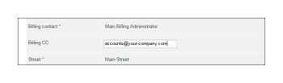
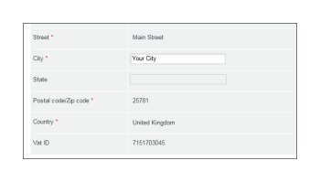
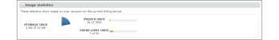

# Le [!DNL Workfront Proof] Page de facturation

>[!IMPORTANT]
>
>Cet article fait référence aux fonctionnalités du produit autonome. [!DNL Workfront Proof]. Pour plus d’informations sur la vérification à l’intérieur [!DNL Adobe Workfront], voir [Vérification](../../../review-and-approve-work/proofing/proofing.md).

## Page de facturation

Pour accéder au [!UICONTROL Facturation] , ouvrez la page **[!UICONTROL Paramètres]** en haut à droite de l’écran, sélectionnez **[!UICONTROL Facturation]** dans le menu déroulant.

Le [!UICONTROL Facturation] La page contient les éléments suivants :

* Nom du compte (1)
* Liste des comptes (par exemple, si vous disposez de comptes satellites)(2)
* Changement de plan (3)
* Modifier les détails du paiement (4)
* Nouveau compte satellite (5)
* Fermer le compte (6)
* Informations sur le plan actuel (7)
* Contact et adresse de facturation (8)
* Statistiques d’utilisation (9)
* Historique de facturation (10)
* Activité Facturation (11)

   

## [!UICONTROL Formule actuelle]

Cette section (7) présente les détails de votre plan actuel, notamment :

* Nom du plan
* Mode de paiement actuel
* Dates de début et de fin du plan actuel
* Type de plan suivant
* Méthode de paiement du prochain plan

   Pour plus d’informations, voir [Choix de votre mode de paiement dans [!DNL Workfront Proof]](../../../workfront-proof/wp-billingsettings/manage-your-billing/choose-payment-method-in-wp.md).

## [!UICONTROL Contact et adresse de facturation]

Cette section (8) présente les coordonnées principales de contact et d’adresse de facturation de votre compte.

Le contact de facturation ne peut être sélectionné que parmi les utilisateurs configurés en tant qu’administrateurs de facturation sur votre compte. Sur les comptes satellites, seuls les administrateurs de facturation du compte principal peuvent être définis dans ce champ.

>[!NOTE]
>
> Votre compte peut comporter plusieurs administrateurs de facturation, mais un seul d’entre eux peut être sélectionné dans la variable [!UICONTROL Contact de facturation] reçoit toutes les notifications de facturation et les alertes d’utilisation du compte.

Cela inclut les emails de notification suivants :

* Utilisation des BAT
* Facturations
* Rétrogradation
* Alerte de suspension de paiement en retard/compte
* Échec de la carte de crédit

   

Le [!UICONTROL Facturation CC] vous permet également d’ajouter une adresse électronique à copier sur tous les emails liés à la facturation. Cliquez sur le champ pour activer l’édition d’inclusion et saisissez l’adresse électronique de votre choix (il peut également s’agir de l’adresse électronique d’un utilisateur existant).

## [!UICONTROL Adresse de facturation]

Cette section utilise les modifications intégrées. Il suffit donc de cliquer sur les champs pour saisir/modifier le texte.

>[!NOTE]
>
> Nous incluons cette adresse dans vos factures d&#39;abonnement afin de vous assurer que ces données sont toujours à jour.

## [!UICONTROL Statistiques d’utilisation]

Cette section présente les statistiques d’utilisation de votre compte au cours de la période de facturation actuelle, notamment :

* Stockage utilisé
* Bons à tirer utilisés
* Limite d’utilisateurs utilisée

### [!UICONTROL Avertissements d’utilisation]

Le [[!UICONTROL Profils d’autorisations de BAT] in [!DNL Workfront] Bon à tirer](../../../workfront-proof/wp-acct-admin/account-settings/proof-perm-profiles-in-wp.md) défini comme Contact de facturation (1) sur votre compte sera averti par e-mail lorsque votre compte arrivera à :

* 75 %, puis 98 % de votre capacité de stockage
* 75 % puis 100 % de votre limite de BAT

Une fois les BAT ou les limites de stockage atteintes, les alertes s’affichent également en haut de la page [!UICONTROL Facturation] page :

* Pour la limite de BAT atteinte

   

* Pour la limite de stockage atteinte

>[!NOTE]
>
>Le nombre de BAT est utilisé lorsque des BAT sont créés dans votre compte et ne peuvent pas être restaurés en supprimant les BAT.

L&#39;espace de stockage peut être libéré en supprimant les BAT et les fichiers et en vidant le [!UICONTROL Corbeille] par la suite.

N’oubliez pas que si vous avez besoin d’autres BAT, stockage ou utilisateurs, vous pouvez mettre à niveau votre compte à tout moment ; et cela prend effet immédiatement.

## [!UICONTROL Historique de facturation]

Cette section présente l&#39;activité pour toutes les périodes de facturation récentes. Vous pouvez également télécharger vos factures depuis cette section.

Pour plus d’informations, voir [Téléchargement de votre [!DNL Workfront Proof] Facture](../../../workfront-proof/wp-billingsettings/manage-your-billing/download-wp-invoice.md).&quot;

## [!UICONTROL Activité de facturation]

Cette section présente les modifications récentes apportées à la configuration de la facturation, par exemple les abonnements, les mises à niveau, les mises à niveau, les mises à niveau et les renouvellements de votre [!DNL Workfront Proof] Planifiez.

Si vous définissez votre formule d’abonnement sur une limite d’utilisateurs inférieure (1), les utilisateurs qui dépassent la nouvelle limite seront automatiquement désactivés au début du nouveau forfait. Cette activité sera également capturée dans vos logs de compte (2).

