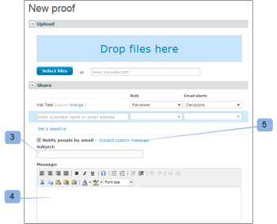

# E-mail Nouvelle épreuve

>[!IMPORTANT]
>
>Cet article fait référence aux fonctionnalités du produit autonome [!DNL Workfront Proof]. Pour plus d’informations sur la relecture à l’intérieur d’[!DNL Adobe Workfront], voir [Relecture](../../../review-and-approve-work/proofing/proofing.md).

<!--

Make this article work better for PiW.

-->

Lorsque vous créez une épreuve ou la version d’une épreuve, que vous ajoutez de nouvelles personnes à une épreuve ou que vous ajoutez un workflow à une épreuve, vous pouvez décider d’envoyer un e-mail aux personnes réviseuses, comme expliqué dans ces articles :

* [Créer une épreuve avancée avec un workflow automatisé](../../../review-and-approve-work/proofing/creating-proofs-within-workfront/create-automated-proof-workflow.md)
* [Générer des preuves dans  [!DNL Workfront Proof]](../../../workfront-proof/wp-work-proofsfiles/create-proofs-and-files/generate-proofs.md)

L’e-mail reçu par les personnes destinataires s’intitule [!UICONTROL Nouvelle épreuve]. Seules la personne ayant créé l’épreuve et les personnes autorisées à ajouter des personnes réviseuses à une épreuve peuvent contrôler cet e-mail. Les personnes destinataires ne peuvent pas le désactiver.

L’e-mail de la nouvelle épreuve contient les éléments suivants :

* Votre message personnel (si vous choisissez d’en inclure un).
* Si vous envoyez toujours le même message personnalisé aux personnes réviseuses, il peut être judicieux de l’enregistrer dans vos [!UICONTROL Paramètres personnels] sous l’onglet [!UICONTROL Valeurs de relecture par défaut]. Pour plus d’informations, voir :
* Lien personnel vers l’épreuve
* Lien **[!UICONTROL Afficher les détails]** qui vous permet d’accéder à l’objet [!DNL Workfront] associé (tel qu’un projet, une tâche ou un problème).
* Miniature de l’image de l’épreuve
* Détails de l’épreuve suivants :

   * Nom de l’épreuve
   * Numéro de version
   * Liste des réviseurs et réviseuses et leur progression sur l’épreuve
   * Lien pour partager l’épreuve avec une autre personne.

     Cela vous permet de partager l’URL de l’épreuve et/ou le lien de téléchargement du fichier original. Cela ne vous permet pas d’ajouter explicitement des personnes réviseuses à l’épreuve, vous partagerez uniquement l’URL publique de l’épreuve, et la personne destinataire n’aura qu’un accès en lecture seule à l’épreuve.

     Pour plus d’informations, consultez [Partager une épreuve dans  [!DNL Workfront Proof]](../../../workfront-proof/wp-work-proofsfiles/share-proofs-and-files/share-proof.md).

     Si vous ne souhaitez pas que ce lien apparaisse dans l’e-mail de la personne destinataire, vous pouvez désactiver le paramètre [!UICONTROL Partage public] pour cette épreuve.

     (Téléchargez le fichier original et l’URL publique.) Pour plus d’informations, consultez [Gérer les détails des épreuves dans  [!DNL Workfront Proof]](../../../workfront-proof/wp-work-proofsfiles/manage-your-work/manage-proof-details.md).

## Journal d’activité.

Les e-mails [!UICONTROL Nouvelle épreuve] envoyés aux personnes réviseuses sont consignés dans la section [!UICONTROL Activité] de la page [!UICONTROL Détails de l’épreuve]. Pour plus d’informations, consultez [Gérer[!UICONTROL  les détails d’une épreuve] dans  [!DNL Workfront Proof]](../../../workfront-proof/wp-work-proofsfiles/manage-your-work/manage-proof-details.md). Vous pouvez vérifier si l’e-mail [!UICONTROL Nouvelle épreuve] a été activé au moment de la création d’une épreuve.

>[!NOTE]
>
>* Si la personne qui a créé l’épreuve ou qui en est propriétaire a désactivé par défaut (dans ses paramètres personnels) les e-mails [!UICONTROL Épreuve effectuée], elle ne recevra aucun e-mail [!UICONTROL Épreuve effectuée] ou [!UICONTROL Nouvelle épreuve] même si la case [!UICONTROL Notifier les personnes par e-mail] est cochée sur la page Nouvelle épreuve. Pour plus d’informations, voir :
>* Si les notifications par e-mail sont désactivées par défaut dans les [!UICONTROL paramètres du compte], la personne qui a créé l’épreuve ou qui en est propriétaire ne recevra aucun e-mail [!UICONTROL Épreuve effectuée] ou [!UICONTROL Nouvelle preuve] même si cette option est activée dans ses paramètres personnels et que la case [!UICONTROL Notifier] les personnes par e-mail est cochée sur la page Nouvelle épreuve. Pour plus d’informations, consultez [l’e-mail [!UICONTROL Épreuve effectuée]](../../../workfront-proof/wp-emailsntfctns/proof-notifications-and-reminders/proof-made-email.md), mais également cet élément.
>

## Activez l’e-mail [!UICONTROL Nouvelle épreuve] et intégrez-y un message personnalisé.

Vous pouvez spécifier si vous souhaitez envoyer une alerte par e-mail aux personnes réviseuses d’une épreuve lorsque vous la créez ou lorsque vous y ajoutez une autre personne.

* [Lorsque vous créez une épreuve.](#when-you-create-a-proof)
* [Lorsque vous ajoutez une personne chargée de la révision à une épreuve.](#when-you-add-a-reviewer-to-a-proof)

### Lorsque vous créez une épreuve. {#when-you-create-a-proof}

Lorsque vous créez une épreuve dans la page [!UICONTROL Nouvelle épreuve], sous la section **[!UICONTROL Partager]**, vous pouvez indiquer si vous souhaitez envoyer des alertes par e-mail :

* Vous pouvez décider ici si vous souhaitez [!UICONTROL Notifier les personnes par e-mail] (1). Si vous désélectionnez cette option, aucune des personnes réviseuses ne recevra d’e-mail pour signaler que l’épreuve est prête pour la révision.
* Vous pouvez également inclure un message personnalisé dans la notification par e-mail (2).
* Si vous décidez d’ajouter votre propre message personnalisé, vous pourrez insérer un objet personnalisé (3) et un message dans le corps de l’e-mail (4).
* Pour ignorer le message personnalisé, cliquez simplement sur le lien (5).

  >[!NOTE]
  >
  >Il peut être judicieux d’enregistrer dans vos paramètres personnels, sous l’onglet [!UICONTROL Valeurs par défaut de relecture], le même message personnalisé que vous envoyez toujours aux personnes chargées de vos relectures. Pour plus d’informations, voir :

### Lorsque vous ajoutez une personne chargée de la révision à une épreuve. {#when-you-add-a-reviewer-to-a-proof}

Vous pouvez choisir si une nouvelle personne chargée de la révision ajoutée à une épreuve existante est informée de son existence (comme ci-dessus).

* Tout d’abord, ajoutez de nouvelles personnes chargées de la révision en cliquant sur le bouton **[!UICONTROL Partager cette version]** sur la page **[!UICONTROL Détails de l’épreuve]** (1).

* Une boîte de dialogue s’affiche, dans laquelle vous pouvez ajouter de nouvelles personnes chargées de la révision. Vous pouvez ensuite décider si vous souhaitez qu’elles soient averties par e-mail (2) et choisir d’ajouter un message personnalisé à cet e-mail (3).

* Si vous choisissez d’ajouter un message personnalisé, la zone se développe et vous pouvez insérer une ligne d’objet personnalisée (4) et un texte personnalisé dans le corps de l’e-mail (5). Vous pouvez également supprimer le message personnalisé en cliquant sur le lien (6).

