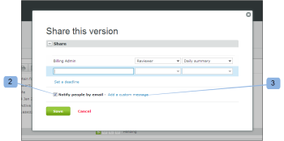
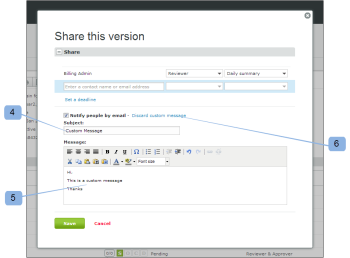

# Nouvel e-mail d’épreuve

>[!IMPORTANT]
>
>Cet article fait référence aux fonctionnalités du produit autonome. [!DNL Workfront Proof]. Pour plus d’informations sur la vérification à l’intérieur [!DNL Adobe Workfront], voir [Vérification](../../../review-and-approve-work/proofing/proofing.md).

<!--

Make this article work better for PiW.

-->

Lorsque vous créez un BAT ou une nouvelle version d&#39;un BAT, que vous ajoutez de nouvelles personnes à un BAT ou que vous ajoutez un workflow à un BAT, vous pouvez décider si vous souhaitez envoyer un email aux validants, comme expliqué dans ces articles :

* [Créer une épreuve avancée avec un workflow automatisé](../../../review-and-approve-work/proofing/creating-proofs-within-workfront/create-automated-proof-workflow.md)
* [Générer des bons à tirer dans [!DNL Workfront Proof]](../../../workfront-proof/wp-work-proofsfiles/create-proofs-and-files/generate-proofs.md)

L’e-mail que vos destinataires reçoivent est appelé [!UICONTROL Nouvelle preuve] e-mail. Seul le créateur du BAT et les utilisateurs autorisés à ajouter des validants à un BAT peuvent contrôler cet email. Les destinataires ne peuvent pas le désactiver.

L&#39;email Nouveau BAT contient :

* Votre message personnel (si vous choisissez d’en inclure un)
* Si vous envoyez toujours le même message personnalisé à vos réviseurs, il peut être judicieux de l’enregistrer dans votre [!UICONTROL Paramètres personnels] sous le [!UICONTROL Vérification des paramètres par défaut] . Pour plus d’informations, voir .
* Lien personnel vers le BAT
* **[!UICONTROL Afficher les détails]** lien qui permet d’accéder au [!DNL Workfront] (projet, tâche ou problème, par exemple)
* Miniature de l’image de BAT
* Les détails du BAT suivants :

   * Nom de l&#39;épreuve
   * Numéro de version
   * Liste des validants et leur état d&#39;avancement sur le BAT
   * Un lien pour partager le BAT avec une autre personne

     Vous pouvez ainsi partager l’URL du BAT et/ou le lien de téléchargement du fichier d’origine. Cela ne vous permet pas d&#39;ajouter explicitement des validants au BAT, vous ne partagerez que l&#39;URL publique du BAT et le destinataire recevra un accès en lecture seule au BAT.

     Voir [Partage d’un bon à tirer dans [!DNL Workfront Proof]](../../../workfront-proof/wp-work-proofsfiles/share-proofs-and-files/share-proof.md) pour plus d’informations.

     Si vous ne souhaitez pas que ce lien apparaisse dans l&#39;email de votre destinataire, vous pouvez désactiver la variable [!UICONTROL Partage public] paramètres du BAT

     (Téléchargez le fichier d’origine et l’URL publique). Voir [Gérer les détails du BAT dans [!DNL Workfront Proof]](../../../workfront-proof/wp-work-proofsfiles/manage-your-work/manage-proof-details.md) pour plus d’informations.

## Journal d’activité

Envoyer un [!UICONTROL Nouvelle preuve] l’e-mail à un réviseur est connecté à la variable [!UICONTROL Activité] section de [!UICONTROL Détails du BAT] page. Voir  [Gérer[!UICONTROL  Détails du BAT] in [!DNL Workfront Proof]](../../../workfront-proof/wp-work-proofsfiles/manage-your-work/manage-proof-details.md) pour plus d’informations. Vous pouvez vérifier si la variable [!UICONTROL Nouvelle preuve] a été activé au moment de la création d’un BAT.

>[!NOTE]
>
>* Si le créateur ou le propriétaire du BAT a [!UICONTROL Bon à tirer] e-mails désactivés par défaut (dans leurs paramètres personnels), ils ne recevront aucun message [!UICONTROL Preuve faite] ou [!UICONTROL Nouveau BAT] e-mails même si la variable [!UICONTROL Notifier les personnes par e-mail] est cochée sur la page Nouveau BAT. Pour plus d’informations, voir .
>* Si les notifications par e-mail sont désactivées par défaut dans la variable [!UICONTROL Paramètres du compte] Le créateur/propriétaire du BAT ne recevra aucun [!UICONTROL Preuve faite] ou [!UICONTROL Nouveau BAT] les emails, même s’ils sont activés dans leurs paramètres personnels et dans la variable [!UICONTROL Notifier] La case Personnes par email est cochée sur la page Nouveau BAT. Pour plus d’informations, [La variable [!UICONTROL Bon à tirer] email](../../../workfront-proof/wp-emailsntfctns/proof-notifications-and-reminders/proof-made-email.md) et voir .
>

## Activez la variable [!UICONTROL Nouvelle preuve] courrier électronique et inclure un message personnalisé

Vous pouvez indiquer si vous souhaitez envoyer une alerte par email aux réviseurs d’un BAT lors de sa création ou lorsque vous y ajoutez une personne.

* [Lorsque vous créez un BAT](#when-you-create-a-proof)
* [Lorsque vous ajoutez un validant à un BAT](#when-you-add-a-reviewer-to-a-proof)

### Lorsque vous créez un BAT {#when-you-create-a-proof}

Lorsque vous créez un BAT dans le [!UICONTROL Nouveau BAT] , sous **[!UICONTROL Partager]** vous pouvez indiquer si vous souhaitez envoyer des alertes par courrier électronique :

* Vous pouvez décider ici si vous souhaitez [!UICONTROL Notifier les personnes par e-mail] (1). Si vous désélectionnez cette option, aucun de vos réviseurs ne reçoit d&#39;email pour lui signaler que le BAT est prêt pour la révision.
* Vous pouvez également inclure un message personnalisé dans la notification électronique (2).
* Si vous décidez d’ajouter votre propre message personnalisé, vous pourrez insérer un objet personnalisé (3) et un message dans le corps de l’email (4).
* Pour ignorer le message personnalisé, cliquez simplement sur le lien (5).

  >[!NOTE]
  >
  >Si vous envoyez toujours le même message personnalisé à vos réviseurs, il peut être judicieux de l’enregistrer dans vos paramètres personnels sous le [!UICONTROL Vérification des paramètres par défaut] . Pour plus d’informations, voir .

### Lorsque vous ajoutez un validant à un BAT {#when-you-add-a-reviewer-to-a-proof}

Vous pouvez choisir si un nouveau validant ajouté à un BAT existant sera informé du BAT (comme ci-dessus).

* Tout d’abord, ajoutez de nouveaux réviseurs en cliquant sur le bouton **[!UICONTROL Partager cette version]** sur le bouton **[!UICONTROL Détails du BAT]** (1).

* Une boîte de dialogue s’affiche, dans laquelle vous pouvez ajouter de nouveaux réviseurs. Vous pouvez ensuite décider si vous souhaitez qu’ils soient avertis par email (2) et choisir d’ajouter un message personnalisé à l’email (3).

* Si vous choisissez d’ajouter un message personnalisé, la zone se développe et vous pourrez insérer une ligne d’objet personnalisée (4) et du texte personnalisé dans le corps de l’email (5). Vous pouvez également ignorer le message personnalisé en cliquant sur le lien (6).

