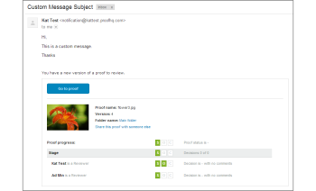

# L’e-mail de [!UICONTROL nouvelle version]

>[!IMPORTANT]
>
>Cet article fait référence aux fonctionnalités du produit autonome [!DNL [!DNL Workfront Proof]]. Pour plus d’informations sur la relecture dans [!DNL [!DNL Adobe Workfront]], voir [Relecture](../../../review-and-approve-work/proofing/proofing.md).

<!--

Does this apply to PiW?

-->

Les e-mails de nouvelle version sont envoyés lorsque vous créez une [!UICONTROL nouvelle version] d’épreuve. Vous pouvez les personnaliser et les désactiver de la même manière que les e-mails de [!UICONTROL Nouvelle épreuve].

>[!NOTE]
>
>Si les notifications par e-mail sont désactivées par défaut dans les [!UICONTROL Paramètres du compte], les réviseurs et réviseuses ne recevront aucun e-mail de [!UICONTROL nouvelle version], sauf si la case [!UICONTROL Notifier les personnes par e-mail] est cochée sur la page Nouvelle version.

