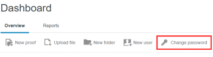

# Se connecter et modifier son mot de passe et son adresse e-mail pour Workfront Proof

>[!IMPORTANT]
>
>Cet article fait référence aux fonctionnalités du produit autonome [!DNL Workfront Proof]. Pour plus d’informations sur la relecture à l’intérieur d’[!DNL Adobe Workfront], voir [Relecture](../../../review-and-approve-work/proofing/proofing.md).

## Connexion

1. Accédez à [la page de connexion](https://app.proofhq.com/login).

1. Cliquez sur le bouton [!UICONTROL Se connecter] en haut à droite.
1. Saisissez votre adresse e-mail et votre mot de passe.\
   Si vous avez oublié votre mot de passe, consultez la section [Lorsque vous oubliez votre mot de passe](#when-you-forget-your-password) plus loin dans cet article.

1. Si vous souhaitez maintenir la connexion (sans expiration de la session après 30 minutes d’inactivité), sélectionnez **[!UICONTROL Maintenir la connexion]**.
1. Cliquez sur **[!UICONTROL Se connecter]**.

L’équipe d’administration [!DNL Workfront Proof] peut configurer un branding personnalisé pour la page [!UICONTROL Se connecter]. Consultez la section [Personnaliser le branding du site  [!DNL Workfront Proof] ](../../../workfront-proof/wp-acct-admin/branding/brand-wp-site.md). Ou, si vous utilisez une formule d’édition [!UICONTROL Entreprise] ou [!UICONTROL Illimité], consultez la section [Personnaliser le branding du site  [!DNL Workfront Proof]  - Avancé](../../../workfront-proof/wp-acct-admin/branding/brand-wp-site-advanced.md).

Pour les formules [!UICONTROL Entreprise] et [!UICONTROL Illimité], nous offrons une fonctionnalité d’authentification unique (SSO) qui permet à vos utilisateurs et vos utilisatrices de se connecter à [!DNL Workfront Proof] à l’aide de leur nom d’utilisateur ou d’utilisatrice et de leur mot de passe pour votre organisation. Consultez la section [Configurer l’authentification unique pour les utilisateurs et les utilisatrices  [!DNL Workfront Proof] ](../../../workfront-proof/wp-acct-admin/account-settings/configure-sso-for-wp-users.md) pour plus d’informations.

## Se déconnecter

1. Cliquez sur **[!UICONTROL Se déconnecter]** dans le coin supérieur droit de Workfront Proof.\
   Un message s’affiche pour confirmer que la déconnexion est effective. Cliquez sur **[!UICONTROL Retour à la page de connexion]** pour vous reconnecter si vous le souhaitez.\
   L’équipe d’administration [!DNL Workfront Proof] peut configurer un branding personnalisé pour ce message. Consultez la section [Personnaliser le branding du site  [!DNL Workfront Proof] ](../../../workfront-proof/wp-acct-admin/branding/brand-wp-site.md). Ou, si vous utilisez une formule d’édition [!UICONTROL Enterprise] ou [!UICONTROL &#x200B; Illimité], consultez la section [Personnaliser le branding du site  [!DNL Workfront Proof]  - Avancé](../../../workfront-proof/wp-acct-admin/branding/brand-wp-site-advanced.md).

## Lorsque vous oubliez votre mot de passe. {#when-you-forget-your-password}

Si vous oubliez votre mot de passe, vous pouvez demander à [!DNL Workfront Proof] de vous envoyer un e-mail de réinitialisation.

1. Accédez à [la page de connexion](https://app.proofhq.com/login).

1. Cliquez sur **[!UICONTROL Mot de passe oublié ?]**.
1. Dans la zone qui s’affiche, saisissez votre adresse e-mail, puis cliquez sur **[!UICONTROL Obtenir un lien]**.

## Modifier votre mot de passe

1. Sur le [!UICONTROL Tableau de bord], cliquez sur **[!UICONTROL Modifier le mot de passe]**.\
   \
   Si l’équipe d’administration [!DNL Workfront Proof] a défini des exigences spécifiques en matière de mot de passe, celles-ci sont indiquées en haut de la page [!UICONTROL Réinitialiser].

## À propos des paramètres de mot de passe avancés

Si vous utilisez une formule [!UICONTROL Select] ou [!UICONTROL Premium], votre équipe d’administration [!DNL Workfront Proof] peut définir des exigences spécifiques en matière de mot de passe afin de se conformer aux politiques informatiques et de sécurité de votre organisation et d’améliorer la sécurité de vos données. Pour plus d’informations, consultez la section « Paramètres de mot de passe avancés » dans l’article.

## Ajouter une adresse e-mail à votre compte

Vous pouvez ajouter plusieurs adresses e-mail à votre compte [!DNL Workfront Proof]. Votre adresse e-mail principale est l’adresse e-mail à laquelle [!DNL Workfront Proof] envoie des notifications d’épreuve. Vous l’utilisez également pour vous connecter à [!DNL Workfront Proof]. Vous pouvez modifier votre adresse e-mail principale.

1. Cliquez sur **[!UICONTROL Paramètres]** > **[!UICONTROL Paramètres personnels]**.

1. Sous **[!UICONTROL Alias de messagerie des utilisateurs et des utilisatrices]**, cliquez sur **[!UICONTROL Nouvelle adresse e-mail]**.

1. Dans la boîte **[!UICONTROL Envoyer un e-mail à l’alias]** qui s’affiche, saisissez l’adresse e-mail à ajouter, puis appuyez sur **[!UICONTROL Entrée]**.\
   [!DNL Workfront Proof] envoie un e-mail de validation à la nouvelle adresse e-mail.

1. Dans l’e-mail de validation que vous recevez, cliquez sur le lien de confirmation.\
   La modification de l’e-mail est enregistrée dans votre profil. Vous devrez peut-être actualiser le navigateur dans lequel vous affichez la page [!DNL Workfront Proof] [!UICONTROL Paramètres personnels] pour vérifier qu’il s’agit d’un alias d’e-mail.
1. (Facultatif) Pour faire de la nouvelle adresse e-mail votre adresse e-mail principale dans [!DNL Workfront Proof], cliquez sur le bouton [!UICONTROL Plus] (trois points) à l’extrémité droite de l’adresse, puis cliquez sur **[!UICONTROL Créer un e-mail principal]** dans le menu qui s’affiche.
