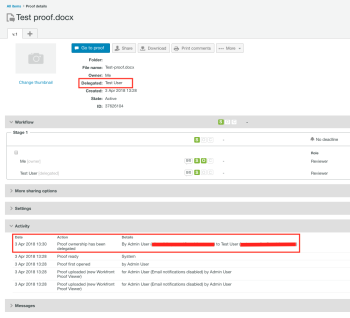

# Désigner des personnes propriétaires temporaires de l’épreuve dans [!DNL Workfront Proof]

>[!IMPORTANT]
>
>Cet article fait référence à la fonctionnalité du produit autonome [!DNL Workfront Proof]. Pour plus d’informations sur la relecture dans [!DNL Adobe Workfront], voir [Relecture](../../../review-and-approve-work/proofing/proofing.md).

Si vous devez vous absenter du bureau pendant une période prolongée, vous pouvez déléguer la propriété de vos épreuves à une autre personne de votre compte.

>[!NOTE]
>
>Cette fonction n’est disponible que sur [!DNL Workfront Proof].

Pour désigner la propriété temporaire de vos épreuves, procédez comme suit :

1. Sur [!DNL Workfront Proof], accédez à **[!UICONTROL Paramètres personnels]**.\
   

1. Cliquez sur l’onglet **[!UICONTROL Absence du bureau]**. Les paramètres suivants sont disponibles :

   * **[!UICONTROL Déléguez vos épreuves à]** une autre personne de votre compte.
   * Activez ou désactivez la fonction **[!UICONTROL Absence du bureau]** en cochant ou décochant la case.
   * Sélectionnez la **[!UICONTROL date de début]**.

     Si l’option **[!UICONTROL Commencer immédiatement]** est choisie, la propriété des épreuves sera déléguée à la personne sélectionnée immédiatement après l’activation de la fonctionnalité.

     Si une date et une heure de début spécifiques sont définies, la fonctionnalité sera activée le jour et à l’heure choisis.

   * Sélectionnez la **[!UICONTROL date de fin]**.

     Si aucune date de fin n’est choisie, la propriété des épreuves sera déléguée jusqu’à ce que la fonctionnalité soit désactivée manuellement.

     Si une date et une heure de fin spécifiques sont définies, la fonctionnalité sera désactivée le jour et à l’heure choisis.

     

1. Lorsque les épreuves sont déléguées, la personne propriétaire déléguée apparaît dans la section **[!UICONTROL Détails]** de la page des détails de l’épreuve. La note de délégation de propriété apparaît dans la section **[!UICONTROL Activité]** de la page des détails de l’épreuve.

   

   Une notification [!UICONTROL Absence du bureau] est également affichée sur le compte de la personne propriétaire de l’épreuve originale pendant la période où la fonctionnalité est activée. Cela sert de rappel à la personne propriétaire originale et lui permet également de mettre fin à la délégation immédiatement ou d’accéder à [!UICONTROL Paramètres personnels] pour l’ajuster.

   

   Lorsque la personne propriétaire originale reprend la propriété de vos épreuves, la personne propriétaire déléguée disparaît de la section [!UICONTROL Détails] de la page des détails de l’épreuve et la notification [!UICONTROL Absence du bureau] n’est plus affichée dans le compte de la personne propriétaire originale de l’épreuve. Une note indiquant que la propriété de la preuve a été rétablie apparaît dans la section [!UICONTROL Activité] de la page des détails de l’épreuve.

   >[!NOTE]
   >
   >La personne propriétaire déléguée reste dans le workflow de l’épreuve à moins que vous ne la supprimiez manuellement.

   ![[!UICONTROL activity-section-taken-back].png](assets/activity-section-taken-back-350x99.png)
