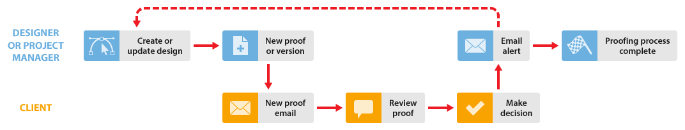

# Processus de relecture de base dans [!DNL Workfront Proof]

<!-- Audited: 5/2025 -->

>[!IMPORTANT]
>
>Cet article fait référence à la fonctionnalité du produit autonome [!DNL Workfront Proof]. Pour plus d’informations sur la relecture dans [!DNL Adobe Workfront], voir [Relecture : index d’article](../../../review-and-approve-work/proofing/proofing.md).

Cet exemple explique le processus de base entre un concepteur ou un chef de projet et un ou plusieurs réviseurs, tels qu&#39;un client. Vous pouvez répéter ce processus jusqu’à ce que l’épreuve soit approuvée.

* **Créer une épreuve** : le concepteur ou le chef de projet crée une épreuve dans [!DNL Workfront Proof] et la partage avec le client. Pour plus d’informations, voir [Générer des épreuves dans [!DNL Workfront Proof]](../../../workfront-proof/wp-work-proofsfiles/create-proofs-and-files/generate-proofs.md).

* **E-mail du nouveau BAT** : le client reçoit un e-mail contenant un lien vers le BAT.

* **Réviser une épreuve** : le client examine l’épreuve, ajoute des commentaires et prend une décision. Pour plus d’informations, consultez [Révision des épreuves dans [!DNL Adobe Workfront] : index d’article](../../../review-and-approve-work/proofing/reviewing-proofs-within-workfront/review-proofs-in-wf.md) et [Prise d’une décision concernant une épreuve dans la visionneuse de relecture](../../../review-and-approve-work/proofing/reviewing-proofs-within-workfront/make-a-decision-on-a-proof/make-decisions-on-proof.md).

* **Alerte par e-mail** : le concepteur ou le chef de projet reçoit un e-mail contenant un résumé de la révision du client ou de la cliente, en fonction des alertes par e-mail qu’il ou elle a définies. Pour plus d’informations, voir [Configuration des paramètres de notification par e-mail dans [!DNL Workfront Proof]](../../../workfront-proof/wp-emailsntfctns/email-alerts/config-email-notification-settings-wp.md).

* **Nouvelle version** (le cas échéant) : le concepteur ou le chef de projet modifie le fichier et le charge dans [!DNL Workfront Proof] en tant que nouvelle version.

