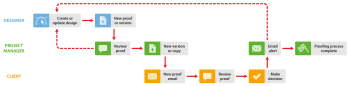

# Révision interne puis externe dans [!DNL Workfront Proof]

>[!IMPORTANT]
>
>Cet article fait référence aux fonctionnalités du produit autonome. [!DNL Workfront Proof]. Pour plus d’informations sur la vérification à l’intérieur [!DNL Adobe Workfront], voir [Vérification](../../../review-and-approve-work/proofing/proofing.md).

Si votre entreprise effectue des révisions internes avant de partager des bons à tirer avec ses clients, nous vous suggérons deux façons d’utiliser [!DNL Workfront Proof] pour améliorer votre workflow :

## Clients Voir Commentaires internes

Cette option illustre un workflow dans lequel les clients peuvent voir tous les commentaires internes.

Le concepteur partage d’abord le BAT avec le chef de projet (et tout autre collègue). Les collègues examinent le BAT et, s’ils l’approuvent, vous pouvez utiliser la fonction de partage pour partager le BAT avec vos clients. Pour plus d’informations, voir [Partage d’un bon à tirer dans [!DNL Workfront Proof]](../../../workfront-proof/wp-work-proofsfiles/share-proofs-and-files/share-proof.md).

1. **Créer un BAT** - le concepteur crée un nouveau BAT dans [!DNL Workfront Proof] et le partage. Il est destiné aux réviseurs internes. Le concepteur fait du chef de projet le propriétaire du BAT.
1. **Révision interne** - le chef de projet et d’autres collègues examinent le BAT.
1. **Partager le BAT** - le chef de projet partage le BAT avec le client.
1. **Nouvel email de BAT** - le client reçoit l&#39;email New BAT avec la fonction [!UICONTROL Accéder au BAT] lien. Pour plus d’informations, voir [Nouvel email de BAT](../../../workfront-proof/wp-emailsntfctns/proof-notifications-and-reminders/new-proof-email.md).

1. **Vérification du BAT** - le client examine le BAT, ajoute des commentaires et prend une décision.
1. **Alerte par email** : le chef de projet reçoit une alerte par courrier électronique (selon ses paramètres sur le BAT). Pour plus d’informations, voir [Configuration des paramètres de notification électronique dans le bon à tirer Workfront](../../../workfront-proof/wp-emailsntfctns/email-alerts/config-email-notification-settings-wp.md).

1. **Demande de modification** - le Gestionnaire de projets permet au concepteur de connaître les demandes de modification. Vous pouvez le faire à l’aide de la fonction de commentaires imprimés. Pour plus d’informations, voir [Imprimer et exporter des commentaires dans [!DNL Workfront Proof]](../../../workfront-proof/wp-work-proofsfiles/organize-your-work/print-and-export-comments.md).

1. **Nouvelle version** (si nécessaire) : le concepteur modifie le fichier et le télécharge vers [!DNL Workfront Proof] comme une nouvelle version. Pour plus d’informations, voir .

Vous pouvez répéter ce processus jusqu’à ce que le BAT soit approuvé.

## Le Client Ne Voit Que Sa Propre Version

Cette option illustre un workflow dans lequel le processus de vérification est géré par le chef de projet qui crée toute nouvelle version (selon les besoins) et partage le BAT avec le client. Le concepteur n’a pas besoin d’être impliqué dans le processus de révision.)

1. **Créer un BAT** - Le concepteur crée un nouveau BAT dans [!DNL Workfront Proof] et le partage avec les réviseurs internes. Le concepteur fait du chef de projet le propriétaire du BAT ou lui donne le rôle de [!UICONTROL Auteur] sur le BAT (voir [Gestion des rôles de BAT dans [!DNL Workfront Proof]](../../../workfront-proof/wp-work-proofsfiles/share-proofs-and-files/manage-proof-roles.md)).

1. **Révision interne** - le chef de projet et d’autres collègues examinent le BAT. Pour plus d’informations, voir [Vérification de BAT dans la visionneuse de BAT Web](https://support.workfront.com/hc/en-us/sections/115000275214-Reviewing-Proofs-in-the-Web-Proofing-Viewer) et [Vérification des bons à tirer dans la visionneuse de vérification de l’appli de bureau.](https://support.workfront.com/hc/en-us/sections/360000686434-Reviewing-Proofs-in-the-Desktop-Proofing-Viewer)

1. **Nouvelle version** - le chef de projet crée une version (ou une copie) du BAT et la partage avec le client. Voir [Copie de BAT dans [!DNL Workfront Proof]](../../../workfront-proof/wp-work-proofsfiles/create-proofs-and-files/copy-proofs.md) et [Partage d’un bon à tirer dans [!DNL Workfront Proof]](../../../workfront-proof/wp-work-proofsfiles/share-proofs-and-files/share-proof.md).

1. **Nouvel email de BAT** - le client reçoit le nouvel email du BAT avec un [!UICONTROL Accéder au BAT] lien. Pour plus d’informations, voir [Nouvel email de BAT](../../../workfront-proof/wp-emailsntfctns/proof-notifications-and-reminders/new-proof-email.md).

1. **[!UICONTROL Vérification du BAT]** - le client examine le BAT, ajoute des commentaires et prend une décision.
1. Le client ne peut voir que la version du BAT qui a été explicitement partagée avec lui ; ils ne pourront pas voir la version interne.
1. **[!UICONTROL Alerte par email]** - le chef de projet reçoit un courrier électronique contenant un résumé de la révision du client (en fonction de leurs paramètres sur le BAT).
1. **Demande de modification** - le Gestionnaire de projets permet au concepteur de connaître les demandes de modification. Vous pouvez le faire à l’aide de la fonction de commentaires imprimés. Pour plus d’informations, voir [Imprimer et exporter des commentaires dans [!DNL Workfront Proof]](../../../workfront-proof/wp-work-proofsfiles/organize-your-work/print-and-export-comments.md).

1. **Nouvelle version** (si nécessaire) : le concepteur modifie le fichier et le télécharge vers [!DNL Workfront Proof] comme une nouvelle version. Pour plus d’informations, voir .

Vous pouvez répéter ce processus jusqu’à ce que le BAT soit approuvé.
