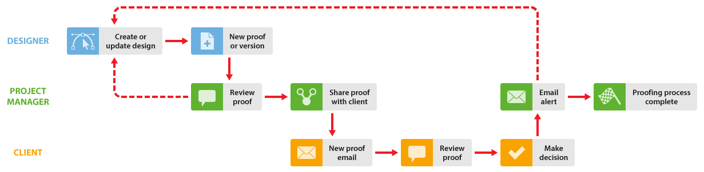

# Révision interne puis externe dans [!DNL Workfront Proof]

>[!IMPORTANT]
>
>Cet article fait référence à la fonctionnalité du produit autonome [!DNL Workfront Proof]. Pour plus d’informations sur la relecture dans [!DNL Adobe Workfront], voir [Relecture](../../../review-and-approve-work/proofing/proofing.md).

Si votre entreprise effectue des révisions internes avant de partager des épreuves avec sa clientèle, nous vous suggérons deux façons d’utiliser [!DNL Workfront Proof] pour améliorer votre workflow :

## La clientèle voit les commentaires internes

Cette option illustre un workflow dans lequel la clientèle peut voir tous les commentaires internes.

La personne chargée de la conception partage d’abord l’épreuve avec la personne gestionnaire de projet (et toute autre personne de l’entreprise). Ces personnes examinent l’épreuve et, si elles l’approuvent, vous pouvez utiliser la fonction de partage pour partager l’épreuve avec votre clientèle. Pour plus d’informations, voir [Partager une épreuve dans  [!DNL Workfront Proof]](../../../workfront-proof/wp-work-proofsfiles/share-proofs-and-files/share-proof.md).

1. **Créer une épreuve** - le concepteur crée un nouveau BAT dans [!DNL Workfront Proof] et le partage. Il est destiné aux réviseurs internes. La personne chargée de la conception rend la personne gestionnaire de projet propriétaire de l’épreuve.
1. **Révision interne** - la personne gestionnaire de projet et d’autres collègues examinent l’épreuve.
1. **Partager l’épreuve** - la personne gestionnaire de projet partage l’épreuve avec la clientèle.
1. **E-mail de nouvelle épreuve** - le client ou la cliente reçoit l’e-mail Nouvelle épreuve, qui comporte le lien [!UICONTROL Accéder à l’épreuve]. Pour plus d’informations, voir [E-mail de nouvelle épreuve](../../../workfront-proof/wp-emailsntfctns/proof-notifications-and-reminders/new-proof-email.md).

1. **Réviser une épreuve** - le client ou la cliente examine l’épreuve, ajoute des commentaires et prend une décision.
1. **Alerte par e-mail** : la personne gestionnaire de projet reçoit une alerte par e-mail (selon ses paramètres sur l’épreuve). Pour plus d’informations, voir [Configurer des paramètres de notification par e-mail dans Workfront Proof](../../../workfront-proof/wp-emailsntfctns/email-alerts/config-email-notification-settings-wp.md).

1. **Demande de modification** - la personne gestionnaire de projet permet au concepteur ou à la conceptrice de visualiser les demandes de modification. Pour ce faire, utilisez la fonction d’impression des commentaires. Pour plus d’informations, voir [Imprimer et exporter des commentaires dans  [!DNL Workfront Proof]](../../../workfront-proof/wp-work-proofsfiles/organize-your-work/print-and-export-comments.md).

1. **Nouvelle version** (si nécessaire) : le concepteur ou la conceptrice modifie le fichier et le charge vers [!DNL Workfront Proof] comme une nouvelle version. Pour plus d’informations, voir :

Vous pouvez répéter ce processus jusqu’à ce que l’épreuve soit approuvée.

## La clientèle ne voit que sa propre version

Cette option illustre un workflow dans lequel le processus de relecture est géré par la personne gestionnaire de projet qui crée toute nouvelle version (selon les besoins) et partage l’épreuve avec le client ou la cliente. Le concepteur ou la conceptrice n’a pas besoin d’être impliqué dans le processus de relecture).

1. **Créer une épreuve** - le concepteur ou la conceptrice crée une nouvelle épreuve dans [!DNL Workfront Proof] et la partage avec les personnes réviseuses internes. Le concepteur ou la conceptrice rend la personne gestionnaire de projet propriétaire de l’épreuve ou lui donne le rôle [!UICONTROL Auteur ou autrice] sur l’épreuve (voir [Gérer les rôles d’épreuve dans  [!DNL Workfront Proof]](../../../workfront-proof/wp-work-proofsfiles/share-proofs-and-files/manage-proof-roles.md)).

1. **Révision interne** - la personne gestionnaire de projet et d’autres personnes de l’entreprise examinent l’épreuve. Pour plus d’informations, voir [Réviser des épreuves dans la visionneuse de relecture web](https://support.workfront.com/hc/en-us/sections/115000275214-Reviewing-Proofs-in-the-Web-Proofing-Viewer) et [Vérifier des épreuves dans la visionneuse de relecture de bureau.](https://support.workfront.com/hc/en-us/sections/360000686434-Reviewing-Proofs-in-the-Desktop-Proofing-Viewer)

1. **Nouvelle version** - la personne gestionnaire de projet crée une version (ou une copie) de l’épreuve et la partage avec le client ou la cliente. Voir [Copier des épreuves dans  [!DNL Workfront Proof]](../../../workfront-proof/wp-work-proofsfiles/create-proofs-and-files/copy-proofs.md) et [Partager une épreuve dans  [!DNL Workfront Proof]](../../../workfront-proof/wp-work-proofsfiles/share-proofs-and-files/share-proof.md).

1. **E-mail de nouvelle épreuve** - le client ou la cliente reçoit l’e-mail de nouvelle épreuve, qui comporte un lien [!UICONTROL Accéder à l’épreuve]. Pour plus d’informations, voir [E-mail de nouvelle épreuve](../../../workfront-proof/wp-emailsntfctns/proof-notifications-and-reminders/new-proof-email.md).

1. **[!UICONTROL Réviser l’épreuve]** - le client ou la cliente examine l’épreuve, ajoute des commentaires et prend une décision.
1. Le client ou la cliente ne peut voir que la version d’épreuve qui a été explicitement partagée avec lui ; il ne pourra pas voir la version interne.
1. **[!UICONTROL Alerte par e-mail]** - la personne gestionnaire de projet reçoit un e-mail contenant un résumé de la révision du client ou de la cliente (en fonction de leurs paramètres sur l’épreuve).
1. **Demande de modification** - la personne gestionnaire de projet permet au concepteur ou à la conceptrice de visualiser les demandes de modification. Pour ce faire, utilisez la fonction d’impression des commentaires. Pour plus d’informations, voir [Imprimer et exporter des commentaires dans  [!DNL Workfront Proof]](../../../workfront-proof/wp-work-proofsfiles/organize-your-work/print-and-export-comments.md).

1. **Nouvelle version** (si nécessaire) : le concepteur ou la conceptrice modifie le fichier et le charge vers [!DNL Workfront Proof] comme une nouvelle version. Pour plus d’informations, voir :

Vous pouvez répéter ce processus jusqu’à ce que l’épreuve soit approuvée.
