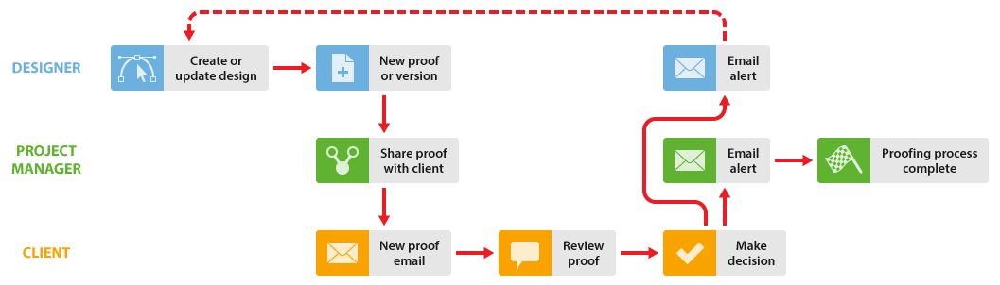

# Utilisation de concepteurs et de responsables de projet dans [!DNL Workfront Proof]

>[!IMPORTANT]
>
>Cet article fait référence aux fonctionnalités du produit autonome. [!DNL Workfront Proof]. Pour plus d’informations sur la vérification à l’intérieur [!DNL Adobe Workfront], voir [Vérification](../../../review-and-approve-work/proofing/proofing.md).

Vous pouvez améliorer le workflow de vérification pour le chef de projet (la personne qui gère le processus de révision) et le concepteur qui travaillent ensemble sur un projet de deux manières décrites ci-dessous.

Ces workflows fonctionnent bien dans n’importe quelle situation, mais ils sont particulièrement utiles si votre concepteur crée des fichiers qui peuvent être trop volumineux pour être envoyés par courrier électronique au chef de projet.

## Quand Designer doit voir les commentaires et les décisions

Lorsque le concepteur doit voir des commentaires et des décisions sur un BAT, il peut commencer le processus de vérification et recevoir le BAT une fois le processus terminé. Le concepteur peut alors recommencer le processus.

1. Le concepteur crée un BAT et attribue le chef de projet comme propriétaire du projet (pour plus d’informations, voir [Générer des bons à tirer dans [!DNL Workfront Proof]](../../../workfront-proof/wp-work-proofsfiles/create-proofs-and-files/generate-proofs.md)). En tant que créateur du BAT, le concepteur peut :

   * Commenter le BAT et utiliser la variable [!UICONTROL Actions] pour effectuer le suivi des threads de commentaires.
   * Créez une nouvelle version du BAT pour le chef de projet.

1. Le chef de projet examine le BAT, puis le partage avec le client. Pour plus d’informations, voir [Partage d’un bon à tirer dans [!DNL Workfront Proof]](../../../workfront-proof/wp-work-proofsfiles/share-proofs-and-files/share-proof.md).
1. Le client reçoit un email contenant un lien vers le BAT. Pour plus d’informations, voir [Nouvel email de BAT](../../../workfront-proof/wp-emailsntfctns/proof-notifications-and-reminders/new-proof-email.md).
1. Le client examine le BAT, ajoute des commentaires et prend une décision sur le BAT.
1. Le chef de projet reçoit un e-mail résumant la révision du client et le concepteur reçoit un e-mail sur les modifications requises. Pour plus d’informations, voir [Configuration des paramètres de notification électronique dans [!DNL Workfront Proof]](../../../workfront-proof/wp-emailsntfctns/email-alerts/config-email-notification-settings-wp.md).
1. Le concepteur ou le chef de projet modifie le fichier ; si le concepteur le télécharge alors en tant que nouvelle version, [!DNL Workfront Proof] réaffecte la propriété du BAT au chef de projet.

## Lorsque Designer n’a pas besoin de voir des commentaires et des décisions de BAT

Lorsqu’il n’est pas nécessaire que le concepteur soit impliqué dans la variable [!DNL Workfront Proof] processus de révision, le chef de projet peut créer le BAT et ajouter les validants.

1. Le concepteur charge le fichier et le partage avec le chef de projet. Pour plus d’informations, voir [Transfert de fichiers et de contenu web vers [!DNL Workfront Proof]](../../../workfront-proof/wp-work-proofsfiles/create-proofs-and-files/upload-files-web-content.md) et [Partage de fichiers dans [!DNL Workfront Proof]](../../../workfront-proof/wp-work-proofsfiles/share-proofs-and-files/share-files.md).

1. Le chef de projet reçoit le fichier et peut créer un BAT à partir du fichier en un seul clic. Pour plus d’informations, voir [Générer des bons à tirer dans [!DNL Workfront Proof]](../../../workfront-proof/wp-work-proofsfiles/create-proofs-and-files/generate-proofs.md) voir aussi  [Gestion des fichiers dans [!DNL Workfront Proof]](../../../workfront-proof/wp-work-proofsfiles/manage-your-work/manage-files.md) pour plus d’informations sur la conversion de fichiers en bons à tirer.

1. Le client reçoit un email contenant un lien vers le BAT. Pour plus d’informations, voir [Nouvel email de BAT](../../../workfront-proof/wp-emailsntfctns/proof-notifications-and-reminders/new-proof-email.md).
1. Le client examine le BAT, ajoute des commentaires et prend une décision.
1. Le chef de projet reçoit un courrier électronique contenant un résumé de l’examen du client et sa décision. Pour plus d’informations, voir [Configuration des paramètres de notification électronique dans [!DNL Workfront Proof]](../../../workfront-proof/wp-emailsntfctns/email-alerts/config-email-notification-settings-wp.md).
1. Le chef de projet informe le concepteur des demandes de modification à l’aide de [!UICONTROL Imprimer les commentaires]. Pour plus d’informations, voir [Imprimer et exporter des commentaires dans [!DNL Workfront Proof]](../../../workfront-proof/wp-work-proofsfiles/organize-your-work/print-and-export-comments.md).
1. Si nécessaire, le concepteur modifie le fichier et le télécharge vers [!DNL Workfront Proof], où le chef de projet peut créer une version pour un autre cycle de vérification.

