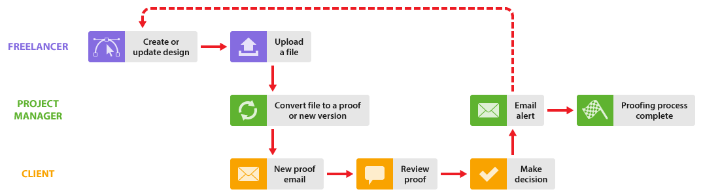

# Travailler avec des personne travaillant en freelance dans [!DNL Workfront Proof]

>[!IMPORTANT]
>
>Cet article fait référence aux fonctionnalités du produit autonome [!DNL Workfront Proof]. Pour plus d’informations sur la relecture dans [!DNL Adobe Workfront], voir [Relecture](../../../review-and-approve-work/proofing/proofing.md).

Si votre entreprise travaille avec des personnes travaillant en freelance, vous pouvez également les inclure dans votre processus [!DNL Workfront Proof].

Il existe plusieurs manière de procéder, selon que vous souhaitez que la personne travaillant en freelance fasse partie de votre entreprise dans [!DNL Workfront Proof] ou non :

## Ajouter des personnes travaillant en freelance à votre compte [!DNL Workfront Proof]

Vous pouvez simplement ajouter des personnes travaillant en freelance en tant qu’utilisateurs et utilisatrices à votre compte dans [!DNL Workfront Proof], comme vous le feriez avec vos collègues. Elles peuvent ainsi faire partie de tous les workflows décrits dans cette section.

Vous pouvez utiliser les différents profils d’utilisateur ou utilisatrice, ainsi que la règle de confidentialité des dossiers, pour gérer la visibilité et l’accès de la personne travaillant en freelance dans votre compte.

Voir les articles [Profils et autorisations des utilisateurs ou des utilisatrices](https://support.workfront.com/hc/https://support.workfront.com/hc/en-us/articles/115004087428-User-profiles-and-permissions) et [Présentation des autorisations de dossier dans  [!DNL Workfront Proof]](../../../workfront-proof/wp-work-proofsfiles/organize-your-work/folder-permissions.md) avant d’ajouter une personne travaillant en freelance en tant qu’utilisateur ou utilisatrice à votre compte.

Pour plus d’informations sur l’ajout d’une personne travaillant en freelance à votre équipe, voir [Créer des utilisateurs et utilisatrices à l’aide de  [!DNL Workfront Proof]](../../../workfront-proof/wp-mnguserscontacts/users/create-users.md).

>[!NOTE]
>
>Toutes les personnes travaillant en freelance ajoutées à votre compte en tant qu’utilisateurs ou utilisatrices auront une visibilité sur votre compte et pourront également consulter les détails du client (en fonction de leur profil d’utilisateur ou utilisatrice). Ce n’est peut-être pas ce que vous souhaitez. Configurer un compte satellite pour les personnes travaillant en freelance serait dans ce cas une option plus appropriée. Voir [Configurer un compte satellite pour les personnes travaillant en freelance](https://support.workfront.com/knowledge/articles/115004259868/en-us?brand_id=662728&amp;return_to=%2Fhc%2Fen-us%2Farticles%2F115004259868#Option-B---set-up-a-satellite-account-for-your-freelancers) ci-dessous.

## Configurer un compte satellite pour les personnes travaillant en freelance

Si vous ne souhaitez pas que les clients et les personnes travaillant en freelance se voient dans [!DNL Workfront Proof], vous pouvez configurer des comptes satellites pour les personnes travaillant en freelance.

Cela signifie qu’elles auront leur propre tableau de bord pour afficher tous les éléments sur lesquels elles travaillent au même endroit. De plus, elles pourront vous envoyer des fichiers via [!DNL Workfront Proof], que vous pouvez convertir en épreuves (plans [!UICONTROL Entreprise] et [!UICONTROL Illimité] uniquement). Pour plus d’informations, voir [Gérer des fichiers dans  [!DNL Workfront Proof]](../../../workfront-proof/wp-work-proofsfiles/manage-your-work/manage-files.md).

Cela signifie également que si la personne travaillant en freelance doit créer de nouvelles versions de l’épreuve pendant le processus de révision, vous pouvez l’ajouter explicitement à l’épreuve en tant qu’[!UICONTROL Auteur ou autrice], ce qui lui permettra de participer au processus de révision et de créer de nouvelles versions selon les besoins. Pour plus d’informations, voir [Gérer des rôles d’épreuve dans  [!DNL Workfront Proof]](../../../workfront-proof/wp-work-proofsfiles/share-proofs-and-files/manage-proof-roles.md).

1. La personne travaillant en freelance se connecte à son compte satellite.
1. La personne travaillant en freelance charge le fichier et le partage avec vous. Voir [Charger des fichiers et de contenu web dans  [!DNL Workfront Proof]](../../../workfront-proof/wp-work-proofsfiles/create-proofs-and-files/upload-files-web-content.md) et [Partager des fichiers dans  [!DNL Workfront Proof]](../../../workfront-proof/wp-work-proofsfiles/share-proofs-and-files/share-files.md).

1. Vous recevez un e-mail vous indiquant qu’un fichier a été partagé avec vous.
1. Vous vous connectez à votre compte et recherchez le fichier qui a été partagé avec vous.
1. Vous utilisez le bouton [!UICONTROL Convertir en épreuve] pour convertir le fichier en épreuve. Pour plus d’informations, voir [Gérer des fichiers dans  [!DNL Workfront Proof]](../../../workfront-proof/wp-work-proofsfiles/manage-your-work/manage-files.md).
1. Vous gérez ensuite normalement le workflow d’épreuve avec vos clientes et clients. Si vous souhaitez ajouter explicitement la personne travaillant en freelance à l’épreuve, vous pouvez utiliser la fonction de partage. Pour plus d’informations, voir [Partager une épreuve dans  [!DNL Workfront Proof]](../../../workfront-proof/wp-work-proofsfiles/share-proofs-and-files/share-proof.md).
1. Si vous ne souhaitez pas ajouter explicitement la personne travaillant en freelance à l’épreuve, mais que vous souhaitez l’avertir lorsqu’elle a été approuvée, vous pouvez l’informer à la fin du processus d’épreuve en partageant un lien vers l’épreuve avec elle.

   Cela signifie qu’elle ne fait pas partie de l’équipe de révision et que vos clientes et clients ne voient pas son nom dans l’épreuve.

Pour plus d’informations sur la configuration d’un compte satellite pour les personnes travaillant en freelance, voir [Configurer un compte satellite dans  [!DNL Workfront Proof]](../../../workfront-proof/wp-acct-admin/satellite-accounts/configure-sat-acct-in-wp.md).

## Utiliser la [!UICONTROL Zone de dépôt]

Cette option est utile si vous ne souhaitez pas que les clientes et clients et les personnes travaillant en freelance se voient dans [!DNL Workfront Proof]. Vous pouvez donner aux personnes travaillant en freelance un accès à votre [!UICONTROL Zone de dépôt] (disponible avec les plans [!UICONTROL Entreprise] et [!UICONTROL Illimité] uniquement). Pour plus d’informations, voir [La [!UICONTROL zone de dépôt]](../../../workfront-proof/wp-work-proofsfiles/create-proofs-and-files/dropzone.md).

1. La personne travaillant en freelance accède à votre page de [!UICONTROL Zone de dépôt] publique.
1. Elle utilise la [!UICONTROL Zone de dépôt] pour créer une épreuve dans votre compte.
1. Vous recevez un e-mail vous indiquant qu’une nouvelle épreuve se trouve dans votre [!UICONTROL Zone de dépôt].
1. Vous vous connectez à votre compte et trouvez l’épreuve dans votre [!UICONTROL Zone de dépôt].
1. Vous déverrouillez l’épreuve, ajoutez des réviseurs et réviseuses, définissez les paramètres de l’épreuve et gérez normalement le workflow de l’épreuve avec vos clientes et clients. La personne travaillant en freelance apparaît comme la créatrice de l’épreuve (et ne peut pas être supprimée).

* Vous pouvez gérer l’accès de la personne travaillant en freelance à l’épreuve dans les paramètres de votre [!UICONTROL Zone de dépôt]. Pour plus d’informations, consultez la section [Configurer les paramètres des épreuves dans  [!DNL Workfront Proof]](../../../workfront-proof/wp-acct-admin/account-settings/configure-dropzone-in-wp.md).
* Vous pouvez également gérer le rôle qui leur est affecté sur l’épreuve, tel que [!UICONTROL Lecture seule], ainsi que les échanges par e-mail au sujet de l’épreuve. Pour plus d’informations, consultez la section [Gérer les rôles d’épreuve dans  [!DNL Workfront Proof]](../../../workfront-proof/wp-work-proofsfiles/share-proofs-and-files/manage-proof-roles.md).
* Si vous ne souhaitez pas que votre personne travaillant en freelance participe au processus de relecture mais qu’elle soit informée de la décision finale, vous pouvez définir le rôle d’épreuve par défaut dans les paramètres de votre [!UICONTROL zone de dépôt] et une alerte par e-mail pour toutes les personnes ayant effectué un dépôt dans la [!UICONTROL zone de dépôt] dans [Gérer les rôles d’épreuve dans  [!DNL Workfront Proof]](../../../workfront-proof/wp-work-proofsfiles/share-proofs-and-files/manage-proof-roles.md) et [Configurer les paramètres de notification par e-mail dans  [!DNL Workfront Proof]](../../../workfront-proof/wp-emailsntfctns/email-alerts/config-email-notification-settings-wp.md), respectivement. Pour plus d’informations, consultez les sections [Alertes par email,](https://support.workfront.com/hc/en-us/sections/115000911867-Email-alerts) [Gérer les rôles d’épreuve dans  [!DNL Workfront Proof]](../../../workfront-proof/wp-work-proofsfiles/share-proofs-and-files/manage-proof-roles.md) et [Configurer les paramètres de notification par e-mail dans  [!DNL Workfront Proof]](../../../workfront-proof/wp-emailsntfctns/email-alerts/config-email-notification-settings-wp.md).
* Si vous souhaitez que votre personne travaillant en freelance participe activement au processus de révision, vous pouvez ajuster son rôle d’épreuve et le paramètre d’alerte par e-mail selon les besoins, en modifiant en ligne ces détails sur la page de détails de l’épreuve. Pour plus d’informations sur cette page, consultez la section [Gérer les détails de l’épreuve dans  [!DNL Workfront Proof]](../../../workfront-proof/wp-work-proofsfiles/manage-your-work/manage-proof-details.md)
