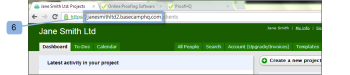

# Intégrer [!DNL Workfront Proof] avec [!DNL Basecamp Classic]

>[!IMPORTANT]
>
>Cet article fait référence aux fonctionnalités du produit autonome. [!DNL Workfront Proof]. Pour plus d’informations sur la vérification à l’intérieur [!DNL Adobe Workfront], voir [Vérification](../../../review-and-approve-work/proofing/proofing.md).

Si vous utilisez [!DNL Basecamp] pour la gestion de projet, vous pouvez proposer à votre équipe de projet des outils d’examen et d’approbation plus riches en utilisant [!DNL Workfront Proof].

## Présentation de la fonction [!DNL Basecamp] Intégration avec [!DNL Workfront]

Intégration avec [!DNL Basecamp] permet aux utilisateurs d’afficher, de réviser et d’approuver les bons à tirer dans [!DNL Basecamp]. Les utilisateurs peuvent envoyer des bons à tirer à votre [!DNL Workfront Proof] et connectez-les à votre [!DNL Basecamp] projet. Vos réviseurs peuvent effectuer des opérations [Prendre une décision sur un BAT dans la visionneuse de vérification](../../../review-and-approve-work/proofing/reviewing-proofs-within-workfront/make-a-decision-on-a-proof/make-decisions-on-proof.md) via [!DNL Basecamp], à l’aide du mini-BAT incorporé dans votre message Basecamp .

Lorsqu’il est intégré à [!DNL Workfront Proof], [!DNL Basecamp] permet aux utilisateurs d’effectuer les opérations suivantes avec des bons à tirer :

* Les utilisateurs peuvent consulter et approuver des BAT dans [!DNL Basecamp Classic].
* Les utilisateurs disposent d’outils de révision facilement disponibles.
* Les équipes d’examen de projet reçoivent un message dans [!DNL Basecamp] avec un mini BAT pour révision et validation.
* Les utilisateurs peuvent passer à un BAT de page entière pour révision et approbation.
* Les utilisateurs peuvent ajouter des commentaires et des annotations aux mini-bons à tirer et aux bons à tirer.

   >[!NOTE]
   >
   >Une fois qu’un commentaire a reçu une réponse, il ne peut pas être modifié ni supprimé.

* Les réviseurs peuvent répondre aux balises et effectuées par d’autres réviseurs.
* Les utilisateurs sont avertis lorsqu’une nouvelle version du BAT est disponible.
* Utilisateurs qui ne sont pas [!DNL Workfront Proof] les utilisateurs peuvent travailler sur un BAT dans [!DNL Basecamp].

L’intégration de [!DNL Workfront Proof] avec [!DNL Basecamp] doit être configuré à deux niveaux :

* Configurer [!DNL Basecamp] in [Paramètres du compte :](https://support.workfront.com/hc/en-us/sections/115000912147-Account-settings) Cela permet l’intégration Basecamp pour l’ensemble de votre organisation.
* Pour plus d’informations, voir [Activation de la variable [!DNL Basecamp] Intégration avec [!DNL Workfront Proof]](#enabling-the-basecamp-integration-with-workfront-proof).
* Configurer [!DNL Basecamp] in [Paramètres personnels](https://support.workfront.com/hc/en-us/sections/115000921168-Personal-settings): Cela permet aux créateurs et aux propriétaires de BAT de se connecter à leurs [!DNL Basecamp] et autoriser [!DNL Workfront Proof] accès. Pour plus d’informations, voir [Configuration des paramètres personnels](#configuring-personal-settings).

Vous pouvez intégrer des [!DNL Workfront] avec [!DNL Basecamp] ou [!DNL Basecamp Classic]. Chaque version de [!DNL Basecamp] utilise une API différente et nécessite donc des procédures de configuration différentes.

Pour plus d’informations sur la configuration [!DNL Basecamp Classic], voir [Activation de la variable [!DNL Basecamp] Intégration avec [!DNL Workfront Proof]](#enabling-the-basecamp-integration-with-workfront-proof) dans cet article.

Pour plus d’informations sur la configuration [!DNL Basecamp], voir [Intégrer [!DNL Workfront Proof] avec [!DNL Basecamp]](../../../workfront-proof/wp-integrations/basecamp/integrate-workfront-proof-with-basecamp.md).

## Activation de la variable [!DNL Basecamp] Intégration avec [!DNL Workfront Proof]

Comme [Profils d’autorisations de BAT dans [!DNL Workfront Proof]](../../../workfront-proof/wp-acct-admin/account-settings/proof-perm-profiles-in-wp.md) ou [Profils d’autorisations de BAT dans [!DNL Workfront Proof]](../../../workfront-proof/wp-acct-admin/account-settings/proof-perm-profiles-in-wp.md), vous pouvez configurer l’intégration Basecamp pour l’ensemble du compte dans votre [Paramètres du compte](https://support.workfront.com/hc/en-us/sections/115000912147-Account-settings).

1. Accédez à [Paramètres du compte.](https://support.workfront.com/hc/en-us/sections/115000912147-Account-settings)
1. Ouvrez le **[!UICONTROL Intégrations]** (1).
1. Pour activer l’intégration Basecamp, cliquez sur **[!UICONTROL Activer]** (2).
1. Vérifiez que [!DNL Basecamp Classic] est la version que vous intégrez à (3).
1. (Conditionnel) Si non [!DNL Basecamp] Affichage de l’URL (4), cliquez sur **[!UICONTROL Modifier]** et saisissez l’URL de votre [!DNL Basecamp] (sans le compte http://).
1. Cliquez sur **[!UICONTROL Enregistrer]** (5).\
   

1. (Facultatif) Vérifiez les [!DNL Basecamp] URL de votre navigateur après connexion à [!DNL Basecamp Classic] compte (6).

   

   Une fois que vous avez intégré [!DNL Workfront Proof] avec [!DNL Basecamp], vos utilisateurs peuvent configurer leurs paramètres personnels. Pour plus d’informations sur la configuration des paramètres personnels, voir [Configuration des paramètres personnels](#configuring-personal-settings).

   Si vous ne pouvez pas activer [!DNL Basecamp] intégration, votre [!DNL Workfront Proof] L’identifiant de compte peut ne pas être identique à l’identifiant de compte utilisé dans [!DNL Basecamp].

## Configuration des paramètres personnels

Après avoir configuré [Paramètres du compte](https://support.workfront.com/hc/en-us/sections/115000912147-Account-settings) pour votre organisation, chaque auteur qui crée/envoie des bons à tirer doit définir sa  [paramètres personnels.](https://support.workfront.com/hc/en-us/sections/115000921168-Personal-settings)

>[!NOTE]
>
>Il est plus facile de suivre ces étapes si vous disposez de la [!DNL Basecamp] ouvrez une session dans une fenêtre de navigateur et [!DNL Workfront Proof] session ouverte dans une autre fenêtre.

* [Récupération de vos [!DNL Basecamp] Jeton API](#retrieving-your-basecamp-api-token)
* [Ajout de [!DNL Basecamp] Jeton API pour vos paramètres personnels](#adding-your-basecamp-api-token-to-your-personal-settings)

### Récupération de vos [!DNL Basecamp] Jeton API

Pour terminer l’intégration au niveau individuel dans [!DNL Workfront Proof], les utilisateurs ont besoin de leur jeton d’authentification individuel pour la variable [!DNL Basecamp] API.

Pour récupérer votre [!DNL Basecamp] Jeton API :

1. Connectez-vous à [!DNL Basecamp] compte .
1. Cliquez sur **[!UICONTROL Mes informations]** (1) dans le coin supérieur droit de l’écran.\
   Le [!UICONTROL Mes informations] s’affiche.\
   

1. Dans le [!UICONTROL Jetons d’authentification] , cliquez sur **[!UICONTROL Afficher vos jetons]** (2) pour afficher vos jetons d’authentification personnels.
1. Sélectionnez la **[!UICONTROL Jeton pour les lecteurs de flux]** ou le **[!UICONTROL API Basecamp]** (3), puis copiez le jeton dans le presse-papiers.

1. Collez vos [!DNL Basecamp] Jeton d’API dans [!UICONTROL Jeton pour les lecteurs de flux] ou le [!UICONTROL API Basecamp] de la boîte.\
   

### Ajout de [!DNL Basecamp] Jeton API pour vos paramètres personnels

Pour coller le [!DNL Basecamp] Jeton API dans votre [!DNL Workfront Proof] [Paramètres personnels](https://support.workfront.com/hc/en-us/sections/115000921168-Personal-settings):

1. Accédez au [[!UICONTROL Intégrations] - Configuration de l’utilisateur](../../../workfront-proof/wp-getstarted/personal-settings/integrations-user-setup.md) dans votre [Paramètres personnels](https://support.workfront.com/hc/en-us/sections/115000921168-Personal-settings) (1).\
   Un administrateur doit d’abord activer la fonction [!DNL Basecamp Classic] pour activer vos paramètres personnels. Pour plus d’informations sur la configuration de l’intégration, voir [Activation de la variable [!DNL Basecamp] Intégration avec [!DNL Workfront Proof]](#enabling-the-basecamp-integration-with-workfront-proof) dans cet article.

1. Dans le [!DNL Basecamp] Zone Jeton API (2), collez le jeton que vous venez de copier à partir de votre [!DNL Basecamp] [!UICONTROL Mes informations] dans le champ (3).\
   Pour plus d’informations sur la copie de votre [!DNL Basecamp] Jeton API, voir [Récupération de vos [!DNL Basecamp] Jeton API](#retrieving-your-basecamp-api-token) dans cet article.

1. Cliquez sur **[!UICONTROL Enregistrer]** (4).

Votre [!DNL Workfront Proof] [Paramètres personnels](https://support.workfront.com/hc/en-us/sections/115000921168-Personal-settings) sont désormais intégrés à votre [!DNL Basecamp Classic] compte .
