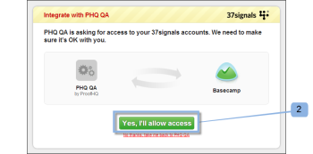

# Intégrer [!DNL Workfront Proof] à [!DNL Basecamp]

>[!IMPORTANT]
>
>Cet article fait référence aux fonctionnalités du produit [!DNL Workfront Proof] autonome. Pour plus d’informations sur la relecture dans [!DNL Adobe Workfront], voir [Relecture](../../../review-and-approve-work/proofing/proofing.md).

Si vous utilisez [!DNL Basecamp] pour la gestion de projets, vous pouvez proposer à votre équipe de projet des outils de révision et d’approbation plus riches à l’aide de [!DNL Workfront Proof].

## Comprendre l’intégration de [!DNL Basecamp] à [!DNL Workfront]

L’intégration à [!DNL Basecamp] permet aux utilisateurs et utilisatrices d’afficher, de réviser et d’approuver des épreuves dans [!DNL Basecamp]. Les utilisateurs et utilisatrices peuvent soumettre des épreuves à votre compte [!DNL Workfront Proof] et les relier à votre projet [!DNL Basecamp]. Les personnes chargées de vos révisions peuvent faire des commentaires et prendre des décisions via [!DNL Basecamp], en utilisant la mini-épreuve intégrée dans votre message Basecamp.

Lorsqu’il est intégré à [!DNL Workfront Proof], [!DNL Basecamp] propose les fonctionnalités de relecture suivantes :

* Les utilisateurs et utilisatrices peuvent examiner et approuver les épreuves dans [!DNL Basecamp Classic].
* Les utilisateurs et utilisatrices disposent d’outils de révision facilement disponibles.
* Les équipes de révision de projet reçoivent un message dans [!DNL Basecamp] avec une mini-épreuve pour révision et approbation.
* Les utilisateurs et utilisatrices peuvent basculer vers une épreuve en pleine page à des fins de révision et d’approbation.
* Les utilisateurs et utilisatrices peuvent ajouter des commentaires et des annotations aux mini-épreuves et aux épreuves en taille réelle.

  >[!NOTE]
  >
  >Une fois qu’une réponse a été ajoutée à un commentaire, ce dernier ne peut pas être modifié ni supprimé.

* Les réviseurs et réviseuses peuvent répondre aux commentaires et aux balisages d’autres réviseurs et réviseuses.

* Les utilisateurs et utilisatrices sont avertis lorsqu’une nouvelle version de l’épreuve est disponible.
* Les utilisateurs et utilisatrices qui n’utilisent pas [!DNL Workfront Proof] peuvent travailler sur une épreuve dans [!DNL Basecamp].

L’intégration de [!DNL Workfront Proof] avec [!DNL Basecamp] doit être mise en place à deux niveaux :

* Configurez [!DNL Basecamp] dans [Paramètres du compte : ](https://support.workfront.com/hc/en-us/sections/115000912147-Account-settings) cela permet d’activer l’intégration de Basecamp pour l’ensemble de votre organisation. Pour plus d’informations, voir [Activer l’intégration Basecamp avec  [!DNL Workfront Proof]](#enabling-the-basecamp-integration-with-workfront-proof).

* Configurez [!DNL Basecamp] dans [Paramètres personnels](https://support.workfront.com/hc/fr-fr/sections/115000921168-Personal-settings) : ceci permet aux créateurs et créatrices et aux personnes propriétaires des épreuves de se connecter à leur compte Basecamp personnel et d’autoriser l’accès à [!DNL Workfront Proof]. Pour plus d’informations, voir [Configurer les paramètres personnels](#configuring-personal-settings).

Vous pouvez intégrer [!DNL Workfront] à [!DNL Basecamp] ou [!DNL Basecamp Classic]. Chaque version de [!DNL Basecamp] utilise une API différente et nécessite par conséquent des procédures de configuration différentes.

Pour plus d’informations sur la configuration de [!DNL Basecamp Classic], voir [Intégrer  [!DNL Workfront Proof]  avec  [!DNL Basecamp Classic].](https://support.workfront.com/knowledge/articles/115004234707/en-us?brand_id=662728&amp;return_to=%2Fhc%2Fen-us%2Farticles%2F115004234707)

## Activer l’intégration de [!DNL Basecamp] avec [!DNL Workfront Proof]

En tant que [profils d’autorisations d’épreuve dans  [!DNL Workfront Proof]](../../../workfront-proof/wp-acct-admin/account-settings/proof-perm-profiles-in-wp.md) ou [profils d’autorisations d’épreuve dans  [!DNL Workfront Proof]](../../../workfront-proof/wp-acct-admin/account-settings/proof-perm-profiles-in-wp.md), vous pouvez configurer l’intégration de [!DNL Basecamp] pour l’ensemble du compte dans vos [Paramètres du compte](https://support.workfront.com/hc/en-us/sections/115000912147-Account-settings).

1. Dans [!UICONTROL Basecamp], recueillez les informations suivantes :

   * L’URL de votre compte [!DNL Basecamp].
   * L’URL trouvée dans la section « [!UICONTROL Mes informations] ».

1. Déconnectez-vous de [!DNL Basecamp].
1. Cliquez sur **[!UICONTROL Paramètres du compte]** en haut à droite.
1. Cliquez sur l’onglet **[!UICONTROL Intégrations]**.
1. Dans la section **[!UICONTROL [!DNL Basecamp]]**, à droite de l’intégration de **[!UICONTROL [!DNL Basecamp]]**, cliquez sur **[!UICONTROL Activer]**.

1. À côté de la version **[!UICONTROL [!DNL Basecamp]]**, vérifiez que la **[!UICONTROL version Classic]** est la version dans laquelle vous réalisez l’intégration.

1. (Le cas échéant) Si aucune URL [!DNL Basecamp] ne s’affiche, cliquez sur **[!UICONTROL Modifier]**, saisissez l’URL de votre compte [!DNL Basecamp] sans inclure « http:// », puis cliquez sur **[!UICONTROL Enregistrer]**.

1. En haut à droite de la fenêtre, cliquez sur **[!UICONTROL Paramètres]** > **[!UICONTROL Paramètres personnels]**.

1. Cliquez sur l’onglet **[!UICONTROL Intégrations]**.
1. Dans **[!DNL Basecamp]**, à droite d’**[!UICONTROL Intégration de Basecamp]**, cliquez sur **[!UICONTROL Activer]**.

1. Dans les options qui apparaissent, à droite du jeton d’API **[!UICONTROL [!DNL Basecamp]]**, cliquez sur **[!UICONTROL Modifier]**.

1. Dans la boîte de dialogue qui apparaît, tapez l’URL trouvée dans la section « [!UICONTROL Mes informations] » dans [!DNL Basecamp], puis cliquez sur **[!UICONTROL Enregistrer]**.\
   Une fois que vous avez intégré [!DNL Workfront Proof] à [!DNL Basecamp], vos utilisateurs et utilisatrices peuvent configurer leurs paramètres personnels. Pour plus d’informations sur la configuration des paramètres personnels, voir [Configuration des paramètres personnels](#configuring-personal-settings)

1. Si vous ne pouvez pas activer l’intégration [!DNL Basecamp], il se peut que votre ID de compte [!DNL Workfront Proof] ne soit pas le même que celui que vous utilisez dans [!DNL Basecamp].
1. Une fois que vous avez intégré [!DNL Workfront Proof] à [!DNL Basecamp], vos utilisateurs et utilisatrices peuvent configurer leurs paramètres personnels. Pour plus d’informations sur la configuration des paramètres personnels, voir [Configuration des paramètres personnels](#configuring-personal-settings).

## Configurer les paramètres personnels

Après avoir configuré les [paramètres du compte](https://support.workfront.com/hc/en-us/sections/115000912147-Account-settings) pour votre entreprise, chacune de vos personne chargée de la création qui crée/soumet des épreuves doit définir ses [paramètres personnels ](https://support.workfront.com/hc/fr-fr/sections/115000921168-Personal-settings).

1. Allez sur **[!UICONTROL Paramètres****personnels]**.

1. Ouvrez l’onglet **[!UICONTROL Intégrations]** (1).
1. Pour activer l’intégration de [!DNL Basecamp], cliquez sur **[!UICONTROL Activer]** (2).
1. Cliquez sur **[!UICONTROL Se connecter à votre compte [!DNL Basecamp]]** (3).\
   

1. Connectez-vous à votre compte [!DNL Basecamp] (1).\
   

1. Cliquez sur **[!UICONTROL Oui, j’autorise l’accès]** pour autoriser [!DNL Workfront Proof] à accéder à votre compte (2).\
   

1. (Facultatif) Lorsque votre intégration personnelle est active (3), vous pouvez facilement passer d’un compte [!DNL Basecamp] à l’autre.

   1. Cliquez sur **[!UICONTROL Changer de compte [!DNL Basecamp]]** (4).

      \
      Le [!UICONTROL compte Switch Basecamp] vous permet d’accéder à la page [!UICONTROL Paramètres personnels], où vous pouvez choisir les comptes [!DNL Basecamp] que vous souhaitez intégrer à votre compte [!DNL Workfront Proof].

   1. Cliquez sur **[!UICONTROL Réintégrer avec[!DNL Basecamp]]** (5) avant de choisir le compte [!DNL Basecamp].

      Cette opération permet d’actualiser la page [!UICONTROL Paramètres personnels] et d’afficher votre liste de comptes [!DNL Basecamp] la plus récente.

   1. Cliquez sur **[!UICONTROL Intégrer à ce compte]** pour le connecter à [!DNL Workfront Proof].

      \
      Vous pouvez désormais ajouter des épreuves aux projets [!DNL Basecamp].
