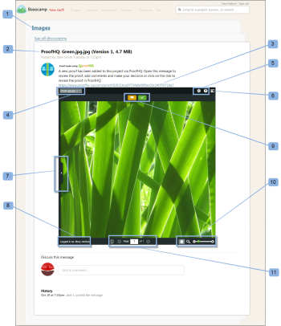

# Vérification d’un bon à tirer dans [!DNL Basecamp]

>[!IMPORTANT]
>
>Cet article fait référence à la fonctionnalité du produit autonome [!DNL Workfront Proof]. Pour plus d&#39;informations sur la vérification à l&#39;intérieur de [!DNL Adobe Workfront], voir [Proofing](../../../review-and-approve-work/proofing/proofing.md).

L&#39;intégration [!DNL Basecamp] à [!DNL Workfront Proof] vous permet de passer facilement en revue et d&#39;approuver les bons à tirer sans quitter [!DNL Basecamp].

Vous n’avez même pas besoin d’une connexion [!DNL Workfront Proof] pour utiliser tous les outils de révision afin de prendre des commentaires et des décisions sur les bons à tirer :

* Dans votre compte [!DNL Basecamp], vous recevrez un message qui comprend le BAT à vérifier (via le BAT minimaliste).
* Vous pouvez ajouter des commentaires, des annotations et prendre des décisions sur le BAT mini-BAT ou passer au BAT de page entière pour révision si vous préférez.
* Vous pouvez afficher les commentaires et les annotations des autres réviseurs et y répondre.

Pour plus d’informations sur les décisions, voir [Prise d’une décision sur un BAT dans la visionneuse de correctifs](../../../review-and-approve-work/proofing/reviewing-proofs-within-workfront/make-a-decision-on-a-proof/make-decisions-on-proof.md).

>[!NOTE]
>
> Si vous n’êtes pas un utilisateur de [!DNL Workfront Proof], vous pouvez toujours travailler sur le BAT dans [!DNL Basecamp]. Il vous suffit de saisir votre adresse électronique et votre nom d’écran. Vous pouvez également choisir de &quot;[!UICONTROL mémoriser moi]&quot; afin que vous n’ayez à entrer ces détails qu’une seule fois.

## Affichage du BAT via l&#39;email de notification

Si vous liez un BAT nouveau ou existant à [!DNL Basecamp], [!DNL Workfront Proof] enverra un email de notification de BAT à tous les réviseurs contenant :

* Le message du BAT (personnalisé ou standard) (1)
* Détails du BAT (2)
* URL personnelle (lien Atteindre le bon à tirer) (3)
* Lien vers le message du projet [!DNL Basecamp] pour vous emmener directement au BAT dans [!DNL Basecamp] (4)\
   Si des réviseurs non-[!DNL Basecamp] ont été ajoutés au BAT, leur notification électronique n’inclura pas le lien [!DNL Basecamp].
* Proof progress (5)
* Les réviseurs et leur progression individuelle (6)

>[!NOTE]
>
> Si aucune session [!DNL Basecamp] n’est ouverte dans une autre fenêtre du navigateur, vous devez vous connecter à votre compte [!DNL Basecamp] avant de pouvoir voir le message dans [!DNL Basecamp].

## Affichage du BAT via le message [!DNL Basecamp]

Lorsque vous recevez une notification par e-mail à propos d’un nouveau BAT ajouté à votre projet [!DNL Basecamp] :

1. Accédez à la page de votre projet (1).
1. Recherchez le message correspondant à votre BAT (2).\
   La page du message contient le nom du BAT (dans l’objet) (3) et un lien vers le visualiseur de BAT plein écran (4).
1. 

1. Si vous êtes connecté à votre compte [!DNL Workfront Proof] dans l’une de vos fenêtres de navigateur, vous pouvez commencer à le consulter immédiatement. Si vous ne pouvez pas voir votre nom dans le coin inférieur gauche de l’image à protéger :
1. Cliquez sur **[!UICONTROL Se connecter]** (5).
1. Saisissez votre adresse email (qui a été utilisée pour vous ajouter au BAT) (6).
1. Cliquez sur **[!UICONTROL Suivant]** et, dans une seconde zone qui s’affiche, saisissez votre mot de passe [!DNL Workfront Proof] (7).\
   Si vous ne disposez pas d’un compte [!DNL Workfront Proof], saisissez un nom public à afficher.

1. Cliquez sur **[!UICONTROL Mémoriser]** afin que vous n’ayez à saisir vos détails qu’une seule fois.\
   Vous êtes maintenant prêt à passer en revue le BAT dans [!DNL Basecamp].

## Vérification d’un bon à tirer dans [!DNL Basecamp]

Réviser un BAT dans [!DNL Basecamp] est aussi facile que de le faire dans [!DNL Workfront Proof]. Le mini-BAT de [!DNL Basecamp] vous fournit tous les outils nécessaires pour ajouter des commentaires, des annotations et prendre des décisions sur le BAT.

* Votre nom de projet [!DNL Basecamp] (1)
* Objet de la notification par email [!DNL Workfront Proof] (2)
* Lien direct vers la visionneuse de BAT complète (ouvre une vue complète de la fenêtre) (3)
* Nom et version du BAT (4)
* Menus d’action (5)
* Bouton Plein écran (6)
* Barre latérale (7)
* Nom d’utilisateur (8)
* Boutons [!UICONTROL Commentaire] et [!UICONTROL Décision] (9)
* Outils de zoom (10)
* Outils de navigation par page (11)

Il n’est pas nécessaire d’envoyer une réponse au message [!DNL Basecamp], car les commentaires et les décisions seront enregistrés sur le BAT (comme c’est le cas lors de la révision d’un BAT dans [!DNL Workfront Proof]).

## Vérification du bon à tirer de la page complète

Vous pouvez afficher le BAT en pleine page avec toutes les fonctionnalités normales de [!DNL Workfront Proof] en cliquant sur le lien contenu dans le message juste au-dessus de l’image à protéger ou sur l’icône en plein écran dans le coin supérieur droit de l’image à protéger.

L’image du BAT est toujours de la taille d’origine, mais la page elle-même est plus large que la page infaillible.

Le BAT en pleine page montre :

* Les boutons [!UICONTROL Ajouter des commentaires] et [!UICONTROL Envoyer la décision] (au lieu des commentaires et des icônes de décision affichés sur le minima) (1).
* Plus d’outils de zoom et de navigation que l’épreuve minima (2).
* Le bouton [!UICONTROL Aller à [!DNL Basecamp]] dans le coin supérieur gauche du BAT. Cliquez sur ce bouton pour revenir à votre compte [!DNL Basecamp] (3).

