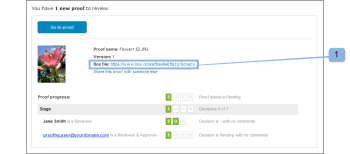

# Afficher le fichier d’origine d’une épreuve dans Box

>[!IMPORTANT]
>
>Cet article fait référence aux fonctionnalités du produit autonome [!DNL Workfront Proof]. Pour plus d’informations sur la relecture à l’intérieur d’[!DNL Adobe Workfront], voir [Relecture](../../../review-and-approve-work/proofing/proofing.md).

Si vous utilisez l’intégration [!DNL Workfront Proof] - [!DNL Box], dans Box, vous pouvez afficher le fichier d’origine utilisé pour créer une épreuve. Vous pouvez le faire de deux façons :

## Afficher le fichier dans [!DNL Box] via la notification par e-mail de l’épreuve

Lorsqu’une nouvelle épreuve ou version est créée à partir d’un fichier [!DNL Box], le créateur ou la créatrice et les réviseurs et réviseuses reçoivent une notification par e-mail contenant un lien vers le fichier dans votre compte [!DNL Box] (1).\

## Afficher le fichier dans [!DNL Box] via la page [!UICONTROL Détails de l’épreuve]

La section [!UICONTROL Autres options de partage] de la page [!UICONTROL Détails de l’épreuve] de l’épreuve que vous avez créée à partir d’un fichier [!DNL Box] comprend un lien vers le fichier dans votre compte [!DNL Box] (1).

