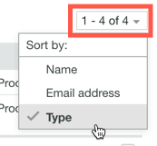
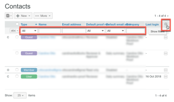
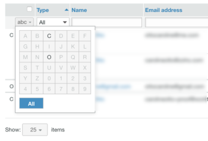

# Gérer vos contacts dans [!DNL Workfront Proof]

>[!IMPORTANT]
>
>Cet article fait référence à la fonctionnalité du produit autonome [!DNL Workfront Proof]. Pour plus d’informations sur la relecture dans [!DNL Adobe Workfront], voir [Relecture](../../../review-and-approve-work/proofing/proofing.md).

Vous pouvez gérer vos collègues, membres et personnes invitées sur la page Contacts.

## Ouvrir la page Contacts

1. Cliquez sur **[!UICONTROL Contacts]** dans la barre latérale de navigation de gauche.
1. (Facultatif) Cliquez sur **[!UICONTROL Modifier l’affichage]**, puis sélectionnez une option pour spécifier si vous souhaitez obtenir un affichage par contact ou par société.

## Filtrer les contacts

1. Cliquez sur **[!UICONTROL Contacts]** dans la barre latérale de navigation de gauche.
1. Cliquez sur l’en-tête de colonne selon lequel vous souhaitez effectuer un tri.
Ou
Sélectionnez une option dans le menu **[!UICONTROL Trier]** dans le coin supérieur droit de la page Contacts.

1. 

1. Le triangle sur l’en-tête d’une colonne indique l’ordre de tri. Pointé vers le haut, il indique l’ordre croissant ; pointé vers le bas, il indique l’ordre décroissant.

## Filtrer les contacts

1. Cliquez sur **[!UICONTROL Contacts]** dans la barre latérale de navigation de gauche.
1. Cliquez sur l’icône **[!UICONTROL Filtrer]** à l’extrêmité droite des en-têtes de colonne pour afficher les options de filtrage sous les en-têtes de colonne.
1. Sélectionnez les [!UICONTROL options de filtrage] dans les menus déroulants, saisissez ce que vous souhaitez dans les zones de filtrage qui apparaissent sous chaque en-tête de colonne, puis cliquez à nouveau sur l’icône **[!UICONTROL Filtrer]** pour appliquer les options.
1. 

1. Ou
1. Sélectionnez la première lettre du nom du contact souhaité.
1. 

## Gérer un ou plusieurs contacts

1. Cliquez sur **[!UICONTROL Contacts]** dans la barre latérale de navigation de gauche.
1. Sélectionnez la case à cocher d’un ou plusieurs contacts.
1. Effectuez l’une des opérations suivantes :

   * Cliquez sur **[!UICONTROL Ajouter au groupe]** pour ajouter les contacts sélectionnés à un groupe.

     

   * Cliquez sur **[!UICONTROL Supprimer]** puis sur une option du menu déroulant pour supprimer le contact des épreuves ou des groupes.
   * Cliquez sur **[!UICONTROL Plus]** > **[!UICONTROL Envoyer un rappel des dernières épreuves]** pour envoyer un e-mail de rappel aux contacts sélectionnés concernant les épreuves en retard.

   * Cliquez sur **[!UICONTROL Plus]** > **[!UICONTROL Exporter les contacts vers CSV]** pour exporter les contacts sélectionnés vers un fichier CSV.

   * Cliquez sur **[!UICONTROL Supprimer les contacts]** pour supprimer les contacts sélectionnés de votre liste.

     
La suppression d’un contact ne signifie pas qu’un utilisateur est supprimé de votre compte. Cependant, si un administrateur ou un administrateur de facturation supprime une personne de la liste de contacts, cette personne est complètement supprimée du compte de votre organisation.

   * Cliquez sur l’icône **[!UICONTROL Plus]** à la fin de la ligne d’un contact et utilisez l’une des options du menu déroulant qui apparaît.

     Ces options sont différentes selon les types de contacts. Pour plus d’informations, voir [Comprendre les utilisateurs et utilisatrices, les membres et les personnes invitées dans [!DNL Workfront Proof]](../../../workfront-proof/wp-mnguserscontacts/contacts/use-members-guests.md).

## Importer des contacts

Vous pouvez importer des contacts à partir d’un fichier CSV.

1. Cliquez sur **[!UICONTROL Contacts]** dans la barre latérale de navigation de gauche.
1. Sur la page Contacts, cliquez sur **[!UICONTROL Plus]** > **[!UICONTROL Importer des contacts]** pour ajouter des contacts à votre liste.

1. Sur la page Importer des personnes qui s’affiche, cliquez sur **[!UICONTROL Choisir le fichier]**.
1. Sélectionnez la méthode de séparation des champs dans le fichier.
1. Cliquer sur **[!UICONTROL Enregistrer]**.

   * Le fichier CSV doit comporter au moins une colonne intitulée « E-mail » (contenant les adresses e-mail).
   * Vous pouvez également ajouter des colonnes supplémentaires pour le « Nom », la « Société », le « Téléphone » et le « Téléphone mobile ».
   * Au lieu de « Nom », vous pouvez utiliser deux colonnes pour « Prénom » et « Nom ». Si vous utilisez des colonnes distinctes pour le nom et le prénom, vous devez vous assurer de ne pas inclure également une colonne « Nom ».
