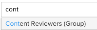

# Ajouter des groupes à une épreuve

>[!IMPORTANT]
>
>Cet article fait référence aux fonctionnalités du produit autonome [!DNL Workfront Proof]. Pour plus d’informations sur la relecture à l’intérieur d’[!DNL Adobe Workfront], voir [Relecture](../../../review-and-approve-work/proofing/proofing.md).

Ajoutez un groupe à une épreuve pour envoyer automatiquement le contenu à toutes les personnes membres du groupe.

Pour plus d’informations sur la création d’un groupe, voir [Créer des groupes de relecture à l’aide de  [!DNL Workfront Proof]](../../../workfront-proof/wp-mnguserscontacts/groups/create-proofing-groups.md).

1. Commencez à créer une épreuve à l’aide de l’une des méthodes suivantes :

   * Créez une épreuve standard.

     Pour plus d’informations, voir [Générer des épreuves dans  [!DNL Workfront Proof]](../../../workfront-proof/wp-work-proofsfiles/create-proofs-and-files/generate-proofs.md).

   * Créez une version d’épreuve.

     Pour plus d’informations, voir :
   * Faites une copie d’une épreuve. Pour plus d’informations, voir <a href="../../../workfront-proof/wp-work-proofsfiles/create-proofs-and-files/copy-proofs.md" class="MCXref xref">Copier des épreuves dans [!DNL Workfront Proof]</a>.

1. Dans la section **[!UICONTROL Workflow]**, commencez à saisir le nom du groupe dans le **[!UICONTROL type de nom de contact ou d’adresse e-mail pour ajouter un champ de personne destinataire]**. 
1. Sélectionnez le nom du groupe.
Les membres du groupe s’affichent désormais. 
1. (Facultatif) Modifiez le **Rôle du BAT** ou **Alertes par e-mail** d’un membre individuel à l’aide des menus déroulants.
Pour plus d’informations, voir <a href="../../../workfront-proof/wp-work-proofsfiles/share-proofs-and-files/manage-proof-roles.md" class="MCXref xref">Gestion des rôles de BAT dans [!DNL Workfront Proof]</a> et <a href="../../../workfront-proof/wp-emailsntfctns/email-alerts/config-email-notification-settings-wp.md" class="MCXref xref">Configuration des paramètres de notification par e-mail dans [!DNL Workfront Proof]</a>.
1. (Facultatif) Supprimez une personne membre du groupe de l’épreuve en pointant le curseur de la souris sur les informations de l’utilisateur ou de l’utilisatrice et en cliquant sur le bouton **[!UICONTROL X]**.
Ou
Supprimez tous les membres de l’épreuve en cliquant sur **[!UICONTROL Tout supprimer]**.
1. Continuez à créer l’épreuve, comme décrit dans la section <a href="../../../workfront-proof/wp-work-proofsfiles/create-proofs-and-files/generate-proofs.md" class="MCXref xref">Générer des épreuves dans [!DNL Workfront Proof]</a> ou <a href="../../../workfront-proof/wp-work-proofsfiles/create-proofs-and-files/copy-proofs.md" class="MCXref xref">Copier des épreuves dans [!DNL Workfront Proof]</a>. 
