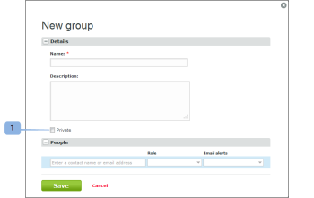
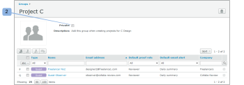

# Rendre les groupes privés à l’aide de [!DNL Workfront Proof]

>[!IMPORTANT]
>
>Cet article fait référence à la fonctionnalité du produit autonome [!DNL Workfront Proof]. Pour plus d’informations sur la relecture dans [!DNL Adobe Workfront], voir [Relecture](../../../review-and-approve-work/proofing/proofing.md).

En rendant votre groupe privé, vous êtes la seule personne autorisée à le consulter, l’utiliser, le modifier ou le supprimer. Si le groupe n’est pas privé, toutes les personnes membres de votre compte peuvent afficher et utiliser le groupe.

## Définir un nouveau groupe comme étant privé

Pour rendre un nouveau groupe privé, procédez comme suit :

1. Accédez à **[!UICONTROL Groupes]** sur le côté gauche de l’écran.
1. Sélectionnez l’option **[!UICONTROL Privé]** sur la page [!UICONTROL Nouveau groupe] lors de la création du groupe. (1)

## Définir un groupe existant comme étant privé

Pour rendre un groupe existant privé, procédez comme suit :

1. Accédez à **[!UICONTROL Groupes]** sur le côté gauche de l’écran.
1. Activez l’option **[!UICONTROL Privé]** sur la page de détails du groupe. (2)

