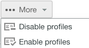

# Créer et gérer des profils personnalisés à l’aide de [!DNL Workfront Proof]

>[!IMPORTANT]
>
>Cet article fait référence à la fonctionnalité du produit autonome [!DNL Workfront Proof]. Pour plus d’informations sur la relecture dans [!DNL Adobe Workfront], voir [Relecture](../../../review-and-approve-work/proofing/proofing.md).

L’équipe d’administration responsable de la facturation peut créer et gérer des profils personnalisés pour spécifier les actions que les utilisateurs et les utilisatrices peuvent effectuer dans le compte de votre entreprise et dans les paramètres du compte.

Cette fonctionnalité est réservée aux comptes Premium.

## Autorisations de module {#module-permissions}

Les autorisations de module vous permettent de décider quel accès accorder à vos utilisateurs et à vos utilisatrices sur leurs propres éléments et sur les éléments appartenant à d’autres personnes au sein du compte.

La section Accès de base détermine si les personnes peuvent lire, créer, modifier et supprimer leurs propres éléments dans le compte.

La section [!UICONTROL Administration des données] détermine les droits dont disposent les utilisateurs et les utilisatrices sur les éléments appartenant à d’autres personnes au sein du compte.

Les deux sections vous permettent d’accorder des droits sur les éléments suivants du compte :

* Épreuves
Pour plus d’informations, consultez la section [Générer des épreuves dans  [!DNL Workfront Proof]](../../../workfront-proof/wp-work-proofsfiles/create-proofs-and-files/generate-proofs.md).

* Fichiers
Pour plus d’informations, consultez la section [Charger des fichiers et du contenu web dans  [!DNL Workfront Proof]](../../../workfront-proof/wp-work-proofsfiles/create-proofs-and-files/upload-files-web-content.md).

* Dossiers publics
Pour plus d’informations, consultez la section [Présentation des autorisations de dossier dans  [!DNL Workfront Proof]](../../../workfront-proof/wp-work-proofsfiles/organize-your-work/folder-permissions.md).

* Dossiers privés
Pour plus d’informations, consultez la section [Présentation des autorisations de dossier dans  [!DNL Workfront Proof]](../../../workfront-proof/wp-work-proofsfiles/organize-your-work/folder-permissions.md).

* Contacts
Pour plus d’informations, consultez la section [Contacts](https://support.workfront.com/hc/en-us/sections/115000920808-Contacts).

* Groupes
Pour plus d’informations, consultez la section [Groupes](https://support.workfront.com/hc/en-us/sections/115000920828-Groups).

* Balises
Pour plus d’informations, consultez la section [Créer et gérer des balises dans  [!DNL Workfront Proof]](../../../workfront-proof/wp-work-proofsfiles/organize-your-work/create-and-manage-tags.md).

* Vues personnalisées
Pour plus d’informations, consultez la section [Créer et gérer des vues personnalisées dans  [!DNL Workfront Proof]](../../../workfront-proof/wp-work-proofsfiles/manage-your-work/create-and-manage-custom-views.md).

## Autorisations administratives {#administrative-permissions}

Dans cette section, vous pouvez accorder des autorisations d’administration à vos utilisateurs et utilisatrices. Certaines autorisations se complètent et, lorsqu’elles sont sélectionnées, accordent automatiquement d’autres autorisations nécessaires à l’exécution de la tâche. Par exemple, l’autorisation de gestion des profils d’autorisation permet automatiquement de gérer les utilisateurs et les utilisatrices du compte.

Vous pouvez accorder les autorisations suivantes :

* Gestion des paramètres du compte
Pour plus d’informations, consultez la section [Paramètres du compte](https://support.workfront.com/hc/en-us/sections/115000912147-Account-settings).

* Gestion des utilisateurs et des utilisatrices
Pour plus d’informations, consultez la section [Utilisateurs et utilisatrices](https://support.workfront.com/hc/en-us/sections/115000911887-Users).

* Gestion des décisions
Pour plus d’informations, consultez la section [Prendre une décision sur une épreuve dans la visionneuse de relecture](../../../review-and-approve-work/proofing/reviewing-proofs-within-workfront/make-a-decision-on-a-proof/make-decisions-on-proof.md).

* Gestion des personnes partenaires
Pour plus d’informations, consultez la section [Personnes partenaires](https://support.workfront.com/hc/en-us/sections/115000912107-Partner-accounts).

* Gestion des applications
Pour plus d’informations, consultez la section [Intégrations](https://support.workfront.com/hc/en-us/categories/115000588707-Integrations).

* Gestion des champs personnalisés
Pour plus d’informations, consultez la section [Créer et gérer des champs personnalisés dans  [!DNL Workfront Proof]](../../../workfront-proof/wp-acct-admin/account-settings/create-and-manage-custom-fields.md).

* Gestion de la zone de dépôt
Pour plus d’informations, consultez la section [Zone de dépôt](../../../workfront-proof/wp-work-proofsfiles/create-proofs-and-files/dropzone.md).

* Gestion des workflows avancés
Pour plus d’informations, consultez la section [Vue d’ensemble des workflows automatisés](../../../review-and-approve-work/proofing/proofing-overview/automated-workflow.md).

* Gestion de l’authentification unique
Pour plus d’informations, consultez la section [Authentification unique dans  [!DNL Workfront Proof]](../../../workfront-proof/wp-acct-admin/managing-security/single-sign-on-overview.md).

* Affichage de l’historique du compte
Pour plus d’informations, consultez la section [Présentation du journal d’audit d’activité de  [!DNL Workfront Proof] ](../../../workfront-proof/wp-work-proofsfiles/basic-features/activity-audit-trail.md).

* Affichage des sauvegardes de compte
Pour plus d’informations, consultez la section [Sauvegarder vos données  [!DNL Workfront Proof] ](../../../workfront-proof/wp-work-proofsfiles/organize-your-work/back-up-data.md).

* Gestion des facturations
Pour plus d’informations, consultez la section [Gérer votre facturation](https://support.workfront.com/hc/en-us/sections/115000912187-Managing-your-billing).

* Création de comptes satellites
Pour plus d’informations, consultez la section [Configurer un compte satellite dans  [!DNL Workfront Proof]](../../../workfront-proof/wp-acct-admin/satellite-accounts/configure-sat-acct-in-wp.md).

* Vidage de la corbeille
Pour plus d’informations, consultez la section [Restaurer et vider la corbeille dans  [!DNL Workfront Proof]](../../../workfront-proof/wp-work-proofsfiles/manage-your-work/restore-and-empty-trash.md).

* Gestion des profils d’autorisation
Pour plus d’informations, consultez la section [Profils d’autorisations d’épreuve dans  [!DNL Workfront Proof]](../../../workfront-proof/wp-acct-admin/account-settings/proof-perm-profiles-in-wp.md).

* Afficher les analyses

## Créer un profil personnalisé

1. Accédez à **[!UICONTROL Paramètres du compte]**, puis cliquez sur l’onglet **[!UICONTROL Profils]**.

1. Cliquez sur **[!UICONTROL Créer un profil]**.

1. Dans la section **[!UICONTROL Détails du profil]** :

   1. Dans le champ **[!UICONTROL Nom]**, saisissez le nom du profil personnalisé.
   1. Sélectionnez **[!UICONTROL Activer le profil]**. 

1. Dans la section **[!UICONTROL Autorisations de module]** :

   1. Sélectionnez les autorisations pour **Accès de base**.
   1. **Administration des données**. Pour plus d’informations, voir [Autorisations de module](#module-permissions).

1. Dans la section **[!UICONTROL Autorisations administratives]**, sélectionnez les autorisations pour les fonctions d’administration.

   Pour plus d’informations, voir [Autorisations administratives](#administrative-permissions).

1. Cliquez sur **[!UICONTROL Créer]**.
Le nouveau profil est désormais disponible dans l’onglet **[!UICONTROL Utilisateurs et utilisatrices]**.

1. (Facultatif) Attribuez le nouveau profil à des comptes d’utilisateurs ou d’utilisatrices nouveaux et existants.
Pour plus d’informations, voir [Profils d’autorisations d’épreuve dans  [!DNL Workfront Proof]](../../../workfront-proof/wp-acct-admin/account-settings/proof-perm-profiles-in-wp.md).

## Activer et désactiver un profil {#enabling-and-disabling-a-profile}

1. Accédez à **[!UICONTROL Paramètres du compte]**, puis cliquez sur l’onglet **[!UICONTROL Profils]**.

1. Sélectionnez le profil que vous souhaitez activer ou désactiver.
Ou
Pour activer ou désactiver plusieurs profils simultanément, sélectionnez les profils manuellement ou sélectionnez **[!UICONTROL Nom]** pour sélectionner tous les profils personnalisés.
   

1. Cliquez sur le menu déroulant **[!UICONTROL Plus]** puis sur l’une des options suivantes, selon que vous souhaitez activer ou désactiver le profil :

   * **Activer les profils :** le profil devient actif et visible dans les menus [!DNL Workfront Proof].
   * **Désactiver les profils :** une boîte de dialogue de confirmation s’affiche. Sélectionnez **[!UICONTROL Oui]** pour confirmer. Le profil devient inactif et est supprimé des menus [!DNL Workfront Proof].

     >[!NOTE]
     >
     >Un profil désactivé ne peut plus être affecté à des utilisateurs ou utilisatrices du compte. Si des utilisateurs et utilisatrices avec ce profil existent dans le compte, sélectionnez un autre profil pour eux avant que le profil ne soit désactivé.

     

## Copier un profil

Créez des copies d’un profil existant pour configurer plusieurs profils avec des autorisations similaires.

1. Accédez à **[!UICONTROL Paramètres du compte]**, puis cliquez sur l’onglet **[!UICONTROL Profils]**.

1. Cliquez sur le nom du profil, puis sur le bouton **[!UICONTROL Copier le profil]**.

   

   Le profil copié apparaît désormais dans la liste des profils. Il porte le nom du profil d’origine précédé du mot « Copie ».

   

1. (Facultatif) Pour activer le profil copié, voir [Activer et désactiver un profil](#enabling-and-disabling-a-profile).
1. (Facultatif) Pour apporter des modifications au profil copié, voir [Modifier un profil](#editing-a-profile).

## Modifier un profil {#editing-a-profile}

Si vous modifiez un profil, les mises à jour sont appliquées à tous les utilisateurs et toutes les utilisatrices auxquels ce profil est actuellement affecté.

1. Accédez à **[!UICONTROL Paramètres du compte]**, puis cliquez sur l’onglet **[!UICONTROL Profils]**.

1. Cliquez sur le nom du profil que vous souhaitez modifier.
1. Apportez les modifications nécessaires au nom ou aux autorisations du profil. Ces modifications sont automatiquement enregistrées et mises à jour.
Pour plus d’informations sur les autorisations, voir [Autorisations de module](#module-permissions) et [Autorisations administratives](#administrative-permissions).

>[!NOTE]
>
>Par défaut, les profils [!DNL Workfront Proof] sont visibles dans la liste des profils mais ne peuvent pas être modifiés.

## Supprimer un profil

1. Accédez à **[!UICONTROL Paramètres du compte]**, puis cliquez sur l’onglet **[!UICONTROL Profils]**.

1. Sélectionnez le ou les profils que vous souhaitez supprimer.
1. Cliquez sur l’icône **[!UICONTROL Corbeille]** en haut de la page.

   

1. Cliquez sur **[!UICONTROL Oui]** dans la **[!UICONTROL Boîte de dialogue Confirmer]** qui s’affiche.

1. Si le profil est attribué à un utilisateur ou une utilisatrice, utilisez le menu déroulant de la boîte de dialogue pour sélectionner un autre profil à affecter à cet utilisateur ou cette utilisatrice. Cliquez sur **[!UICONTROL Oui]** pour confirmer.

   

>[!NOTE]
>
>Il n’est pas possible de supprimer des profils standard du compte. Il est possible de désactiver les profils standard si vous ne souhaitez pas les utiliser dans votre compte.

Pour plus d’informations sur la désactivation des profils, voir [Activer et désactiver un profil](#enabling-and-disabling-a-profile).
