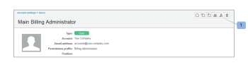
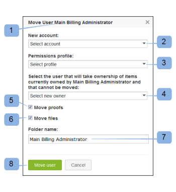

# Déplacer des utilisateurs et utilisatrices entre plusieurs comptes à l’aide de [!DNL Workfront Proof]

>[!IMPORTANT]
>
>Cet article fait référence aux fonctionnalités du produit autonome [!DNL Workfront Proof]. Pour plus d’informations sur la relecture dans [!DNL Adobe Workfront], voir [Relecture](../../../review-and-approve-work/proofing/proofing.md).

Si vous êtes un administrateur ou une administratrice [!DNL Workfront] Proof et que vous disposez de plusieurs comptes satellites connectés à votre compte principal, vous pouvez déplacer les utilisateurs et utilisatrices entre tous ces comptes.

## Déplacer des utilisateurs et utilisatrices entre des comptes connectés

1. Cliquez sur **[!UICONTROL Paramètres]** > **[!UICONTROL Paramètres du compte]**.

1. Ouvrez l’onglet **[!UICONTROL Utilisateurs et utilisatrices]**.
1. Cliquez sur l’icône **[!UICONTROL Déplacer l’utilisateur ou l’utilisatrice]** (1). 

1. Dans la zone Déplacer l’utilisateur ou l’utilisatrice qui s’affiche, confirmez l’utilisateur ou l’utilisatrice à déplacer (1).
1. Sélectionnez un compte de destination dans la liste des comptes connectés (2).
1. Attribuez l’autorisation de profil (3) que cet utilisateur ou cette utilisatrice doit posséder sur le nouveau compte.
1. Sélectionnez un utilisateur (4) qui doit s’approprier les éléments qui ne seront pas déplacés.
Cela inclut les éléments que vous déciderez de laisser sur l’ancien compte et les éléments qui ne peuvent pas être déplacés (voir [Éléments qui ne peuvent pas être déplacés](https://support.workfront.com/knowledge/articles/115004087708/en-us?brand_id=662728&return_to=%2Fhc%2Fen-us%2Farticles%2F115004087708#Items-that-can't-be-moved) ci-dessous).

1. Cochez les cases si vous souhaitez déplacer les épreuves (5) et les fichiers (6) avec l’utilisateur ou l’utilisatrice.
1. Donnez un nom au dossier (7) dans lequel tous les éléments déplacés seront placés sur le nouveau compte.
1. Cliquez sur **[!UICONTROL Déplacer l’utilisateur ou l’utilisatrice]** (8) pour lancer le processus.
   

Si vous choisissez de déplacer l’utilisateur ou l’utilisatrice sans ses épreuves et ses fichiers, cette action sera exécutée immédiatement. Si vous choisissez de déplacer l’utilisateur ou l’utilisatrice avec ses épreuves et ses fichiers, le profil de l’utilisateur ou de l’utilisatrice sera immédiatement réaffecté, mais les épreuves et les fichiers apparaîtront progressivement sur le compte de destination, car cette opération nécessite du temps pour transférer les données.

Selon le nombre de fichiers et le processus de déplacement des épreuves, le temps de déplacement peut aller de quelques minutes à quelques heures.

>[!NOTE]
>
>Si vous pensez que le processus prend plus de temps que prévu ou que les épreuves et/ou les fichiers déplacés n’apparaissent pas sur le nouveau compte, contactez notre équipe d’assistance.

## Éléments qui ne peuvent pas être déplacés.

### Dossiers créés ou détenus par la personne déplacée

En raison de la nature des différentes autorisations appliquées aux dossiers et à leur contenu (par exemple, ils peuvent être partagés avec d’autres utilisateurs, utilisatrices et comptes), nous ne pouvons pas déplacer les structures de dossiers avec l’utilisateur ou l’utilisatrice.

Si un dossier appartient à la personne déplacée, la propriété est transférée à la personne sélectionnée (4) dans la fenêtre contextuelle « Déplacer l’utilisateur ou l’utilisatrice ».

>[!NOTE]
>
>Si un dossier a été créé par la personne déplacée, elle en reste la personne qui l’a créé, seule la propriété est transférée. Le dossier reste visible pour la personne déplacée dans la barre latérale de son nouveau compte. La personne déplacée disposera toujours d’un accès en lecture seule aux éléments placés dans ces dossiers.

Si vous ne souhaitez pas que la personne déplacée conserve ces autorisations ou que la personne déplacée ne souhaite pas consulter ses dossiers sur l’ancien compte, la solution consiste à supprimer les dossiers comme suit :

1. Créez un dossier sur l’ancien compte.
1. Déplacez tous les éléments des dossiers de la personne déplacée vers le dossier nouvellement créé.
1. Supprimez tous les dossiers laissés par la personne déplacée.

### Jeux de versions avec différentes personnes propriétaires

Si une épreuve comporte plusieurs versions et que chacune d’elles appartient à une personne différente, les versions détenues par la personne déplacée ne seront pas déplacées. La propriété de ces versions sera transférée à une autre personne selon votre choix (4) dans la zone Déplacer l’utilisateur ou l’utilisatrice. (Pour plus d’informations, voir .)

>[!NOTE]
>
>Une personne déplacée doit posséder toutes les versions d’épreuve dans le jeu pour que l’épreuve soit déplacée.

### Groupes

Les groupes devront être recréés par la personne déplacée sur son nouveau compte. Pour plus d’informations, consultez la section [Créer des groupes de relecture à l’aide de  [!DNL Workfront Proof]](../../../workfront-proof/wp-mnguserscontacts/groups/create-proofing-groups.md).

### Vues personnalisées

Les vues personnalisées personnelles devront être recréées par la personne déplacée sur son nouveau compte. Pour plus d’informations, consultez la section [Créer et gérer des vues personnalisées dans  [!DNL Workfront Proof]  Proof](../../../workfront-proof/wp-work-proofsfiles/manage-your-work/create-and-manage-custom-views.md).

### Champs personnalisés

Les champs personnalisés ne peuvent pas être déplacés et les données des champs personnalisés seront perdues. Assurez-vous donc de générer les rapports sur les éléments requis avant le déplacement.

### Modèles de workflows automatisés

Les modèles de workflow automatisés doivent être recréés sur le nouveau compte, mais les étapes seront conservées sur les épreuves déplacées créées avec les modèles.

### Actions sur les commentaires

Les actions sur les commentaires restent sur les épreuves, mais il ne sera plus possible de les utiliser comme filtre. La solution serait de créer des actions correspondantes sur le nouveau compte et de marquer à nouveau les commentaires avec les nouvelles actions si nécessaire.
