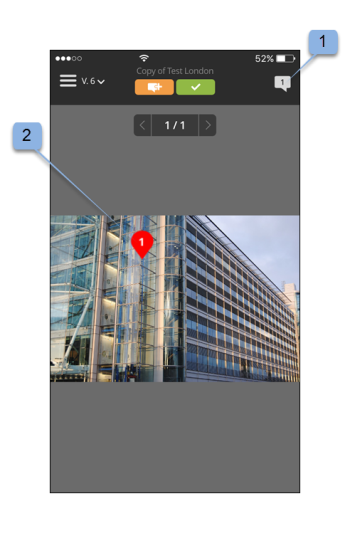
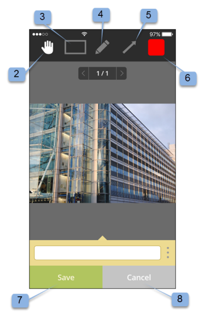

# Application mobile de l’épreuve Workfront

>[!IMPORTANT]
>
>Cet article fait référence à la fonctionnalité du produit autonome [!DNL Workfront Proof]. Pour plus d&#39;informations sur la vérification à l&#39;intérieur de [!DNL Adobe Workfront], voir [Proofing](../../../review-and-approve-work/proofing/proofing.md).

Téléchargez l’application [!DNL Workfront Proof] depuis Apple App Store ou Google Store pour qu’elle soit productive où que vous soyez. L’application [!DNL Workfront Proof] dispose des fonctionnalités suivantes sur iPhone et iPod Touch :

* Affichage, révision et approbation de BAT statiques et audio-visuels
* Afficher, ajouter et répondre aux commentaires
* Gérer vos BAT via votre tableau de bord et vos vues

Vous n’avez pas besoin d’être un utilisateur de [!DNL Workfront Proof] (c’est-à-dire de disposer de vos propres informations de connexion) pour passer en revue et approuver un BAT via l’application iOS. Tant que vous téléchargez l’application sur votre appareil iOS et accédez à votre URL personnelle via votre application de messagerie iOS, vous pouvez la consulter et l’approuver en déplacement.

## Exigences relatives aux périphériques

Nécessite iOS 7.0 ou version ultérieure. Android 4.0 et versions ultérieures. Compatible avec iPhone, iPad et iPod touch.

## Téléchargement et installation de l’application

>[!IMPORTANT]
>
>L’application mobile Workfront Proof n’est plus prise en charge et est disponible en l’état.  Aucun problème dans l’application ne sera résolu.

Pour les appareils iOS, veillez à désinstaller l’application [!DNL Workfront Proof] précédente pour les appareils iOS avant d’installer la nouvelle application.

L’application [!DNL Workfront Proof] détecte automatiquement le type d’appareil que vous utilisez. Si vous souhaitez utiliser l’application sur votre tablette, voir [[!DNL Workfront Proof] application mobile pour tablettes](../../../workfront-proof/wp-mobile/wp-mobile-apps/wp-mobile-app-tablet.md).

>[!NOTE]
>
>Il n’est pas possible de consulter des fichiers ou des fichiers audio de SWF, tels que MP3 sur les appareils iOS, en raison des limitations logicielles des appareils mobiles. Si vous souhaitez passer en revue un BAT créé à partir d’un fichier de SWF ou d’un fichier audio sur un appareil mobile, convertissez-le dans un format pris en charge avant de le transférer vers [!DNL Workfront Proof].

## Prise en main de l’application

Vous n’avez pas besoin d’être un utilisateur [!DNL Workfront Proof] pour commencer à utiliser l’application. Installez simplement l’application sur votre appareil et cliquez sur un lien **[!UICONTROL Atteindre le bon à tirer]** dans votre notification électronique. L’application démarre et charge automatiquement le BAT.

Si vous êtes un utilisateur [!DNL Workfront Proof], vous pouvez vous connecter à l’application avant d’ouvrir un bon à tirer. L’application vous permet de parcourir tous les bons à tirer partagés avec vous et de passer facilement d’un formulaire à l’autre.

1. Ouvrez l’application.
1. Saisissez votre adresse électronique et votre mot de passe, puis appuyez sur **[!UICONTROL Login]**.

   Ou

   Utilisez l’authentification unique, si elle est configurée sur votre compte [!DNL Workfront Proof].

   Vous pouvez utiliser l&#39;option **[!UICONTROL Mot de passe oublié]** si vous ne vous souvenez pas de votre mot de passe.

## Le tableau de bord

Une fois que vous êtes connecté à votre compte [!DNL Workfront Proof], le tableau de bord s’affiche. Ici, vous pouvez facilement accéder à vos bons à tirer. Vous pouvez ouvrir l’une des vues disponibles, Mes bons à tirer et Tous les bons à tirer. Vous pouvez également appuyer sur le nom de l’un de vos BAT récents pour accéder directement à la visionneuse de BAT.

Par défaut, le tableau de bord ouvre la vue Total des bons à tirer . Cette vue affiche tous les bons à tirer dont vous êtes le propriétaire ou qui ont été partagés avec vous. Vous pouvez modifier la vue en appuyant sur la barre supérieure de la page pour ouvrir un menu déroulant contenant les options [!UICONTROL À l’heure ], [!UICONTROL À risque], [!UICONTROL En retard] et [!UICONTROL Récent]. Pour ouvrir un BAT dans n’importe quelle vue, faites défiler la liste vers le bas pour trouver le BAT de votre choix, puis appuyez sur son nom pour accéder à la visionneuse de BAT.

| **Sur l’affichage de l’heure** | Affiche tous les bons à tirer actifs de votre compte que vous êtes autorisé à voir et qui ne comportent aucune date limite ou qui se trouvent dans un délai supérieur à 24 heures. |
|---|---|
| **À l’affichage des risques** | Affiche tous les bons à tirer pour lesquels la date limite est inférieure à 24 heures. |
| **Affichage en retard** | Répertorie tous les BAT pour lesquels toutes les actions pour lesquelles la date limite n’est pas respectée ne sont pas terminées. |
| **Vue récente** | Inclut les bons à tirer récemment consultés par vous-même et que vous détenez, ainsi que les autorisations à afficher selon vos autorisations de profil et qui ont été partagés avec vous. Cette vue affiche uniquement les bons à tirer que vous avez vous-même ouverts (via la visionneuse [!DNL Workfront Proof] ou via la page Détails du bon à tirer). |
| **Lien d’email** | Pour ouvrir un BAT à partir de votre email, ouvrez simplement l&#39;email dans votre application de messagerie, cliquez sur le lien du bouton [!UICONTROL Aller au BAT] dans l&#39;email (1) et vous serez redirigé vers le BAT dans l&#39;application [!DNL Workfront Proof]. |

{style="table-layout:auto"}

## Vérification d’un BAT statique dans l’application

Lorsque vous ouvrez un BAT dans l’application mobile, vous pouvez effectuer les opérations suivantes :

* Lecture et réponse aux commentaires laissés par les autres validants (1 - le chiffre visible sur l&#39;icône indique le nombre de commentaires laissés sur le BAT, si aucun commentaire n&#39;a été laissé sur le BAT, ce bouton affichera 0 et sera grisé).
* Ajouter des commentaires et des annotations (2).
* La visibilité du bouton Commentaire et Décision dépend de votre rôle de BAT.
* Prenez une décision (3).
* Accédez au menu (4).
* Mettez le BAT à l’échelle en pinçant l’écran.
  

## Ajout de commentaires et de réponses

1. Lorsque vous avez ouvert un BAT, appuyez sur le bouton **[!UICONTROL Ajouter un commentaire]** (1).

   

1. Saisissez votre commentaire (2).

   

1. Cliquer sur **[!UICONTROL Enregistrer]**.

## Lecture et réponse aux commentaires

1. Ouvrez le BAT, puis appuyez sur l’icône de légende dans le coin supérieur droit pour afficher la liste de commentaires (1) et choisir le commentaire à réviser.
1. Appuyez sur l’épingle pour ouvrir le commentaire qui lui est associé (2).

   

1. Effectuez l’une des opérations suivantes :

   * Pour répondre à un commentaire, appuyez sur le bouton **[!UICONTROL Répondre]** (3).
   * Pour revenir à l’image du BAT, appuyez sur l’icône [!UICONTROL callout] .
   * Pour afficher le commentaire complet et ses réponses, appuyez sur le commentaire lui-même.

     

   * Pour appliquer une action à un commentaire :

      1. Ouvrez un commentaire.
      1. Appuyez sur **[!UICONTROL Répondre]**.
      1. Ouvrez le menu [!UICONTROL actions] sur le côté droit du champ de texte (1).
      1. Appuyez sur **[!UICONTROL Ajouter une action]** (2).

         

         Pour plus d’informations sur les actions, voir [Utilisation d’actions sur les commentaires de BAT](../../../review-and-approve-work/proofing/reviewing-proofs-within-workfront/comment-on-a-proof/use-actions-on-comments-in-viewer.md).

## Ajouter des balises

Vous pouvez ajouter une annotation (par exemple, une zone surlignant une zone du BAT) et saisir un commentaire associé à cette annotation. Vous pouvez également faire un commentaire sans ajouter de marque-up. Et vous pouvez ajouter plusieurs annotations à un seul commentaire.

1. Sur un BAT que vous avez ouvert, appuyez sur **Ajouter un commentaire** (1).

   

1. Choisissez entre le [!UICONTROL mode Panoramique] (2), l&#39;[!UICONTROL outil de rectangle] (3), le [!UICONTROL dessin à main libre] (4) ou l&#39;outil [!UICONTROL flèche] (5)).

   Vous pouvez également modifier la couleur de la ligne de l’annotation (6).

1. Pour tracer une annotation sur le BAT, appuyez sur l&#39;écran puis déplacez votre doigt sur le BAT.

   Vous n’avez pas besoin d’ajouter du texte pour enregistrer vos balises (7).

1. Appuyez sur **[!UICONTROL Annuler]** (8) si vous souhaitez ignorer vos balises .

   

   Le fait de marquer une zone du BAT ouvre automatiquement le champ de commentaire. Vous pouvez supprimer les balises créées en appuyant sur la croix située en regard de la forme (9).

   

## Prendre des décisions sur un BAT

1. Ouvrez le BAT dans la visionneuse de BAT et appuyez sur le bouton [!UICONTROL Décision] (1).

   

1. Appuyez sur la décision que vous souhaitez soumettre (2).
1. Appuyez sur **[!UICONTROL Enregistrer]** pour envoyer votre décision.

   

   >[!NOTE]
   >
   >* Si un message contextuel de décision est défini sur le compte dans lequel le BAT a été créé, il apparaît également dans l’application iOS lorsqu’une décision est prise sur un BAT.
   >* Si vous définissez des motifs de décision, ils s’afficheront sur l’écran [!UICONTROL Soumettre votre décision] pour que vous puissiez choisir.

   Si vous avez déjà soumis une décision et que vous souhaitez la modifier ou la supprimer, vous pouvez facilement le faire. Après avoir envoyé une décision, une nouvelle option, **[!UICONTROL Supprimer ma décision]** (6), apparaît sur l’écran [!UICONTROL Envoyer votre décision].

   

## Vérification d’un BAT audio ou vidéo dans l’application

La vérification d’un BAT audio-vidéo dans l’application iOS est tout aussi simple que la révision d’un fichier statique :

1. Appuyez sur le bouton [!UICONTROL play/pause] pour lire ou suspendre la vidéo (1).
1. Pour parcourir la vidéo, appuyez sur la barre [!UICONTROL navigation] (2).
1. Pour laisser un commentaire, appuyez sur le bouton **[!UICONTROL Commentaire]** (3), puis suivez les instructions décrites ci-dessus.

   Les commentaires ou les annotations laissés sur le BAT seront marqués par des épingles le long de la barre de navigation (4).

1. Si vous souhaitez consulter les commentaires laissés sur le BAT, appuyez sur le bouton **[!UICONTROL Commentaires]** (5), puis suivez les instructions décrites ci-dessus.
1. Pour prendre une décision, appuyez sur le bouton **[!UICONTROL Decision]** (6), puis suivez les instructions ci-dessus.

   
