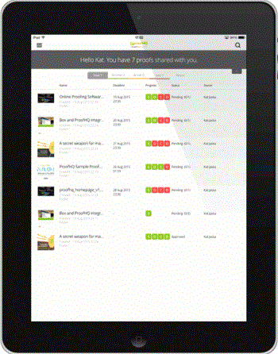

# [!DNL Workfront Proof] application mobile pour tablettes

>[!IMPORTANT]
>
>Cet article fait référence aux fonctionnalités du produit autonome. [!DNL Workfront Proof]. Pour plus d’informations sur la vérification à l’intérieur [!DNL Adobe Workfront], voir [Vérification](../../../review-and-approve-work/proofing/proofing.md).

Le [!DNL Workfront Proof] l’application pour tablette vous permet de vérifier et d’approuver facilement vos bons à tirer lorsque vous êtes en déplacement. L’application est disponible en téléchargement pour tous, vous n’avez pas besoin d’être un [!DNL Workfront Proof] pour pouvoir vérifier les bons à tirer sur votre tablette ou votre téléphone.

Vous pouvez simplement cliquer sur le bouton [!UICONTROL Accéder au BAT] dans la notification électronique qu’ils reçoivent pour ouvrir le BAT dans l’application.

[!DNL Workfront Proof] les utilisateurs peuvent se connecter à l’application et utiliser le tableau de bord pour gérer facilement leur travail.

## Exigences relatives aux périphériques

* Appareils iOS : iPad 3, iPad Air, iPad mini
* Appareils Android : Android OS version 4.4+, 5+; Samsung Galaxy Tab 3+ (10.1&quot;)

Il s’agit d’une application conçue spécifiquement pour les tablettes. Si vous souhaitez utiliser [!DNL Workfront Proof] sur votre iPhone, téléchargez l’application iOS à partir de l’iTunes Store.

## Téléchargement de l’application

>[!IMPORTANT]
>
>L’application mobile Workfront BAT n’est plus prise en charge et est disponible en l’état.  Aucun problème dans l’application ne sera résolu.

Le [!DNL Workfront Proof] L’application pour tablettes est disponible dans Apple App Store et dans Google Play Store.

1. Cliquez sur le lien ci-dessous pour télécharger l’application et l’installer sur votre appareil.

   

   

## Connexion

Le [!DNL Workfront Proof] L’application pour tablette vous donne accès au tableau de bord avec les bons à tirer qui nécessitent votre attention. Pour accéder au tableau de bord :

1. Utilisez l’une des méthodes suivantes :

   * Connectez-vous à l’aide de votre [!DNL Workfront Proof] informations d’identification.

      Si vous recevez un courrier électronique d’invitation à un BAT et ouvrez-le sur votre appareil mobile, le lien vous redirigera vers le BAT dans l’application. Vous n’avez pas besoin d’être un utilisateur pour pouvoir vérifier les bons à tirer ; toutefois, l’application doit être installée sur votre appareil pour pouvoir l’afficher.

   * Si l’authentification unique est activée dans votre compte, appuyez sur cette option dans l’écran de connexion.

      Vous accédez à la page de connexion qui vous demande votre adresse électronique. Après avoir saisi votre adresse électronique, vous serez redirigé vers la page de votre fournisseur d’identité où vous pourrez vous connecter à l’aide de votre mot de passe.

      

## Le tableau de bord

Si vous souhaitez rester connecté à votre [!DNL Workfront Proof] compte :

1. Activer **[!UICONTROL Gardez-moi connecté]** dans le menu de la barre latérale sous **[!UICONTROL Paramètres]**:

Le *[!UICONTROL Tableau de bord]* vous ramène au tableau de bord depuis n’importe quelle vue de l’application. Vous pouvez également l’utiliser pour recharger le tableau de bord.

D’autres éléments du tableau de bord sont la barre de recherche qui vous permet de rechercher le compte en fonction du nom du BAT et de différents affichages qui vous aident à gérer efficacement votre charge de travail.

## Gestion de votre charge de travail à l’aide des vues Tableau de bord

Comme pour les graphiques de tableau de bord de notre application web, dans l’application mobile, nous affichons une liste de BAT qui ont été partagés avec vous. Le message de bienvenue en haut de la page vous indique le nombre total de BAT et, en dessous, les informations de ventilation *Heure d’activation*, *À risque*, et *BAT tardif*.

* **BAT à l’heure** sont les bons à tirer pour lesquels aucun délai n’est fixé ou pour lesquels le délai est dépassé de 24 heures.
* **Preuves à risque** sont ceux où la date limite est fixée à 24 heures (la barre de progression est orange pour ces bons à tirer).
* **BAT tardif** sont les bons à tirer qui ont déjà dépassé la date limite - la barre de progression est rouge pour ces bons à tirer. Une fois le délai atteint [!DNL Workfront Proof] envoie aux décideurs et au propriétaire du BAT un courriel de rappel automatisé.

Ces bons à tirer sont regroupés dans des vues distinctes, ce qui vous permet de privilégier facilement votre travail, à partir des bons à tirer qui ont déjà dépassé la date limite.

Une autre vue que vous trouverez utile est la vue Récente. Elle vous montre les bons à tirer récemment consultés dans l’application. Ainsi, si vous souhaitez revoir le même bon à tirer, vous pouvez facilement le trouver dans cette liste.

## Vérification des bons à tirer dans l’application

1. Cliquez sur le nom du BAT à ouvrir dans la [!DNL Workfront Proof] Visionneuse.

   Ou

   Pour ouvrir un BAT à partir d’une notification électronique, les opérateurs validants peuvent cliquer sur le bouton **[!UICONTROL Accéder au BAT]** dans la notification.
Si vous avez une [!DNL Workfront Proof] vous pouvez vous connecter et accéder à votre BAT à partir du tableau de bord.

   >[!NOTE]
   >
   >L’application doit être installée sur votre appareil pour pouvoir passer en revue les bons à tirer dans [!DNL Workfront Proof], même si vous n’avez pas de [!DNL Workfront Proof] compte .

   Lorsque vous ouvrez un BAT pour la première fois, nous vous proposons un tour d’horizon vous permettant de commencer à vérifier les bons à tirer dans l’application.

   

1. Naviguez dans votre BAT :

   * Pour accéder à une page spécifique du BAT, faites glisser le curseur ou utilisez le [!UICONTROL miniatures] liste.

      Vous pouvez également utiliser les flèches situées au bas de la page ou indiquer un numéro de page spécifique.

   * Pour accéder à une autre version du BAT, utilisez le menu déroulant Version en haut de la page.
   * Pour effectuer un zoom avant, effectuez un pincement sur l’écran.
   * Pour effectuer un panoramique, appuyez longuement et déplacez l’image jusqu’à ce que vous trouviez la bonne position.

      La vérification des BAT dans l’application mobile est aussi simple que la vérification des BAT à l’aide de la fonction [!DNL Workfront Proof] Visionneuse. Vous trouverez ci-dessous des informations plus détaillées sur l’ajout de commentaires et de balises, la gestion des commentaires et la prise de décisions. Nous discuterons également des différentes options disponibles dans la barre latérale de l’application.

## Commentaire dans l’application

La vidéo ci-dessous présente les principes de base des commentaires dans l’application mobile. Il indique comment faire un commentaire, comment publier une réponse à un commentaire, comment utiliser différentes balises et les supprimer, et comment modifier et supprimer des commentaires.

Vous ne pouvez modifier et supprimer des commentaires que si aucune réponse n’a été publiée. Si vous ne voyez pas le [!UICONTROL corbeille] , il est possible que cette option ait été désactivée par votre [!DNL Workfront Proof] administrateur.

L’application comporte trois options d’affichage des commentaires. Vous pouvez basculer entre les deux en cliquant sur le bouton de commentaire.

* **[!UICONTROL Mode Liste]** affiche une liste de tous les commentaires. Vous pouvez les parcourir en appuyant sur chaque commentaire ou en appuyant sur les flèches haut et bas.
* **[!UICONTROL Affichage de commentaire unique]** affiche un commentaire à la fois. Pour accéder au commentaire suivant, appuyez sur la flèche en haut de la page.
* **[!UICONTROL Masquer la vue des commentaires]** masque tous les commentaires.

Chaque annotation laissée sur le BAT place une épingle sur l’image. Pour afficher le commentaire et le balisage associés à l’épingle, appuyez simplement sur l’épingle. Vous ne pouvez le faire que si la zone d’édition des commentaires est fermée. Pour fermer la zone de commentaire, appuyez sur le bouton [!UICONTROL x] dans le commentaire supérieur gauche de la zone.

## Outil d’annotation de texte

Le texte de vérification en déplacement se trouve vraiment dans la [!DNL Workfront Proof] application pour tablette. L’outil d’annotation de texte est disponible dans la barre d’outils des annotations lorsque vous cliquez sur l’icône orange **[!UICONTROL Ajouter un commentaire]** bouton .

1. Sélectionnez l’outil, puis appuyez sur le mot à mettre en surbrillance.
1. Tenez le doigt sur le mot jusqu’à ce que le surlignage soit disponible et utilisez les curseur pour mettre en surbrillance l’ensemble du mot ou de l’expression que vous souhaitez marquer.

   L’outil de texte propose quatre options :

   | **[!UICONTROL Surligner]** | Met le texte en surbrillance et le copie dans la zone de commentaire. |
   |---|---|
   | **[!UICONTROL Remplacer]** | Ajoute [[!UICONTROL REPLACER]] et [[!UICONTROL AVEC]] dans la zone de commentaire avec le texte, ce qui facilite la recommandation de texte de remplacement. |
   | **[!UICONTROL Supprimer]** | Le texte est barré et ajoute : [DELETE] dans la zone de commentaire. |
   | **[!UICONTROL Insérer après]** | Ajouts [INSÉRER APRÈS] dans la zone de commentaire. |

   {style=&quot;table-layout:auto&quot;}

1. (Facultatif) Pour coller le texte d’un autre document que vous avez enregistré sur votre tablette, appuyez et maintenez votre doigt dans la zone de commentaire jusqu’à ce que vous ayez la possibilité de coller le texte copié à partir du document.

## Gestion des commentaires dans l’application mobile

Une fois que tout le monde a laissé ses commentaires et annotations sur le BAT, très souvent le chargé de BAT doit passer par les commentaires et décider quels changements doivent être appliqués à la prochaine version du BAT. Dans [!DNL Workfront Proof] vous pouvez utiliser des actions sur les commentaires pour marquer chaque commentaire et marquer ceux qui doivent être actifs.

Les actions sur les commentaires doivent être configurées dans votre compte par la variable [!DNL Workfront Proof] et ne peuvent être utilisés que sur un BAT par des personnes disposant de droits d’édition.

Lorsque vous préparez la prochaine version de votre BAT, vous pouvez vérifier les commentaires au fur et à mesure. Le commentaire est marqué comme résolu avec une coche verte. Si vous devez rouvrir le commentaire, vous pouvez cliquer sur la flèche située au bas de la zone de commentaire.

Si vous souhaitez empêcher les autres réviseurs de répondre à un fil de commentaire, vous pouvez le verrouiller. Pour pouvoir le faire, vous devez disposer de droits d&#39;édition sur le BAT. Le verrouillage du fil de commentaire est très simple, il vous suffit d’appuyer sur l’icône de cadenas au bas de la zone de commentaire.

## Vérification de BAT vidéo

La lecture d’une vidéo en déplacement est facile avec la fonction [!DNL Workfront Proof] application pour tablette. La vidéo ci-dessous montre comment faire des commentaires, des annotations et des décisions dans l’application.

## Mode Comparaison

Le mode de comparaison dans l’application pour tablette vous permet de comparer facilement deux versions différentes d’un BAT ou deux bons à tirer du même dossier.

>[!NOTE]
>
>En raison des limites d’iOS, la comparaison de deux vidéos n’est pas disponible sur les iPad. Il est disponible sur les tablettes dotées de systèmes d’exploitation Android.

Le mode de comparaison est disponible dans le coin supérieur droit de l’écran.

L’outil de comparaison affiche les deux versions les plus récentes du BAT.

1. Pour modifier les versions que vous souhaitez comparer, utilisez les listes déroulantes des versions en haut de la page.
1. Pour sélectionner un BAT différent à partir du même dossier, utilisez l’explorateur de dossiers (l’icône de dossier disponible en haut de la page).

   
   
L’outil de comparaison vous permet de comparer les versions côte à côte afin de vérifier si les modifications demandées ont été effectuées. Si vous déverrouillez la navigation, vous pourrez comparer différentes pages des deux versions.

   

   Vous pouvez maintenant comparer différentes pages des bons à tirer que vous consultez. Vous pouvez également comparer différentes pages d’un même BAT, ce qui peut s’avérer utile si vous vérifiez la cohérence de vos BAT en matière de messages et de marques.

   

## Prise de décisions dans l’application

1. Appuyez sur le bouton de décision vert en haut de la page.

   

   Si vous ne voyez pas le vert **[!UICONTROL Terminer la révision]** et vous pensez que vous devriez prendre une décision sur le BAT, votre [!DNL Workfront Proof] l’administrateur peut mettre à jour votre rôle BAT, comme expliqué dans la section [Gestion des rôles de BAT dans [!DNL Workfront Proof]](../../../workfront-proof/wp-work-proofsfiles/share-proofs-and-files/manage-proof-roles.md).

## Barre latérale de la visionneuse de vérification

La barre latérale contient de nombreuses fonctions et fonctionnalités utiles. Selon vos autorisations sur le BAT, il se peut que vous ne les voyiez pas tous. Vous trouverez ci-dessous des informations plus détaillées.

| Tableau de bord | Vous ramène au tableau de bord de l’application mobile. |
|---|---|
| **[!UICONTROL Flux de travail]** | Affiche les détails des étapes de révision, ainsi qu’une liste des opérateurs validants, leurs échéances, barres de progression, décisions et le nombre de commentaires et de réponses. |
| **[!UICONTROL Détails]** | Affiche des informations sur le BAT, des options de partage supplémentaires et le Suivi des activités. |
| **[!UICONTROL Partager]** | Affiche l’URL du bon à tirer et le code intégré. |
| **[!UICONTROL Notifications]** | Vous permet de mettre à jour vos alertes par email sur le BAT que vous êtes en train de vérifier. Cela ne modifie pas vos paramètres par défaut. |
| **[!UICONTROL Verrouiller]** | Permet de verrouiller le bon à tirer. Vous devez disposer de droits d’édition sur le BAT pour pouvoir voir cette option. |
| **[!UICONTROL Supprimer]** | Déplace le BAT vers le dossier Corbeille. Vous devez disposer de droits d&#39;édition sur le BAT pour pouvoir le supprimer. |
| **[!UICONTROL Paramètres]** | Vous pouvez choisir d&#39;afficher les pin&#39;s et/ou les annotations sur le BAT. Vous pouvez également activer [!UICONTROL Gardez-moi connecté] pour vous empêcher d’être déconnecté de l’application. |
| **[!UICONTROL Aide]** | Permet d’afficher à nouveau la visite de l’application. |
| **[!UICONTROL Déconnexion]** | Vous déconnecte de l’application et de votre compte. |
