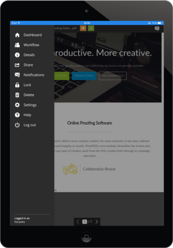

# Application mobile [!DNL Workfront Proof] pour tablettes

>[!IMPORTANT]
>
>Cet article fait référence aux fonctionnalités du produit autonome [!DNL Workfront Proof]. Pour plus d’informations sur la relecture dans [!DNL Adobe Workfront], voir [Relecture](../../../review-and-approve-work/proofing/proofing.md).

L’application pour tablette [!DNL Workfront Proof] vous permet de réviser et d’approuver facilement vos épreuves lorsque vous êtes en déplacement. L’application est disponible en téléchargement et vous n’avez pas besoin d’être un utilisateur ou une utilisatrice [!DNL Workfront Proof] pour pouvoir réviser les épreuves sur votre tablette ou votre téléphone.

Il vous suffit simplement de cliquer sur le bouton [!UICONTROL Accéder à l’épreuve] dans la notification par e-mail reçue pour ouvrir l’épreuve dans l’application.

Les utilisateurs et utilisatrices [!DNL Workfront Proof] peuvent se connecter à l’application et utiliser le tableau de bord pour gérer facilement leur travail.

## Exigences relatives aux périphériques

* Appareils iOS : iPad 3, iPad Air, iPad mini
* Appareils Android  : Android OS version 4.4+, 5+  ; Samsung Galaxy Tab 3+ (10.1&quot;)

Il s’agit d’une application spécialement conçue pour les tablettes. Si vous souhaitez utiliser [!DNL Workfront Proof] sur votre iPhone, téléchargez l’application iOS à partir de l’iTunes Store.

## Télécharger l’application

>[!IMPORTANT]
>
>L’application mobile Workfront Proof n’est plus prise en charge et est disponible en l’état.  Aucun problème dans l’application ne sera résolu.

L’application pour tablette [!DNL Workfront Proof] est disponible dans Apple App Store et dans Google Play Store.

1. Cliquez sur le lien ci-dessous pour télécharger l’application et l’installer sur votre appareil.

   

   

## Connexion

L’application pour tablette [!DNL Workfront Proof] vous permet d’accéder au tableau de bord avec les épreuves qui nécessitent votre attention. Pour accéder au tableau de bord  :

1. Utilisez l’une des méthodes suivantes :

   * Connectez-vous à l’aide de vos informations d’identification [!DNL Workfront Proof].

     Si vous recevez un e-mail d’invitation à une épreuve et que vous l’ouvrez sur votre appareil mobile, le lien vous redirige vers l’épreuve dans l’application. Vous n’avez pas besoin d’être un utilisateur ou une utilisatrice pour pouvoir réviser les épreuves ; toutefois, l’application doit être installée sur votre appareil pour pouvoir les afficher.

   * Si l’authentification unique est activée dans votre compte, appuyez sur cette option sur l’écran de connexion.

     Vous accédez à la page de connexion qui vous demande votre adresse e-mail. Après avoir saisi votre adresse e-mail, vous allez à la page de votre fournisseur d’identité où vous pourrez vous connecter à l’aide de votre mot de passe.

     

## Tableau de bord

Si vous souhaitez maintenir la connexion à votre compte [!DNL Workfront Proof] :

1. Activez **[!UICONTROL Maintenir ma connexion]** dans le menu de la barre latérale sous **[!UICONTROL Paramètres]** :

Le lien *[!UICONTROL Tableau de bord]* vous ramène au tableau de bord depuis n’importe quelle vue de l’application. Vous pouvez également l’utiliser pour recharger le tableau de bord.

Parmi les autres éléments du tableau de bord figurent la barre de recherche qui vous permet de rechercher le compte en fonction du nom de l’épreuve et différents affichages qui vous aident à gérer efficacement votre charge de travail.

## Gérer votre charge de travail à l’aide des vues Tableau de bord

Comme pour les graphiques de tableau de bord de notre application web, dans l’application mobile, nous affichons une liste des épreuves qui ont été partagées avec vous. Le message de bienvenue en haut de la page vous indique le nombre total d’épreuves. En dessous, ces dernières sont réparties selon le statut *Dans les temps*, *À risque* et *En retard*.

* Les **épreuves dans les temps** sont celles pour lesquelles aucun délai n’est fixé ou pour lesquelles le délai est dépassé de plus de 24 heures.
* Les **épreuves à risque** sont celles dont la date limite est dans les 24 prochaines heures. Pour celles-ci, la barre de progression est orange.
* Les **épreuves en retard** sont celles qui ont déjà dépassé la date limite. Pour celles-ci, la barre de progression est rouge. Une fois le délai atteint, [!DNL Workfront Proof] envoie aux personnes décisionnaires et propriétaires de l’épreuve un e-mail de rappel automatisé.

Ces épreuves sont regroupées dans des vues distinctes, ce qui vous permet de prioriser facilement votre travail, en commençant par les épreuves qui ont déjà dépassé la date limite.

Une autre vue que vous trouverez utile est la vue Récent. Elle affiche les épreuves récemment consultées dans l’application. Ainsi, si vous souhaitez revoir la même épreuve, vous pouvez facilement la trouver dans cette liste.

## Réviser des épreuves dans l’application

1. Cliquez sur le nom de l’épreuve à ouvrir dans la visionneuse [!DNL Workfront Proof].

   Ou

   Pour ouvrir une épreuve à partir d’une notification par e-mail, les réviseurs et réviseuses peuvent cliquer sur le lien **[!UICONTROL Accéder à l’épreuve]** dans la notification.
Si vous avez un compte [!DNL Workfront Proof], vous pouvez vous connecter et accéder à votre épreuve à partir du tableau de bord.

   >[!NOTE]
   >
   >L’application doit être installée sur votre appareil pour pouvoir passer en revue les épreuves dans [!DNL Workfront Proof], même si vous n’avez pas de compte [!DNL Workfront Proof].

   Lorsque vous ouvrez une épreuve pour la première fois, nous vous proposons un tour d’horizon vous permettant de commencer à vérifier les épreuves dans l’application.

   

1. Naviguez dans votre épreuve :

   * Pour accéder à une page spécifique de l’épreuve, balayez sur le côté ou utilisez la liste des [!UICONTROL miniatures].

     Vous pouvez également utiliser les flèches situées au bas de la page ou indiquer un numéro de page spécifique.

   * Pour accéder à une autre version de l’épreuve, utilisez le menu déroulant Version en haut de la page.
   * Pour effectuer un zoom avant, effectuez un pincement sur l’écran.
   * Pour effectuer un panoramique, appuyez longuement et déplacez l’image jusqu’à ce que vous trouviez la bonne position.

     La révision des épreuves dans l’application mobile est aussi simple que la révision des épreuves à l’aide de la visionneuse [!DNL Workfront Proof]. Ci-dessous, nous examinerons de plus près l’ajout de commentaires et de balises, la gestion des commentaires et la prise de décisions. Nous discuterons également des différentes options disponibles dans la barre latérale de l’application.

## Commentaire dans l’application

La vidéo ci-dessous présente les principes de base des commentaires dans l’application mobile. Elle indique comment faire un commentaire, comment publier une réponse à un commentaire, comment utiliser différentes balises et les supprimer, et comment modifier et supprimer des commentaires.

Vous pouvez modifier et supprimer uniquement les commentaires si aucune réponse n’a été publiée. Si vous ne voyez pas l’icône [!UICONTROL Corbeille], il est possible que cette option ait été désactivée par votre administrateur ou administratrice [!DNL Workfront Proof].

L’application comporte trois options d’affichage des commentaires. Vous pouvez basculer entre ces options en cliquant sur le bouton de commentaire.

* La **[!UICONTROL vue Liste]** affiche une liste de tous les commentaires. Vous pouvez les parcourir en appuyant sur chaque commentaire ou en appuyant sur les flèches haut et bas.
* La **[!UICONTROL vue Commentaire unique]** affiche un commentaire à la fois. Pour accéder au commentaire suivant, appuyez sur la flèche en haut de la page.
* La **[!UICONTROL vue Masquer les commentaires]** masque tous les commentaires.

Chaque balise laissée sur l’épreuve place une épingle sur l’image. Pour afficher le commentaire et la balise associés à l’épingle, appuyez simplement sur l’épingle. Vous ne pouvez le faire que si la zone d’édition des commentaires est fermée. Pour fermer la zone de commentaires, appuyez sur le [!UICONTROL x] dans le coin supérieur gauche de la zone.

## Outil d’annotation de texte

La relecture de texte en déplacement se fait dans l’application pour tablette [!DNL Workfront Proof]. L’outil d’annotation de texte est disponible dans la barre d’outils des balises lorsque vous cliquez sur le bouton orange **[!UICONTROL Ajouter un commentaire]**.

1. Sélectionnez l’outil, puis appuyez sur le mot à mettre en surbrillance.
1. Tenez le doigt sur le mot jusqu’à ce que le surlignage soit disponible et utilisez les curseurs pour mettre en surbrillance le mot entier ou la phrase que vous souhaitez baliser.

   L’outil de texte propose quatre options :

   | **[!UICONTROL Surligner]** | Met le texte en surbrillance et le copie dans la zone de commentaire. |
   |---|---|
   | **[!UICONTROL Remplacer]** | Ajoute [[!UICONTROL REPLACE]] et [[!UICONTROL WITH]] dans la zone de commentaire avec le texte, ce qui vous permet de recommander plus facilement un texte de remplacement. |
   | **[!UICONTROL Supprimer]** | Barre le texte et ajoute [DELETE] dans la zone de commentaire. |
   | **[!UICONTROL Insérer après]** | Ajoute [INSERT AFTER] dans la zone de commentaire. |

   {style="table-layout:auto"}

1. (Facultatif) Pour coller le texte d’un autre document que vous avez enregistré sur votre tablette, appuyez et maintenez votre doigt dans la zone de commentaire jusqu’à ce que vous ayez la possibilité de coller le texte copié à partir du document.

## Gérer les commentaires dans l’application mobile

Une fois que tout le monde a laissé ses commentaires et balises sur l’épreuve, très souvent, la personne gestionnaire d’épreuve doit examiner le feedback et décider quels changements doivent être appliqués à la prochaine version de l’épreuve. Dans [!DNL Workfront Proof], vous pouvez utiliser des actions sur les commentaires pour indiquer chaque commentaire et marquer ceux qui doivent être mis en œuvre.

Les actions sur les commentaires doivent être configurées dans votre compte par l’administrateur ou l’administratrice [!DNL Workfront Proof] et ne peuvent être utilisées sur une épreuve que par des personnes disposant de droits de modification.

Lorsque vous préparez la prochaine version de votre épreuve, vous pouvez vérifier les commentaires au fur et à mesure. Le commentaire est marqué comme résolu par une coche verte. Si vous souhaitez rouvrir le commentaire, vous pouvez cliquer sur la flèche située en bas de la case de commentaires.

Si vous souhaitez empêcher d’autres personnes réviseuses de répondre à un thread de commentaires, vous pouvez verrouiller ce dernier. Pour ce faire, vous devez avoir des droits de modification sur l’épreuve. Verrouiller le thread de commentaires est très simple : il vous suffit de cliquer sur l’icône du cadenas en bas de la zone de commentaires.

## Réviser des épreuves vidéo

Il est facile de réviser des vidéos en déplacement grâce à l’application pour tablette [!DNL Workfront Proof]. La vidéo ci-dessous vous montre comment utiliser des commentaires, des balises et des décisions dans l’application.

## Mode de comparaison

Le mode de comparaison de l’application pour tablette vous permet de comparer facilement deux versions différentes d’une épreuve ou deux épreuves d’un même dossier.

>[!NOTE]
>
>En raison des limitations d’iOS, la comparaison de deux vidéos n’est pas disponible sur les iPads. Elle est disponible sur les tablettes dotées d’un système d’exploitation Android.

Le mode de comparaison est disponible dans le coin supérieur droit de l’écran.

L’outil de comparaison affiche les deux versions les plus récentes de l’épreuve.

1. Pour modifier les versions que vous souhaitez comparer, utilisez les menus déroulants en haut de la page.
1. Pour sélectionner une épreuve différente dans le même dossier, utilisez le navigateur de dossiers (l’icône de dossier disponible en haut de la page).

   
   
L’outil de comparaison vous permet de comparer les versions côte à côte pour vérifier si les changements demandés ont été effectués. Si vous déverrouillez la navigation, vous pourrez comparer différentes pages des deux versions.

   

   Vous pouvez désormais comparer les différentes pages des épreuves que vous consultez. Vous pouvez également comparer différentes pages d’une même épreuve, ce qui peut s’avérer utile si vous vérifiez la cohérence de vos messages et de votre image de marque.

   

## Prendre des décisions dans l’application

1. Appuyez sur le bouton vert de décision en haut de la page.

   

   Si vous ne voyez pas le bouton vert **[!UICONTROL Terminer la révision]** et que vous pensez devoir prendre une décision sur l’épreuve, votre administrateur ou administratrice [!DNL Workfront Proof] peut mettre à jour votre rôle d’épreuve, comme expliqué dans [Gérer les rôles d’épreuve dans  [!DNL Workfront Proof]](../../../workfront-proof/wp-work-proofsfiles/share-proofs-and-files/manage-proof-roles.md).

## Barre latérale de la visionneuse de relecture

La barre latérale contient de nombreuses caractéristiques et fonctionnalités utiles. En fonction de vos autorisations sur l’épreuve, il se peut que vous ne les voyiez pas toutes. Elles sont toutes examinées plus en détail ci-dessous.

| Tableau de bord | Vous ramène au tableau de bord de l’application mobile. |
|---|---|
| **[!UICONTROL Workflow]** | Affiche les détails des étapes de révision, ainsi que la liste des personnes réviseuses, leurs échéances, les barres de progression, les décisions et le nombre de commentaires et de réponses. |
| **[!UICONTROL Détails]** | Affiche des informations sur l’épreuve, des options de partage supplémentaires et le journal d’audit de l’activité. |
| **[!UICONTROL Partager]** | Affiche l’URL de l’épreuve et le code intégré. |
| **[!UICONTROL Notifications]** | Vous permet de mettre à jour vos alertes par e-mail sur l’épreuve que vous êtes en train de réviser. Cela ne modifie pas vos paramètres par défaut. |
| **[!UICONTROL Verrouiller]** | Permet de verrouiller l’épreuve. Vous devez disposer de droits de modification sur l’épreuve pour voir cette option. |
| **[!UICONTROL Supprimer]** | Déplace l’épreuve dans le dossier Corbeille. Vous devez disposer de droits de modification sur l’épreuve pour pouvoir la supprimer. |
| **[!UICONTROL Paramètres]** | Vous pouvez décider d’afficher les épingles et/ou les balises de l’épreuve. Vous pouvez également activer l’option [!UICONTROL Conserver ma connexion] pour éviter de vous déconnecter de l’application. |
| **[!UICONTROL Aide]** | Permet d’afficher à nouveau la visite de l’application. |
| **[!UICONTROL Se déconnecter]** | Vous déconnecte de l’application et de votre compte. |
