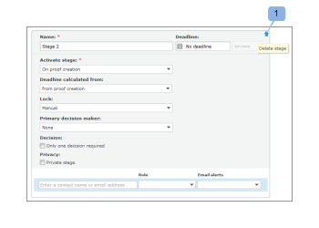

# Configuration d’un BAT avec un workflow automatisé dans [!DNL Workfront Proof]

>[!IMPORTANT]
>
>Cet article fait référence à la fonctionnalité du produit autonome [!DNL Workfront Proof]. Pour plus d&#39;informations sur la vérification à l&#39;intérieur de [!DNL Adobe Workfront], voir [Proofing](../../../review-and-approve-work/proofing/proofing.md).

Le processus automatisé facilite la gestion de la révision et de l’approbation du contenu lorsque vous disposez de processus de révision complexes, ou si vous envoyez régulièrement du contenu à des groupes de personnes identiques.

Vous créez le BAT, puis il passe de l’étape à l’étape jusqu’à l’approbation finale. Les utilisateurs concernés sont avertis lorsqu’ils sont tenus d’effectuer une validation.

Vous pouvez ajouter un workflow automatisé à un BAT lors du téléchargement du document ou une fois le document chargé.

## Création d’un BAT avec le workflow automatisé

1. Commencez à créer le BAT.
1. Dans la section **[!UICONTROL Partager]** , cliquez sur **[!UICONTROL Utiliser le processus automatisé]**.

   Vous pouvez désélectionner cette option pour revenir à un workflow standard.

1. (Facultatif) Si vous souhaitez utiliser un modèle de workflow automatisé que votre administrateur [!DNL Workfront] a configuré et partagé avec vous, sélectionnez-le dans le menu déroulant **[!UICONTROL Sélectionner un modèle de workflow]** .

   >[!NOTE]
   >
   >Votre capacité à modifier le modèle dépend des paramètres de modèle configurés par l’administrateur [!DNL Workfront]. Si la possibilité de modifier le modèle est désactivée, seul le propriétaire du modèle peut le modifier.

1. Spécifiez les informations suivantes pour configurer la première étape du processus automatisé :

   * **[!UICONTROL Nom] :** Le nom de l’étape apparaît dans le diagramme Processus et est inclus dans les notifications électroniques envoyées aux réviseurs.
   * **[!UICONTROL Deadline] :** Les fonctionnalités de ce champ varient en fonction de l’option sélectionnée dans la liste déroulante **[!UICONTROL Deadline calculée à partir de]**.

   * **[!UICONTROL A partir de la création du BAT] :** Sélectionnez la date d’échéance du BAT.
   * **[!UICONTROL À partir de l’activation de l’étape] :** Sélectionnez le nombre de jours ouvrés qui seront ajoutés à la date d’activation de l’étape pour définir automatiquement une échéance sur le BAT.
   * **[!UICONTROL Activer l’étape] :** Pour chaque étape de votre workflow, vous pouvez décider quand l’étape doit être activée. Pour la première étape, les options suivantes sont disponibles.

      * Lors de la création du BAT
      * À une heure et une date spécifiques
      * Manuellement\

        D’autres options sont disponibles pour les étapes suivantes. Ces options nécessitent une étape parent. Ils sont :
      * Une fois l’échéance précédente atteinte
      * Toutes les décisions sont approuvées ou approuvées avec des modifications
      * Toutes les décisions sont approuvées
      * Toutes les décisions sont prises
   * **[!UICONTROL Délai calculé à partir de] :** L’option que vous sélectionnez dans cette liste déroulante affecte les options disponibles dans le champ **[!UICONTROL Délai]** .

   * **[!UICONTROL Création de BAT] :** Dans le champ **[!UICONTROL Date limite]**, sélectionnez la date d’échéance du BAT.

   * **[!UICONTROL Activation de l’évaluation] :** Dans le champ **[!UICONTROL Date limite]** , sélectionnez le nombre de jours ouvrables qui seront ajoutés à la date d’activation de l’évaluation pour définir automatiquement une date limite sur le BAT.

   * **[!UICONTROL Verrouiller l’étape] :** Sélectionnez le moment où l’étape peut être verrouillée.
   * **[!UICONTROL Décideur de Principal] :** Sélectionnez le décideur de Principal sur l’étape. Les décideurs ne sont disponibles dans la liste déroulante qu’une fois que vous avez ajouté des réviseurs à l’étape.
   * **[!UICONTROL Une seule décision requise] :** Sélectionnez cette option pour que la révision soit terminée une fois que l’un des décideurs a pris sa décision.\

     Cette option n’est pas disponible si vous avez désigné un utilisateur dans le menu déroulant **[!UICONTROL Décideur de Principal]** .

   * **[!UICONTROL Étape privée] :** Lorsque cette option est sélectionnée, les commentaires et les décisions ne sont pas visibles pour les personnes qui ne sont pas ajoutées à cette étape ou qui ne sont pas superviseurs, administrateurs ou administrateurs de facturation dans le compte.

1. (Facultatif) Ajoutez des réviseurs à l’étape.
1. Tenez compte des points suivants lors de l’ajout de réviseurs :

   * Un validant ne peut être ajouté qu&#39;une seule fois à un BAT. (Vous ne pouvez pas ajouter la même personne à plusieurs étapes du BAT.)
   * Les réviseurs qui sont ajoutés à une scène privée ne peuvent voir que la scène à laquelle ils sont ajoutés sur le BAT et les commentaires faits à cette étape.
   * Par défaut, l’ajout d’un utilisateur à un environnement intermédiaire lui donne accès pour afficher le BAT à partir du moment où le BAT est créé.\

     L&#39;administrateur système peut configurer le système de vérification afin de limiter l&#39;accès des utilisateurs au BAT jusqu&#39;à ce que le workflow entre dans l&#39;étape où l&#39;utilisateur a été ajouté. Pour plus d’informations, voir

1. (Facultatif) Cliquez sur **[!UICONTROL Nouvelle étape]**, puis répétez les étapes 4 et 5 pour ajouter plusieurs étapes au workflow automatisé.
1. Continuez à créer le BAT en spécifiant les informations nécessaires dans les sections [!UICONTROL Organiser] et [!UICONTROL Plus de paramètres] de la page [!UICONTROL Nouveau BAT], comme décrit dans la section

## Diagrammes de workflow automatisés

Lors de la configuration du workflow de votre BAT, vous remarquerez la création d’un diagramme. Chaque étape que vous ajoutez à votre BAT apparaîtra dans le diagramme, indiquant clairement les dépendances entre les étapes. Les scènes privées sont marquées d’une icône de clé.

Le diagramme flotte, ce qui signifie qu’il restera visible même si vous faites défiler la page vers le bas.

Si le diagramme n’est pas nécessaire, vous pouvez le masquer (1).

## Ajout d’une étape

Vous pouvez ajouter une étape supplémentaire à un workflow que vous créez ou modifiez.

1. Si vous ajoutez une étape à un BAT existant, accédez à la page Détails du BAT, comme décrit sur la page [Gérer les détails du BAT dans [!DNL Workfront Proof]](../../../workfront-proof/wp-work-proofsfiles/manage-your-work/manage-proof-details.md).
1. Dans la section **[!UICONTROL Workflow]** , cliquez sur **[!UICONTROL Nouvelle étape]**.

1. Spécifiez les informations pour l’étape comme à l’étape 4 sous la section [!UICONTROL Création d’un bon à tirer avec un workflow automatisé] de cet article.
1. Cliquez sur **[!UICONTROL Ajouter une étape]**, puis sur **[!UICONTROL Terminé]**.

## Suppression d’une étape

1. Cliquez sur l’icône de la corbeille disponible dans le coin supérieur droit de l’étape (1).\
   L’icône s’affiche lorsque vous pointez sur la scène.\
   

## Paramètres d’évaluation

* **[!UICONTROL Nom de l’étape]** : s’affiche sur le diagramme de workflow et est inclus dans les notifications électroniques envoyées aux réviseurs.
* **[!UICONTROL Activer l’étape]** : pour chaque étape de votre workflow, vous pouvez décider à quel moment il doit être activé. Pour votre première étape, les options suivantes seront disponibles :

   * Lors de la création du BAT
   * À une heure et une date spécifiques
   * Manuellement
   * Seules ces trois options sont disponibles pour votre première étape. Les autres options deviennent disponibles lorsque vous ajoutez une seconde étape ; elles vous obligent à sélectionner une étape parent.
   * Une fois l’échéance précédente atteinte (nécessite le choix d’une étape parente)
   * Toutes les décisions sont approuvées ou [!UICONTROL  approuvées avec modifications ] (nécessite de sélectionner une étape parent)
   * Toutes les décisions sont approuvées (nécessite le choix d’une étape parent)
   * Toutes les décisions sont prises (nécessite le choix d’une étape parent).

* **[!UICONTROL Date limite] :** Vous pouvez décider comment la date limite doit être calculée à chaque étape d’un workflow. Les options sont les suivantes :

   * A partir de la création du BAT : dans le champ [!UICONTROL date limite] (9), vous pouvez sélectionner la date limite de création du BAT.
   * À partir de l’activation de l’étape : dans la liste déroulante [!UICONTROL date limite], vous sélectionnez le nombre de jours ouvrés qui seront ajoutés à la date d’activation de l’étape pour définir automatiquement une date limite sur le BAT.

* **[!UICONTROL Verrouillage] :** Un certain nombre d’options déterminent à quel moment une scène peut être verrouillée. Les options incluent :

   * Verrouillage manuel
   * Jamais
   * Lorsque l’étape suivante commence
   * Lorsque toutes les décisions sont prises

**[!UICONTROL Décideur de Principal]** : vous définissez le décideur de Principal sur la scène. Les décideurs disponibles apparaissent dans la liste uniquement après avoir ajouté les réviseurs à l’étape.

>[!NOTE]
>
>Si vous choisissez un décideur Principal, une seule option de décision requise ne sera plus disponible à cette étape.

* **[!UICONTROL Une seule décision requise]** : vous pouvez activer cette option sur une étape. Cela signifie que l&#39;examen sera terminé une fois que l&#39;un des décideurs aura pris sa décision.
* **[!UICONTROL Confidentialité] :** Chaque étape peut être rendue privée. Si une étape est privée, les commentaires et les décisions ne seront pas visibles par les personnes qui ne sont pas ajoutées à cette étape ou qui ne sont pas superviseurs, administrateurs ou administrateurs de facturation dans le compte. Pour plus d’informations, voir [Présentation du workflow automatisé](../../../review-and-approve-work/proofing/proofing-overview/automated-workflow.md) .

## Ajout de réviseurs à une étape

1. Saisissez un nom de contact ou une adresse email dans le champ situé en bas de chaque étape.
1. Cliquez sur l’icône verte plus pour les ajouter.
1. Définissez le rôle sur le BAT.
1. Définissez l’alerte par courrier électronique.
1. Lors de la configuration de la première étape, vous avez également la possibilité de modifier le propriétaire du BAT.

   >[!NOTE]
   >
   >* Un validant ne peut être ajouté qu&#39;une seule fois à un BAT. Vous ne pouvez pas ajouter la même personne à plusieurs étapes du BAT.
   >* Les réviseurs qui ne sont pas ajoutés à une scène privée ne peuvent pas voir la scène sur le BAT ou les commentaires faits à cette étape.

## Convertir un BAT en workflow automatisé

Vous pouvez convertir un BAT de base en workflow automatisé.

1. Cliquez sur **[!UICONTROL Convertir en processus automatisé]** sur la page [!UICONTROL Détails du bon à tirer] .
Une fois le BAT retravaillé vers le workflow automatisé, toutes les étapes sont actives, publiques et leur option [!UICONTROL Verrouiller l’étape] est définie sur Manuel par défaut. Toutes les étapes restent avec les utilisateurs et leurs paramètres.

   * L’étape d’activation est définie sur Lors de la création du BAT à chaque étape.
   * La date limite calculée à partir de l’option est définie sur Création de BAT à chaque étape.
   * Si une seule option de décision a été sélectionnée sur le BAT de base, toutes les étapes sont sélectionnées.
   * Si le [!UICONTROL décideur de Principal] a été sélectionné sur le BAT de base, les étapes avec ce destinataire sont définies sur Aucun et toutes les autres.
   * Le nom de l’étape reste le même.

## Ajouter un modèle supplémentaire à un workflow automatisé existant

Une fois qu’un BAT de base est converti en workflow automatisé, vous pouvez y ajouter un modèle supplémentaire.

1. Sur la page Détails du BAT, dans la section Workflow, cliquez sur **[!UICONTROL Ajouter un modèle].**

   * Les paramètres du modèle déterminent ce qui peut être fait avec un BAT auquel ce modèle a été ajouté. Par exemple, si les options [!UICONTROL Ajouter une scène et Ajouter des personnes aux scènes] sont désactivées dans le modèle, les boutons [!UICONTROL ajouter une étape] et [!UICONTROL partager le BAT] ne seront pas visibles.
   * Si [!UICONTROL Ajouter une option d&#39;étape] est désactivé dans le modèle donné, après l&#39;avoir ajouté, le bouton [!UICONTROL Ajouter un modèle] n&#39;est pas visible.
   * Lorsqu’une personne est ajoutée à une scène dans un modèle de workflow automatisé, mais également déjà présente sur le BAT, alors si ce modèle est appliqué, le système supprime automatiquement cette personne de la scène. Si personne d’autre n’est ajouté à cette étape particulière, l’erreur suivante s’affiche, car le système ne permet pas d’ajouter une étape vide au workflow.

     
