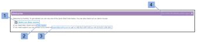

# Le tableau de bord dans [!DNL Workfront Proof]

>[!IMPORTANT]
>
>Cet article fait référence aux fonctionnalités du produit autonome. [!DNL Workfront Proof]. Pour plus d’informations sur la vérification à l’intérieur [!DNL Adobe Workfront], voir [Vérification](../../../review-and-approve-work/proofing/proofing.md).

Le tableau de bord est la première page qui s’affiche lorsque vous vous connectez à votre [!DNL Workfront Proof] compte . Il résume l’activité dans votre [!DNL Workfront Proof] compte et fournit des liens rapides vers d’autres sections et fonctions dans [!DNL Workfront Proof].

Le tableau de bord contient les éléments suivants :

* Logo de l’organisation (1)
* Navigation supérieure (2)
* Recherche (3)

* Menu En-tête (4)
* Nouveau menu (5)
* Barre latérale (6)
* Section Bienvenue (7)
* Aperçu (8)
* Éléments récemment consultés (9)
* Activité récente (10)

>[!NOTE]
>
>Les menus et liens que vous pouvez afficher et utiliser dans votre tableau de bord dépendent de votre profil utilisateur et de vos autorisations.

Vous pouvez personnaliser votre compte pour afficher le logo, les couleurs, les liens personnalisés, etc. de votre propre entreprise. Pour plus d’informations, voir [Marque [!DNL Workfront Proof] site](../../../workfront-proof/wp-acct-admin/branding/brand-wp-site.md).&quot;

Si vous ne marquez pas votre compte, la variable [!DNL Workfront Proof] Le logo et les couleurs standard s’affichent.

## Menu En-tête

### Nom d’utilisateur

Le nom d’utilisateur (2) que vous avez choisi s’affiche ici. Il peut être modifié dans les paramètres personnels.

### Paramètres

Ici (3) vous pouvez accéder à :

* Paramètres personnels
* Paramètres du compte
* Facturation

>[!NOTE]
>
>La visibilité des menus ci-dessus dépend de votre profil. Pour plus d’informations, voir Profils utilisateur et autorisations .

### Aide

Ici (4) vous pouvez accéder aux éléments suivants :

* Articles d’aide
* Films de démonstration

>[!NOTE]
>
>Grâce à nos plans Select et Premium , vous pouvez configurer les options d’aide afin que vos utilisateurs pointent vers votre propre contenu. Pour plus d’informations, consultez nos Options de valorisation de marque avancées .

### Déconnexion

Cliquez ici pour vous déconnecter de votre compte.

## Le nouveau menu

Pour ouvrir le menu Nouveau ,

1. Cliquez sur la flèche de liste déroulante (7).

   Le **[!UICONTROL Nouveau]** propose les options suivantes :

   * Nouveau Bon à tirer (8)
   * Télécharger le fichier (9)
   * Nouveau dossier (10)
   * Nouvel invité (11)
   * Nouvel utilisateur (12)
   * Nouveau groupe (13)

## Le menu Tableau de bord

Le menu Tableau de bord contient les menus suivants :

* Modifier les balises
* Déplacer vers
* Autres actions
* Supprimer

## Modifier les balises

Le [!UICONTROL Modifier les balises] (1) permet :

* Application d’une balise à un ou plusieurs éléments
* Créer de nouvelles balises
* Gestion des balises (2)

## Déplacer vers

Cette fonction vous permet de déplacer des BAT et des fichiers dans l’un de vos dossiers. Pour ce faire :

1. Cochez la case correspondant au ou aux éléments concernés.
1. Cliquez sur **[!UICONTROL Déplacer vers]** (3) et choisissez le dossier visé (4).
1. Cliquez sur **[!UICONTROL Enregistrer]** (5).

   

### Autres actions

Dans le [!UICONTROL Autres actions] (6) vous pouvez effectuer les actions suivantes :

* Verrouiller (BAT uniquement)
* Activer
* Archive (BAT uniquement)
* Désarchiver (BAT uniquement)
* Changer de propriétaire

### Supprimer

Pour supprimer des éléments :

1. Sélectionnez la case à cocher située à gauche du ou des éléments et cliquez sur **[!UICONTROL Supprimer]** (7).

1. Dans l’écran de confirmation qui s’affiche, vérifiez les détails et confirmez en cliquant sur **[!UICONTROL Oui]** (8).

### Barre latérale

La barre latérale contient des liens vers les pages suivantes :

* Tableau de bord (1)
* Vues (2)
* Workflows (3) (formule Premium uniquement)
* Zone de dépôt (4) (Formules Select et Premium)
* Contacts (5)
* Groupes (6)
* Activité (7)
* Corbeille (8)
* Mes dossiers (9) (vous pouvez également accéder à chaque dossier individuel à partir de la barre latérale)
* Dossiers d’autres organisations (10) (où vous pouvez trouver des éléments que d’autres organisations ont partagés avec vous)
* Balises (11)

La barre latérale est décrite plus en détail sur la page d’aide de la barre latérale.

### [!UICONTROL Bienvenue] section

Le [!UICONTROL Bienvenue] comporte les liens utiles suivants :

* Regardez nos films de démonstration (1)
* Pages d’aide (2)
* Coordonnées de l’assistance (3)
* Lien &quot;Ne plus m’afficher la section Bienvenue&quot; (4)

### Vue d’ensemble

Dans cette section, vous trouverez des liens rapides vers :

* Création d’un BAT Chargement d’un fichier
* Création d’un dossier
* Ajouter un nouvel utilisateur
* Modifier votre mot de passe

La section d’aperçu affiche également des informations préfiltrées. Ces éléments sont les suivants :

* Bons à tirer à gérer : nombre total de principaux BAT que vous possédez et que vous avez délégués
* Bons à tirer en attente de décision : nombre total de principaux bons à tirer nécessitant vos décisions

   

Vous pouvez voir immédiatement combien de bons à tirer nécessitent une action immédiate de votre part ou de la part de vos réviseurs :

* Total
* Heure d’activation : BAT sans délai ou il y a plus de 24 heures avant la date limite
* En danger - BAT dont le délai est inférieur à 24 heures
* En retard : BAT avec des actions non terminées et un délai dépassé

>[!NOTE]
>
>Vous pouvez cliquer sur les valeurs des graphiques : vous pouvez facilement accéder à la liste détaillée des éléments.

### Éléments récemment consultés

Le [!UICONTROL Éléments récemment consultés] vous présente les éléments auxquels vous avez récemment accédé. Cela inclut les éléments que vous possédez, les éléments que vous disposez des autorisations à afficher selon vos autorisations de profil et les éléments qui ont été partagés avec vous. Cette section comprend uniquement les éléments que vous avez vous-même ouverts (via l’ [!DNL Workfront Proof] Visionneuse ou via la page Détails du BAT).

Le [!UICONTROL Éléments récemment consultés] La section vous présente les informations suivantes sur les bons à tirer et les fichiers récents :

* Nom
* Progression
* Statut
* Décision
* Propriétaire

Résumé (ces informations seront réduites par défaut - cliquez sur le bouton développer/réduire à gauche du BAT approprié pour ouvrir la synthèse du BAT)

Menu Actions

Voir Dispositions de pages pour connaître les différentes options de mise en page disponibles pour cette section.

>[!NOTE]
>
>En cliquant sur le nom du BAT dans [!UICONTROL Éléments récemment consultés] vous emmènera directement au BAT dans la visionneuse de BAT.

Pour accéder à la page Détails du BAT :

1. Cliquez sur le bouton **[!UICONTROL Actions]** (1) disponible à droite du nom du BAT.
1. Sélectionner **[!UICONTROL Afficher les détails du BAT]** (2) dans le menu.

### Activité récente

Cette section vous montre les détails suivants sur les activités récentes de votre compte :

* Date et heure BAT/Nom de fichier
* Action
* Détails

Vous pouvez également accéder à la page Détails d’un élément en cliquant sur l’ouverture du menu Actions de l’élément et en choisissant Afficher les détails. Pour plus d’informations sur l’activité de votre compte, voir Suivi d’activité .

>[!NOTE]
>
>En cliquant sur le nom du BAT dans la [!UICONTROL Activité récente] ouvre le BAT dans la visionneuse de BAT.

Pour accéder à la page Détails du BAT de ce BAT :

1. Cliquez sur le bouton **[!UICONTROL Actions]** (1).
1. Sélectionner **[!UICONTROL Afficher les détails du BAT]** (2) dans le menu déroulant.

   
