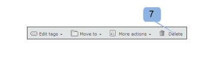

# Tableau de bord dans [!DNL Workfront Proof]

>[!IMPORTANT]
>
>Cet article fait référence aux fonctionnalités du produit [!DNL Workfront Proof] autonome. Pour plus d’informations sur la relecture dans [!DNL Adobe Workfront], voir [Relecture](../../../review-and-approve-work/proofing/proofing.md).

Le tableau de bord est la première page qui s’affiche lorsque vous vous connectez à votre compte [!DNL Workfront Proof]. Il récapitule l’activité dans votre compte [!DNL Workfront Proof] et fournit des liens rapides vers d’autres sections et fonctions dans [!DNL Workfront Proof].

Le tableau de bord contient les éléments suivants :

* Logo de l’entreprise (1)
* Navigation supérieure (2)
* Recherche (3)

* Menu d’en-tête (4)
* Nouveau menu (5)
* Barre latérale (6)
* Section de bienvenue (7)
* Vue d’ensemble (8)
* Éléments récemment consultés (9)
* Activité récente (10)

>[!NOTE]
>
>Les menus et liens que vous pouvez afficher et utiliser dans votre tableau de bord dépendent de votre profil d’utilisateur ou d’utilisatrice et de vos autorisations.

Vous pouvez personnaliser le branding de votre compte pour afficher le logo, les couleurs, les liens personnalisés, etc., de votre propre entreprise. Pour plus d’informations, voir [Personnaliser le branding du site  [!DNL Workfront Proof] ](../../../workfront-proof/wp-acct-admin/branding/brand-wp-site.md).

Si vous ne personnalisez pas le branding de votre compte, le logo [!DNL Workfront Proof] et les couleurs standard apparaissent.

## Menu d’en-tête

### Nom d’utilisateur ou d’utilisatrice

Le nom d’utilisateur ou d’utilisatrice (2) choisi s’affiche ici. Il peut être modifié dans les paramètres personnels.

### Paramètres

Ici (3), vous pouvez accéder aux éléments suivants :

* Paramètres personnels
* Paramètres du compte
* Facturation

>[!NOTE]
>
>La visibilité des menus ci-dessus dépend de votre profil. Pour plus d’informations, voir Profils d’utilisateur ou d’utilisatrice et autorisations.

### Aide

Ici (4), vous pouvez accéder aux éléments suivants :

* Articles d’aide
* Films de démonstration

>[!NOTE]
>
>Grâce à nos formules Select et Premium, vous pouvez configurer les options d’aide pour diriger vos utilisateurs et utilisatrices vers votre propre contenu. Pour plus d’informations, consultez nos options de personnalisation de branding avancées.

### Déconnexion

Cliquez ici pour vous déconnecter de votre compte.

## Nouveau menu

Pour ouvrir le nouveau menu,

1. cliquez sur la flèche déroulante (7).

   Le **[!UICONTROL nouveau]** menu propose les options suivantes :

   * Nouvelle épreuve (8)
   * Charger un fichier (9)
   * Nouveau dossier (10)
   * Nouvelle personne invitée (11)
   * Nouvel utilisateur ou nouvelle utilisatrice (12)
   * Nouveau groupe (13)

## Menu « Tableau de bord »

Le menu « Tableau de bord » contient les menus suivants :

* Modifier les balises
* Déplacer vers
* Plus d&#39;actions
* Supprimer

## Modifier les balises

Le menu [!UICONTROL Modifier les balises] (1) permet les actions suivantes :

* Appliquer une balise à un ou plusieurs éléments
* Créer de nouvelles balises
* Gérer les balises (2)

## Déplacer vers

Cette fonction vous permet de déplacer des épreuves et des fichiers dans l’un de vos dossiers. Pour ce faire :

1. Sélectionnez la case à cocher correspondant aux éléments concernés.
1. Cliquez sur **[!UICONTROL Déplacer vers]** (3) et choisissez le dossier souhaité (4).
1. Cliquez sur **[!UICONTROL Enregistrer]** (5).

   

### Plus d&#39;actions

Dans le menu [!UICONTROL Pus d’actions] (6) vous pouvez effectuer les actions suivantes :

* Verrouiller (épreuve uniquement)
* Activer
* Archiver (épreuve uniquement)
* Désarchiver (épreuve uniquement)
* Changer de personne propriétaire

### Supprimer

Pour supprimer des éléments, procédez comme suit :

1. Sélectionnez la case à cocher située à gauche des éléments et cliquez sur **[!UICONTROL Supprimer]** (7).

1. Dans l’écran de confirmation qui s’affiche, vérifiez les détails et confirmez en cliquant sur **[!UICONTROL Oui]** (8).

### Barre latérale

La barre latérale contient des liens vers les pages suivantes :

* Tableau de bord (1)
* Vues (2)
* Workflows (3) (formule Premium uniquement)
* Zone de dépôt (4) (formules Select et Premium)
* Contacts (5)
* Groupes (6)
* Activité (7)
* Corbeille (8)
* Mes dossiers (9) (possibilité également d’accéder à chaque dossier individuel à partir de la barre latérale)
* Dossiers d’autres organisations (10) (pour trouver des éléments partagés avec vous par d’autres organisations)
* Balises (11)

La barre latérale est décrite plus en détail sur la page d’aide de la barre latérale.

### Section [!UICONTROL Bienvenue]

La section [!UICONTROL Bienvenue] comporte les liens utiles suivants :

* Regarder nos films de démonstration (1)
* Pages d’aide (2)
* Coordonnées de l’assistance (3)
* Lien « Ne plus afficher la section Bienvenue » (4)

### Vue d’ensemble

Dans cette section, vous trouverez des liens rapides vers :

* Créer une nouvelle épreuve Charger un fichier
* Créer un dossier
* Ajouter un nouvel utilisateur ou une nouvelle utilisatrice
* Modifier votre mot de passe

La section vue d’ensemble affiche également des informations préfiltrées. Ces informations sont les suivantes :

* Épreuves à gérer : nombre total d’épreuves actives que vous possédez et que l’on vous a déléguées.
* Épreuves en attente de décision : nombre total d’épreuves actives nécessitant des décisions de votre part.

  

Ici, vous pouvez voir immédiatement combien d’épreuves nécessitent une action immédiate de votre part ou de la part de vos réviseurs et réviseuses :

* Total
* Dans les délais : épreuves sans date d’échéance ou pour lesquelles il reste au moins 24 heures avant la date d’échéance.
* À risque : épreuves pour lesquelles il reste moins de 24 heures avant la date d’échéance.
* En retard : épreuves pour lesquelles toutes les actions ne sont pas effectuées et qui ont dépassé leur date d’échéance.

>[!NOTE]
>
>Vous pouvez cliquer sur les valeurs des graphiques et facilement accéder à la liste détaillée des éléments.

### Éléments récemment consultés

La section [!UICONTROL Éléments récemment consultés] vous affiche les éléments que vous avez récemment consultés. Elle inclut les éléments que vous possédez, les éléments que vous avez l’autorisation de voir en fonction des autorisations de votre profil et les éléments qui ont été partagés avec vous. Cette section inclut uniquement les éléments que vous avez vous-même ouverts (via la visionneuse [!DNL Workfront Proof] ou via la page Détails de l’épreuve).

La section [!UICONTROL Éléments récemment consultés] vous affiche les informations suivantes sur les épreuves et les fichiers récents :

* Nom
* Progression
* Statut
* Décision
* Propriétaire

Résumé (ces informations sont réduites par défaut : cliquez sur le bouton développer/réduire à gauche de l’épreuve correspondante pour ouvrir le résumé de l’épreuve)

Menu Actions

Voir les Dispositions de pages pour connaître les différentes options de mise en page disponibles pour cette section.

>[!NOTE]
>
>Cliquer sur le nom de l’épreuve dans la section [!UICONTROL Éléments récemment consultés] vous dirige directement vers l’épreuve dans la visionneuse d’épreuves.

Pour accéder à la page Détails de l’épreuve, procédez comme suit :

1. Cliquez sur le menu **[!UICONTROL Actions]** (1) qui se trouve à droite du nom de l’épreuve.
1. Sélectionnez **[!UICONTROL Afficher les détails de l’épreuve]** (2) dans le menu.

### Activité récente

Cette section vous affiche les détails suivants sur l’activité récente de votre compte :

* Date et heure, nom de l’épreuve/du fichier
* Action
* Détails

Vous pouvez également accéder à la page Détails d’un élément en cliquant sur le menu Actions de l’élément et en choisissant Afficher les détails. Pour plus d’informations sur l’activité de votre compte, voir Journal d’audit de l’activité.

>[!NOTE]
>
>Cliquer sur le nom de l’épreuve dans la section [!UICONTROL Activité récente] ouvre l’épreuve dans la visionneuse d’épreuves.

Pour accéder à la page Détails de l’épreuve de cette épreuve, procédez comme suit :

1. Cliquez sur le menu **[!UICONTROL Actions]** (1).
1. Sélectionnez **[!UICONTROL Afficher les détails de l’épreuve]** (2) dans le menu déroulant.

   
