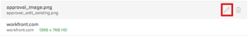
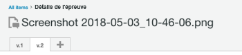

# Générer des bons à tirer dans [!DNL Workfront Proof]

>[!IMPORTANT]
>
>Cet article fait référence à la fonctionnalité du produit autonome [!DNL Workfront Proof]. Pour plus d&#39;informations sur la vérification à l&#39;intérieur de [!DNL Adobe Workfront], voir [Proofing](../../../review-and-approve-work/proofing/proofing.md).

[!DNL Workfront Proof] vous permet de créer des bons à tirer à partir de documents ou de sites web et de partager ces bons à tirer avec d’autres personnes. Les étapes suivantes décrivent les différentes options de configuration disponibles :

## Générer un BAT pour un document

1. Pour commencer à créer un BAT et afficher la page [!UICONTROL New Proof] , effectuez l’une des opérations suivantes :

   * Cliquez sur le bouton vert **[!UICONTROL Nouveau BAT]** dans le coin supérieur gauche d’une page.
   * Dans la zone **[!UICONTROL Tableau de bord]**, dans l’onglet **[!UICONTROL Aperçu]**, cliquez sur le lien **[!UICONTROL Nouveau BAT]**.

   * Envoyer par zone de dépôt (fonction Enterprise).
   * La page **[!UICONTROL New Proof]** s’affiche.

1. Pour BAT d’un ou de plusieurs documents, ajoutez les documents à vérifier de l’une des façons suivantes (répétez cette procédure pour ajouter plusieurs documents à vérifier) :

   * Faites glisser un document de votre système de fichiers vers la zone de glisser-déposer dans la zone **[!UICONTROL Ajouter des fichiers]**.
   * Cliquez dans la zone de glisser-déposer de la zone **[!UICONTROL Ajouter des fichiers]**, puis recherchez et sélectionnez le document à télécharger à partir du système de fichiers de votre poste de travail.

     

1. Pour tester un ou plusieurs sites web, spécifiez l&#39;URL du site web que vous souhaitez tester dans la zone **[!UICONTROL Ajouter des fichiers]**, puis appuyez sur **[!UICONTROL Entrée]**.

1. (Facultatif) Répétez cette procédure pour ajouter plusieurs sites web à des BAT.

   Pour plus d&#39;informations sur les sites web de vérification, voir [Générer un BAT pour une URL](#generate-a-proof-for-a-url).

   

1. (Facultatif) Modifiez les noms des fichiers chargés :

   1. Placez le pointeur de la souris sur le nom du document que vous souhaitez modifier dans la liste des documents de la zone **[!UICONTROL Ajouter des fichiers]**, puis cliquez sur l’icône **[!UICONTROL Modifier]** .

      

   1. Dans le champ **[!UICONTROL Nom du bon à tirer]**, spécifiez un nouveau nom, puis cliquez sur **[!UICONTROL Terminé]**.

   1. (Facultatif) Pour supprimer des fichiers à charger, placez le pointeur de la souris sur le document que vous souhaitez supprimer de la liste de documents dans la zone **[!UICONTROL Ajouter des fichiers]**, puis cliquez sur l’icône **[!UICONTROL Supprimer]**.

      

   1. (Facultatif) Activez l’option, **[!UICONTROL Combinez tous les fichiers compatibles en un seul BAT]**.

      **Lorsque cette option est activée :** Tous les fichiers et sites web statiques sont disponibles dans un seul BAT et vous pouvez charger jusqu’à 50 fichiers à la fois.

      >[!NOTE]
      >
      >Les fichiers interactifs, y compris les vidéos et les sites web interactifs, ne peuvent pas être combinés en un seul BAT.

      **Lorsque cette option est désactivée :** Tous les documents et sites web sont générés en tant que bons à tirer individuels. Vous pouvez charger jusqu’à 20 fichiers à la fois.

      Pour combiner tous les fichiers et sites Web chargés en un seul BAT :

      1. Activez l’option **[!UICONTROL Combinez tous les fichiers compatibles en un seul BAT]**.
      1. Dans le champ **[!UICONTROL Nom du bon à tirer]** , spécifiez un nouveau nom pour le BAT combiné.
      1. Dans la zone **[!UICONTROL Ajouter des fichiers]**, réorganisez les fichiers inclus en faisant glisser un fichier dans l’ordre souhaité. L’ordre des fichiers est l’ordre des pages du BAT combiné. Pour plus d’informations sur la création de BAT combinés, voir [Création d’un BAT multi-page](../../../review-and-approve-work/proofing/creating-proofs-within-workfront/create-multi-page-proof.md).

1. (Facultatif) Si vous souhaitez utiliser un workflow automatisé qui comprend plusieurs étapes, dans la section **[!UICONTROL Workflow]** , sélectionnez l’une des options suivantes :

   * **De base :** Sélectionnez cette option pour désigner les utilisateurs qui doivent avoir accès au BAT immédiatement après sa création. Vous pouvez partager le BAT avec plusieurs utilisateurs.

     Pour plus d’informations sur le partage d’un BAT, voir &quot;Ajout d’utilisateurs à un BAT&quot; dans [Partager un BAT dans [!DNL Adobe Workfront]](../../../review-and-approve-work/proofing/managing-proofs-within-workfront/share-a-proof-in-workfront.md).

   * **Automatisé :** Sélectionnez cette option pour gérer la révision et l’approbation du contenu lorsque vous avez des processus de révision complexes, ou si vous envoyez régulièrement du contenu pour révision à ces mêmes groupes de personnes. Avec le workflow automatisé, le BAT passe d’une étape à l’autre jusqu’à l’approbation finale. Les utilisateurs concernés sont avertis lorsqu’ils sont tenus d’effectuer une validation.

     Pour plus d’informations sur la création d’un workflow automatisé, voir [Configuration d’un BAT avec un workflow automatisé dans [!DNL Workfront Proof]](../../../workfront-proof/wp-work-proofsfiles/automated-workflow/set-up-proof-auto-workflow.md#create2).

1. Indiquez si vous souhaitez envoyer des notifications par e-mail et un message personnalisé aux utilisateurs que vous avez sélectionnés à l’étape précédente :

   * **Avertissez les destinataires de ce BAT :** Sélectionnez cette option pour envoyer une notification électronique aux utilisateurs. Lorsque l&#39;option **[!UICONTROL Partage de base]** est sélectionnée dans la section **[!UICONTROL Workflow]**, une notification par e-mail est envoyée lorsque le BAT est créé. Lorsque **[!UICONTROL Processus automatisé]** est sélectionné dans la section **[!UICONTROL Workflow]**, une notification par courrier électronique est envoyée lorsque le BAT entre dans l’étape du processus automatisé auquel l’utilisateur est associé.

   * **Ajouter un message personnalisé :** Sélectionnez cette option pour inclure un message personnalisé dans la notification. Vous pouvez spécifier un objet et un corps de message. Le corps du message peut inclure une mise en forme en texte enrichi (gras, puces et liens hypertexte).

1. Sélectionnez l’un des paramètres de BAT suivants :

   <table style="table-layout:auto"> 
    <col> 
    <col> 
    <tbody> 
     <tr> 
      <td role="rowheader">Connexion requise : le BAT ne peut être partagé qu’avec d’autres utilisateurs.</td> 
      <td> 
<strong>Connexion requise - le BAT ne peut être partagé qu'avec d'autres utilisateurs :</strong> Lorsque cette option est sélectionnée, seuls les utilisateurs [!DNL Workfront Proof] peuvent afficher le BAT.
 
Cette option est désactivée par défaut ; toute personne disposant de l’URL peut afficher le BAT.
 
Lorsque cette option est sélectionnée :
 
       <ul> 
        <li>Les utilisateurs ne peuvent pas se connecter au BAT à moins qu’ils n’aient été ajoutés au BAT.</li> 
        <li>Les abonnements ne peuvent pas être activés.</li> 
       </ul> </td> 
     </tr> 
     <tr> 
      <td role="rowheader">Une seule décision requise pour ce BAT</td> 
      <td> 
Lorsque cette option est sélectionnée, la révision est terminée une fois que l’un des décideurs a pris sa décision.
 
Cette option est désactivée par défaut.
 </td> 
     </tr> 
     <tr> 
      <td role="rowheader">Exiger que les décisions soient signées de manière électronique</td> 
      <td>Les utilisateurs doivent indiquer leur nom d’utilisateur et leur mot de passe au moment où ils prennent une décision sur un BAT.</td> 
     </tr> 
     <tr> 
      <td role="rowheader">Verrouiller le BAT lorsque toutes les décisions requises sont prises</td> 
      <td> 
<strong></strong> Lorsque ce paramètre est activé, l’état du BAT est verrouillé une fois toutes les décisions prises. L’état est automatiquement modifié du déverrouillé au verrouillé lorsque l’approbateur final prend sa décision.
 
Cette option est désactivée par défaut.
 </td> 
     </tr> 
     <tr> 
      <td role="rowheader">Télécharger le fichier d’origine</td> 
      <td> 
<strong></strong> Lorsque cette option est sélectionnée, les réviseurs peuvent télécharger le fichier d'origine à partir duquel le BAT a été créé.
 
Si cette option est désélectionnée, l’icône Télécharger n’est plus visible. Cette option est activée par défaut.
 </td> 
     </tr> 
     <tr> 
      <td role="rowheader">Partage du BAT via une URL publique ou un code intégré</td> 
      <td>Lorsque cette option est sélectionnée, le BAT peut être partagé via une URL publique ou un code intégré.</td> 
     </tr> 
     <tr> 
      <td role="rowheader">Abonnez-vous au BAT via une URL publique ou un code intégré</td> 
      <td> 
Lorsque cette option est sélectionnée, les personnes qui n’ont pas été explicitement ajoutées au BAT peuvent s’abonner au BAT. La personne qui s'abonne au BAT se voit attribuer le rôle et l'email que vous définissez dans les paramètres suivants :
 
       <ul> 
        <li><strong>Rôle d’abonné</strong> : rôle de BAT par défaut attribué à tous les réviseurs qui souscrivent au BAT.</li> 
        <li><strong>Paramètres des alertes par email pour les abonnés</strong> : alerte par défaut attribuée à tous les réviseurs qui souscrivent au BAT.</li> 
        <li> 
<strong>Accès au BAT par le biais d'un lien d'email requis pour</strong> : configurez si l'abonné reçoit un email avec un lien vers le BAT. Vous pouvez sélectionner <strong>Aucun email</strong> (aucun lien d'email n'est nécessaire pour accéder au BAT), <strong>Email de notification de BAT uniquement</strong> (l'abonné reçoit un lien vers le BAT par email sans vérification) ou <strong>Email de validation et de notification de BAT</strong> (l'abonné reçoit un lien vers le BAT par email et doit cliquer sur le lien pour accéder à un BAT ; l'option permettant de s'assurer que la personne adresse électronique correcte à laquelle ils ont accès).
 
Remarque : Si le workflow automatisé est joint aux bons à tirer, tous les abonnements génèrent des emails de confirmation au propriétaire du BAT, afin qu’il puisse décider à quelle étape la personne doit être ajoutée.
 </li> 
       </ul> </td> 
     </tr> 
    </tbody> 
   </table>

1. Cliquez sur **[!UICONTROL Créer un bon à tirer]**.

   Workfront commence à générer un bon à tirer des documents ou des sites Web sélectionnés. Selon la taille et le type du fichier, le délai de téléchargement d’un document varie. Soyez patient car la génération de fichiers plus volumineux prend plus de temps. Vous pouvez quitter la page et Workfront continue à générer votre fichier. La taille maximale du téléchargement de fichier est de 4 Go.

   Une fois le BAT généré, cliquez sur **[!UICONTROL Aller au BAT]** pour lancer l’outil de vérification de performance.

   

   Le document apparaît dans l’outil de vérification.

   Les utilisateurs dont le compte ne contient pas de vérification peuvent toujours afficher le document et envoyer des commentaires au BAT.

## Générer un BAT pour une URL {#generate-a-proof-for-a-url}

Vous pouvez générer un BAT pour une URL pour la première fois. Vous pouvez également générer une nouvelle version d’un BAT d’URL où un BAT a été généré précédemment.

>[!NOTE]
>
>Vous pouvez générer un BAT interactif pour une URL uniquement si votre environnement [!DNL Workfront] est intégré à un compte [!DNL Workfront Proof] Premium. Si vous ne pouvez pas utiliser le correctif comme décrit dans cette section, contactez votre administrateur système.

Pour générer un BAT pour une URL :

1. Pour commencer à créer un BAT et afficher la page [!UICONTROL New Proof] , effectuez l’une des opérations suivantes :

   * Cliquez sur le bouton vert **[!UICONTROL Nouveau BAT]** dans le coin supérieur gauche d’une page.
   * Dans la zone **[!UICONTROL Tableau de bord]**, dans l’onglet **[!UICONTROL Aperçu]**, cliquez sur le lien **[!UICONTROL Nouveau BAT]**.

   * Envoyer par zone de dépôt (fonction Enterprise).

1. (Conditionnel) Sur la page **[!UICONTROL New BAT]** qui s’affiche, pour créer une version d’un BAT existant :

   1. Sélectionnez le BAT de l’URL où vous souhaitez ajouter une nouvelle version.
   1. Cliquez sur le bouton **[!UICONTROL Nouvelle version]** en haut de la page.

      

1. Dans la page Nouvelle version du BAT qui s’affiche, spécifiez l’URL du site Web que vous souhaitez tester dans la zone **[!UICONTROL Ajouter des fichiers]**, puis appuyez sur **[!UICONTROL Entrée]**.

1. (Facultatif) Répétez cette procédure pour ajouter plusieurs sites web à des BAT.

   

1. Cliquez sur le site web dans la liste des documents de la zone **[!UICONTROL Ajouter des fichiers]**.

   

1. Spécifiez un **[!UICONTROL nom du BAT]** pour le BAT.

   Par défaut, le nom du BAT est identique à l’URL du site.

1. Sélectionnez les options **[!UICONTROL Gérer le contenu du site]** :

   <table style="table-layout:auto"> 
    <col> 
    <col> 
    <tbody> 
     <tr> 
      <td role="rowheader">Capture d’écran</td> 
      <td>Crée un BAT d’une image statique de la page d’accueil de l’URL.</td> 
     </tr> 
     <tr> 
      <td role="rowheader">Interactif</td> 
      <td> 
Crée un BAT qui permet aux réviseurs de parcourir le site, d’afficher les images HTML5, les éléments de Flash, etc.
 
Pour créer un BAT interactif, le site web doit être hébergé avec un protocole sécurisé (https). En outre, les sites web qui ne peuvent pas être incorporés dans un iframe ne peuvent pas être générés en tant que BAT interactif (les restrictions d’intégration d’iframe sont contrôlées par le site web que vous tentez d’incorporer).
 
Une fois le BAT initial créé, ce paramètre ne peut plus être modifié lors de la création de versions ultérieures.
 
Pour plus d’informations sur la vérification interactive, voir <a href="#generate-a-proof-for-interactive-content" class="MCXref xref">Générer un BAT pour le contenu interactif</a>.
 </td> 
     </tr> 
     <tr> 
      <td role="rowheader">Résolution de la capture d’écran</td> 
      <td> 
(Cette option n’est pas disponible pour les bons à tirer interactifs.) Vous pouvez ajuster la résolution de votre contenu ou sélectionner plusieurs résolutions.
 
Cela permet aux utilisateurs de vérifier le BAT pour voir comment le contenu apparaîtra sur différents appareils, comme les différentes tailles de téléphones, tablettes et moniteurs.
 
Si vous sélectionnez plusieurs résolutions, un BAT distinct est créé pour chaque résolution sélectionnée.
 
Lorsque les utilisateurs commentent le BAT, la résolution d’écran actuelle s’affiche automatiquement dans le commentaire pour s’assurer que les autres utilisateurs connaissent la résolution à laquelle le commentaire est associé.
 </td> 
     </tr> 
     <tr> 
      <td role="rowheader">Recherche de sous-pages</td> 
      <td>(Cette option n’est pas disponible pour les bons à tirer interactifs.) Sélectionnez cette option pour parcourir les pages du site web. Vous pouvez développer le site web jusqu’à 2 niveaux de profondeur à partir de la page principale. Pointez sur une page pour afficher l’URL de la page. Sélectionnez uniquement les pages à tester. Chaque page sélectionnée est créée par défaut en tant que BAT individuel ; ou, activez l’option <strong>Combiner en un seul BAT</strong> pour combiner toutes les pages sélectionnées en un seul BAT.</td> 
     </tr> 
    </tbody> 
   </table>

1. (Facultatif) Configurez toutes les options de vérification avancées, telles que le partage du BAT, l’ajout d’un workflow automatisé ou la configuration des paramètres d’accès et d’abonnement. Pour plus d’informations sur ces options, consultez les articles suivants :

   * [Partager un BAT dans  [!DNL Adobe Workfront]](../../../review-and-approve-work/proofing/managing-proofs-within-workfront/share-a-proof-in-workfront.md)
   * [Configuration d’un BAT avec un workflow automatisé dans  [!DNL Workfront Proof]](../../../workfront-proof/wp-work-proofsfiles/automated-workflow/set-up-proof-auto-workflow.md)
   * [Configurer les paramètres d’accès et d’abonnement d’une épreuve](../../../review-and-approve-work/proofing/managing-proofs-within-workfront/configure-access-subscription-settings-proof.md)

1. Cliquez sur **[!UICONTROL Terminé]**.

   Si vous ajoutez une nouvelle version à un BAT d’URL existant, toutes les options configurées sur le BAT d’origine ou la version précédente sont conservées dans cette version. Si vous ajoutez une nouvelle version à un BAT d’URL existant, toutes les options configurées sur le BAT d’origine ou la version précédente sont conservées dans cette version.

1. Cliquez sur **[!UICONTROL Créer un bon à tirer]**.

## Générer un BAT pour le contenu interactif {#generate-a-proof-for-interactive-content}

Pour utiliser cette fonctionnalité, vous devez disposer d’un abonnement Pro Workfront ou d’une version ultérieure. Pour plus d’informations sur les différentes formules disponibles, voir [Formules Workfront](https://www.workfront.com/plans?lang=fr).

Pour plus d’informations sur le contenu interactif, voir [Présentation des bons à tirer du contenu interactif](../../../review-and-approve-work/proofing/proofing-overview/interactive-content-proofs.md).

* [Ajout de contenu interactif en tant qu’URL](#add-interactive-content-as-a-url)
* [Ajout de contenu interactif en tant que fichier ZIP](#add-interactive-content-as-a-zip-file)

### Ajout de contenu interactif en tant qu’URL {#add-interactive-content-as-a-url}

Pour plus d’informations sur l’ajout d’un BAT d’URL interactif, voir [Générer un BAT pour une URL](#generate-a-proof-for-a-url).

### Ajout de contenu interactif en tant que fichier ZIP {#add-interactive-content-as-a-zip-file}

1. Préparez votre contenu en créant un fichier compressé .zip.

   Pour plus d’informations sur les spécifications de fichiers compressés .zip, voir [À propos de la préparation de contenu interactif dans un fichier ZIP pour la vérification](../../../review-and-approve-work/proofing/proofing-overview/interactive-content-proofs.md#howtoprepareaninteractiveziparchive) dans l’article [Présentation des BAT de contenu interactif](../../../review-and-approve-work/proofing/proofing-overview/interactive-content-proofs.md).

1. Pour commencer à créer un BAT et afficher la page [!UICONTROL New Proof] , effectuez l’une des opérations suivantes :

   * Cliquez sur le bouton vert **[!UICONTROL Nouveau BAT]** dans le coin supérieur gauche d’une page.
   * Dans la zone **[!UICONTROL Tableau de bord]**, dans l’onglet **[!UICONTROL Aperçu]**, cliquez sur le lien **[!UICONTROL Nouveau BAT]**.

   * Envoyer par zone de dépôt (fonction Enterprise).

1. Dans la page **[!UICONTROL New BAT]** qui s’affiche, faites glisser et déposez votre lot interactif .zip dans la zone **[!UICONTROL Ajouter des fichiers]**.

1. (Facultatif) Configurez toutes les options de vérification avancées, telles que le partage du BAT, l’ajout d’un workflow automatisé ou la configuration des paramètres d’accès et d’abonnement. Pour plus d’informations sur ces options, consultez les articles suivants :

   * [Partager un BAT dans  [!DNL Adobe Workfront]](../../../review-and-approve-work/proofing/managing-proofs-within-workfront/share-a-proof-in-workfront.md)
   * dans l’article
   * [Configurer les paramètres d’accès et d’abonnement d’une épreuve](../../../review-and-approve-work/proofing/managing-proofs-within-workfront/configure-access-subscription-settings-proof.md)

1. Cliquez sur **[!UICONTROL Créer un bon à tirer]**.

   Workfront commence à générer un bon à tirer du lot .zip. Selon la taille du lot, le délai de remise d’un document varie. La génération de fichiers plus volumineux prend plus de temps. Vous pouvez quitter la page et Workfront continue à générer votre fichier. La taille maximale du téléchargement de fichier est de 4 Go.

   Une fois le BAT généré, vous pouvez cliquer sur le bouton **[!UICONTROL Aller au BAT]** qui s’affiche pour ouvrir le BAT.
