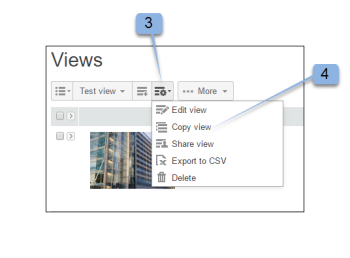

# Créer et gérer des vues personnalisées dans [!DNL Workfront Proof]

>[!IMPORTANT]
>
>Cet article fait référence à la fonctionnalité du produit autonome [!DNL Workfront Proof]. Pour plus d&#39;informations sur la vérification à l&#39;intérieur de [!DNL Adobe Workfront], voir [Proofing](../../../review-and-approve-work/proofing/proofing.md).

Vous pouvez créer des vues personnalisées de vos fichiers et BAT pour répertorier les éléments de votre choix comme vous le souhaitez. Vous pouvez également exporter les informations dans votre vue personnalisée sous la forme d’un rapport (au format CSV, valeur séparée par des virgules, format de fichier).

>[!NOTE]
>
>Les vues personnalisées sont disponibles uniquement sur les plans Select et Premium. Veuillez contacter notre équipe des ventes pour obtenir un devis.

## Création d’une vue personnalisée

Lorsque vous créez une vue personnalisée, vous pouvez choisir :

* Si vous souhaitez inclure des bons à tirer, des fichiers ou les deux
* Les colonnes affichées
* Quelle colonne doit trier ?
* Ordre de tri de la colonne (ascendant ou descendant)
* Quels types de filtres utiliser pour déterminer les informations incluses dans la vue ?

Une fois la vue personnalisée créée, elle peut être utilisée immédiatement. Le nom de la nouvelle vue est également inclus dans le menu déroulant sous le titre Mes vues personnalisées (sous les vues standard).

Pour créer une vue personnalisée :

1. Accédez à la page **[!UICONTROL Vues]** .
1. Pour plus d’informations sur les vues, voir [Gestion des éléments sur la page des vues dans [!DNL Workfront Proof]](../../../workfront-proof/wp-work-proofsfiles/manage-your-work/manage-items-on-views-page.md).
1. Effectuez l’une des opérations suivantes, selon que vous souhaitez créer une vue personnalisée à partir de zéro ou créer une vue personnalisée basée sur une vue standard existante :

   * Pour créer une vue personnalisée basée sur une vue standard existante : dans le menu déroulant, sélectionnez la vue standard existante à utiliser comme base de votre nouvelle vue personnalisée. Cliquez sur l’icône **[!UICONTROL Afficher les paramètres]**, puis sur **[!UICONTROL Copier]** vers une nouvelle vue personnalisée.

   * 

   * Pour créer une vue personnalisée à partir de zéro : cliquez sur l’icône **[!UICONTROL Nouvelle vue]** .
   * 

1. Dans la section **[!UICONTROL Details]** , spécifiez les informations suivantes :

   * **[!UICONTROL Nom]** (obligatoire) : nom de la nouvelle vue. Utilisez un nom unique afin que les utilisateurs puissent facilement trouver la vue personnalisée dans le menu déroulant des vues.
   * **[!UICONTROL Éléments]** : choisissez si vous souhaitez que les bons à tirer et le fichier, les bons à tirer uniquement ou les fichiers uniquement inclus dans la vue. Par défaut, les bons à tirer et les fichiers sont inclus.

1. Dans la section **[!UICONTROL Colonnes]** , déterminez les colonnes que vous souhaitez inclure dans la vue personnalisée.

   1. Cliquez sur l’icône de flèche vers la droite.
   1. 

   1. Double-cliquez sur le nom de la colonne sélectionnée.
   1. Vous devez sélectionner au moins une colonne et une seule colonne peut être ajoutée.
   1. Sélectionnez une colonne dans la zone **[!UICONTROL Colonnes disponibles]** que vous souhaitez inclure dans la nouvelle vue.
   1. Les colonnes sont déplacées de la liste **[!UICONTROL Colonnes disponibles]** vers la liste **[!UICONTROL Colonnes sélectionnées]**.

   1. Vous pouvez choisir parmi les colonnes standard ou les champs personnalisés et les motifs de décision à afficher dans votre vue personnalisée. (Si votre compte les a configurés, ils s’affichent sous la liste standard de la zone Colonnes disponibles .)
   1. Colonnes standard que vous pouvez inclure

      <table style="table-layout:auto">
      <thead>

      </thead>
      <tbody>  
      <tr>   
      <td><strong>Nom de l’étape active</strong></td>   
      <td>Nom de l’étape active dans le workflow automatisé.</td>  
      </tr>  
      <tr>   
      <td><strong>Commentaires</strong></td>   
      <td>Nombre de commentaires reçus.</td>
      </tr>  
      <tr>   
      <td><strong>Compteur</strong></td>
      <td>Affiche un certain nombre de BAT qui ont été chargés sur votre compte (une option de compteur de BAT doit être activée dans les paramètres du compte).</td>
      </tr>
      <tr>
      <td><strong>Créé</strong></td>
      <td>Date et heure de création de l’élément.</td>
      </tr>
      <tr>
      <td><strong>Créateur ou créatrice</strong></td>
      <td>L’utilisateur qui a créé l’élément.</td>
      </tr>
      <tr>
      <td><strong>[!UICONTROL Date ajoutée au BAT]</strong></td>
      <td>La date à laquelle vous avez été ajouté au BAT. </td>
      </tr>
      <tr>
      <td><strong>Échéance</strong></td>
      <td>La date limite pour la totalité de la preuve.</td>
      </tr>
      <tr>
      <td><strong>Décisions</strong></td>
      <td>Le nombre de décisions prises par rapport au nombre attendu (par exemple 0 sur 1, 1 sur 1, etc.)</td>
      </tr>
      <tr>
      <td><strong>[!UICONTROL Téléchargements]</strong></td>
      <td>Nombre de téléchargements du fichier d’origine.</td>
      </tr>
      <tr>
      <td><strong>Nom du fichier</strong></td>
      <td>Nom du fichier ou du BAT.</td>
      </tr>
      <tr>
      <td><strong>Dossier</strong></td>
      <td>Le dossier contenant l’élément.</td>
      </tr>
      <tr>
      <td><strong>Dernière activité</strong></td>
      <td>Date et heure de la dernière activité sur l’élément.</td>
      </tr>
      <tr>
      <td><strong>Dernière décision sur</strong></td>
      <td>Date et heure de la dernière décision prise.</td>
      </tr>
      <tr>
      <td><strong>Ma date limite</strong></td>
      <td>Votre propre délai d’expiration sur les bons à tirer pour lesquels vous êtes explicitement ajouté en tant que réviseur/approbateur (le cas échéant).</td>
      </tr>
      <tr>
      <td><strong>Propriétaire</strong></td>
      <td>Propriétaire de l’élément.</td>
      </tr>
      <tr>
      <td><strong>Pays du propriétaire</strong></td>
      <td>Le pays s'est inscrit dans le système pour le propriétaire du BAT. </td>
      </tr>
      <tr>
      <td><strong>BAT parent</strong></td>
      <td>Nom du BAT parent.</td>
      </tr>
      <tr>
      <td><strong>Progression</strong></td>
      <td>
Barre de progression. Affiche les bons à tirer qui ne sont pas encore lancés, ouverts, commentés le ou décidés le.

Ces informations ne sont pas triées.
</td>
      </tr>
      <tr>
      <td><strong>Nom de l'épreuve</strong></td>
      <td>Le nom du BAT.</td>
      </tr>
      <tr>
      <td><strong>Type de BAT</strong></td>
      <td>
Le type de BAT : Fichier statique, Page web statique, Web interactif (téléchargement .zip), Page web interactive (https), Vidéo, Audio, etc. 

Les BAT combinés sont identifiés comme "Type de BAT combiné". Type de fichier du BAT.
</td>
      </tr>
      <tr>
      <td><strong>Taille de fichier (Mo)</strong></td>
      <td>
Taille de fichier du BAT en ce qui concerne le quota d’utilisation du disque.

Cette information est fournie pour la version actuelle du BAT. S’il n’existe pas de version actuelle, il s’agit de la version la plus récente.
</td>
      </tr>
      <tr>
      <td>
 

<strong>Délai d’évaluation actif</strong>
</td>
      <td>Délai des étapes dans le workflow automatisé.</td>
      </tr>
      <tr>
      <td><strong>Nom de l’étape</strong></td>
      <td>Nom de chaque étape du workflow automatisé. Cela inclut les étapes passées, actives et futures.</td>
      </tr>
      <tr>
      <td><strong>Département</strong></td>
      <td>Actif, Verrouillé, Brouillon ou Envoyé.</td>
      </tr>
      <tr>
      <td><strong>Statut</strong></td>
      <td>En attente, Modifications requises, Approuvé avec modifications, Approuvé ou Non pertinent.</td>
      </tr>
      <tr>
      <td><strong>Balises</strong></td>
      <td>Toutes les balises associées à l’élément.</td>
      </tr>
      <tr>
      <td><strong>Noms des étapes à venir</strong></td>
      <td> Nom de chaque étape qui n’a pas encore commencé dans le workflow automatisé. </td>
      </tr>
      <tr>
      <td><strong>compteur de versions</strong></td>
      <td> Nombre de versions de l’élément. </td>
      </tr>
      <tr>
      <td><strong>Numéro de version du BAT</strong></td>
      <td><i>Numéro de version du BAT.</i></td>
      </tr> 
      </tbody>
      </table>

   1. (Facultatif) Effectuez l’une des opérations suivantes pour déplacer la colonne vers la zone **[!UICONTROL Colonnes sélectionnées]** afin qu’elle soit incluse dans la nouvelle vue :

      * Réorganisez toutes les colonnes de la liste **[!UICONTROL Colonnes sélectionnées]**.
      * L&#39;ordre dans lequel les colonnes sont affichées dans la liste **[!UICONTROL Colonnes sélectionnées]** détermine l&#39;ordre dans lequel les colonnes sont affichées dans la vue personnalisée.
      * Les colonnes sont visibles dans la liste **[!UICONTROL Colonnes sélectionnées]** dans l’ordre dans lequel vous les avez ajoutées à partir de la liste **[!UICONTROL Colonnes disponibles]**.

      * Pour réorganiser une colonne dans la liste **[!UICONTROL Colonnes sélectionnées]**, sélectionnez le nom de la colonne et faites-la glisser vers le haut ou vers le bas dans la liste.

      * Supprimez une colonne de la liste **[!UICONTROL Colonnes sélectionnées]** en cliquant sur le nom de la colonne sélectionnée, puis en cliquant sur la flèche **[!UICONTROL Left]** . Vous pouvez également double-cliquer sur le nom de la colonne sélectionnée (la colonne est déplacée vers la liste **[!UICONTROL Colonnes disponibles]**).

      * Une colonne ne peut être ajoutée qu&#39;une seule fois. Par exemple, si vous déplacez la colonne Commentaires de la liste [!UICONTROL Available] vers [!UICONTROL Selected columns], le nom de cette colonne disparaîtra de la liste [!UICONTROL Available columns].

1. Dans la section **[!UICONTROL Tri]** , spécifiez les informations suivantes :

   * **Trier par :** Utilisez l’onglet [!UICONTROL Tri] si vous souhaitez définir un ordre particulier dans lequel les éléments sont répertoriés dans votre vue personnalisée. Si vous ne sélectionnez pas de colonne à trier, la valeur par défaut est Aucune colonne, c’est-à-dire pas de colonne de tri ou d’ordre spécial.
   * Seules les colonnes que vous avez sélectionnées sur l’onglet [!UICONTROL Colonnes] sont incluses dans la liste déroulante [!UICONTROL  Trier par colonne].
   * **ascendant ou descendant :** Choisissez si vous souhaitez trier la colonne par défaut, de manière ascendante ou descendante.

1. Utilisez la section **[!UICONTROL Filtres]** pour définir un ou plusieurs critères de sélection des éléments à inclure dans votre vue personnalisée. Les filtres s’avèrent particulièrement utiles si vous souhaitez utiliser votre vue personnalisée comme rapport.
1. Pour inclure tous les éléments dans votre vue personnalisée, ignorez la section **[!UICONTROL Filtres]** .
1. Filtres disponibles :

   * **Champ :** Sélectionnez le champ pour ce filtre (Commentaires est le champ par défaut). La liste Champ contient tous les champs standard (comme dans l’onglet [!UICONTROL Colonnes] ). La liste ne se limite pas aux colonnes que vous avez sélectionnées pour l’affichage.
   * **Opérateur :** Les opérateurs disponibles pour le filtre dépendent du type de champ que vous avez sélectionné. Sélectionnez un Opérateur qui affiche la relation entre le champ et le champ de valeur. Vous renseignez ces informations ultérieurement.
   * **Valeur :** Sélectionnez ou saisissez la valeur de votre choix dans ce champ, en fonction du champ et de l’opérateur que vous avez sélectionné. Selon l’opérateur que vous avez choisi, il peut y avoir un champ Valeur ou deux ou aucun. Consultez les exemples ci-dessous.
   * **Les filtres sont appliqués à l’aide de la logique suivante :** Les critères de filtre entre différents champs utiliseront l’opérateur AND. Plusieurs critères de filtrage utilisant le même champ utiliseront l’opérateur OU pour le même champ.

     Si vous souhaitez afficher uniquement les bons à tirer sans commentaires, sélectionnez les valeurs suivantes :

      * Champ : Commentaires
      * Opérateur : égal à
      * Champ Valeur : 0

     Si vous souhaitez afficher uniquement les bons à tirer avec deux commentaires ou plus, sélectionnez les valeurs suivantes :

      * Champ : Commentaires
      * Opérateur : supérieur ou égal à
      * Champ Valeur : 2

     Si vous souhaitez afficher uniquement les bons à tirer avec entre 1 et 4 commentaires, sélectionnez les valeurs suivantes :

      * Champ : Commentaires
      * Opérateur : entre
      * Champ de valeur (premier champ) : 1
      * Champ de valeur (deuxième champ) : 4

        Vous pouvez modifier un filtre que vous avez ajouté à votre vue personnalisée sans problème ou le supprimer en cliquant sur l’icône croisée en regard du filtre [!UICONTROL setup] si nécessaire.

        La liste Champ n’étant pas limitée aux colonnes sélectionnées dans l’onglet [!UICONTROL Colonnes], veillez à créer un filtre qui inclut une colonne que vous n’avez pas sélectionnée pour l’affichage dans votre vue personnalisée. Par exemple, le filtre suivant pour la vue sélectionne tous les bons à tirer avec une valeur de compteur Version de 2 ou plus :

         * Champ = compteur de version
         * Opérateur = supérieur ou égal à
         * Champ Valeur = 2

           >[!NOTE]
           >
           >Vous pouvez modifier un filtre que vous avez ajouté à votre vue personnalisée sans problème ou le supprimer en cliquant sur l’icône croisée en regard du filtre [!UICONTROL setup] si nécessaire.

1. Dans la section **[!UICONTROL Partage]** , sélectionnez les utilisateurs de votre compte qui pourront voir votre vue personnalisée.
1. Les vues personnalisées sont spécifiques à l’utilisateur qui les crée. Par défaut, la nouvelle vue personnalisée n’est visible que pour son créateur. Vous pouvez toutefois choisir de partager votre vue personnalisée en sélectionnant l’une des options suivantes :

   * **Vous seul pouvez voir cette vue personnalisée** (par défaut) : sélectionnez cette option si vous souhaitez que la vue personnalisée soit disponible uniquement pour vous.
   * **Tous les utilisateurs peuvent voir cette vue personnalisée** : sélectionnez cette option pour rendre la vue personnalisée disponible pour tous les utilisateurs de votre compte.
   * **Sélectionnez les utilisateurs qui peuvent voir cette vue personnalisée** : sélectionnez cette option pour rendre la vue personnalisée disponible uniquement pour des utilisateurs spécifiques.
   * Commencez à saisir le nom ou l’adresse électronique de l’utilisateur qui doit avoir accès à la vue personnalisée, puis cliquez sur le nom lorsqu’il apparaît dans la liste déroulante.
   * Si vous choisissez de ne pas partager votre vue avec d’autres utilisateurs à ce stade, vous pouvez le faire ultérieurement en modifiant la vue personnalisée.

1. Cliquez sur **[!UICONTROL Créer]**.
1. La vue personnalisée s’affiche et est disponible sur la page [!DNL Views]. Pour plus d’informations sur les vues, voir [Gestion des éléments sur la  [!DNL Views] page dans [!DNL Workfront Proof]](../../../workfront-proof/wp-work-proofsfiles/manage-your-work/manage-items-on-views-page.md).

## Modification de vues personnalisées

Vous pouvez facilement modifier une vue personnalisée. Pour modifier une vue personnalisée :

1. Accédez à la page **[!UICONTROL Vues]** .\
   Pour plus d’informations sur les vues, voir [Gestion des éléments sur la page des vues dans [!DNL Workfront Proof]](../../../workfront-proof/wp-work-proofsfiles/manage-your-work/manage-items-on-views-page.md).

1. Cliquez sur le bouton [!UICONTROL Views] (1)
1. Sélectionnez la vue à modifier dans le menu déroulant.\
   

1. Cliquez sur le bouton **[!UICONTROL Options d’affichage]**, puis sur **[!UICONTROL Modifier la vue]**.\
   \
   La page Modifier la vue personnalisée s’affiche.

1. Cliquez sur le menu [!UICONTROL Actions] . (3)\
   Ce bouton n’est disponible que si vous incluez la colonne Nom du BAT dans votre vue.
1. Sélectionnez [!UICONTROL Modifier la vue] dans le menu. (4) \
   

1. La page Modifier l’affichage personnalisé s’affiche.

>[!NOTE]
>
>Si vous modifiez la vue personnalisée, les colonnes de la liste Colonnes sélectionnées s’organisent automatiquement dans l’ordre alphabétique. Vous devrez les réorganiser si nécessaire avant de mettre à jour la vue.

## Copie de vues personnalisées

La fonction Copier la vue vous permet de créer facilement une copie d’une vue personnalisée existante. Cela s’avère très utile, par exemple, si vous souhaitez configurer des vues distinctes pour tous vos concepteurs, chaque vue étant identique, à l’exception du propriétaire du BAT (designer).

Pour copier une vue personnalisée :

1. Accédez à la page **[!UICONTROL Vues]** .\
   Pour plus d’informations sur les vues, voir [Gestion des éléments sur la page des vues dans [!DNL Workfront Proof]](../../../workfront-proof/wp-work-proofsfiles/manage-your-work/manage-items-on-views-page.md).

1. Cliquez sur le bouton **[!UICONTROL Views]** . (1)
1. Sélectionnez votre vue personnalisée dans la liste. (2)
1. Cliquez sur le menu **[!UICONTROL Actions]** . (3)\
   Ce bouton n’est disponible que si vous incluez la colonne Nom du BAT dans votre vue.

1. Sélectionnez [!UICONTROL Copier] dans le menu. (4)\
   

1. Dans la page Copier l’affichage personnalisé , tous les paramètres d’origine sont renseignés. Modifiez la vue personnalisée selon votre choix et cliquez sur le bouton **[!UICONTROL Copier la vue]** . Vous serez immédiatement dirigé vers votre nouvelle vue.\
   

## Partage de vues personnalisées

La fonction Partager la vue permet de partager une vue avec d&#39;autres utilisateurs de votre compte si vous ne les avez pas déjà sélectionnées dans la section Partage de la vue. Lorsque vous partagez une vue personnalisée avec d’autres utilisateurs, la vue apparaît dans la section [!UICONTROL Mes vues personnalisées] du menu déroulant Vues.

Pour partager une vue personnalisée avec d’autres utilisateurs :

1. Accédez à la page **[!UICONTROL Vues]** .\
   Pour plus d’informations sur les vues, voir [Gestion des éléments sur la page des vues dans [!DNL Workfront Proof]](../../../workfront-proof/wp-work-proofsfiles/manage-your-work/manage-items-on-views-page.md).

1. Cliquez sur le bouton **[!UICONTROL Views]** (1)
1. Sélectionnez votre vue personnalisée dans la liste (2)
1. Cliquez sur le menu **[!UICONTROL Actions]** . (3)\
   Ce bouton n’est disponible que si vous incluez la colonne Nom du BAT dans votre vue.

1. Sélectionnez [!UICONTROL Partager la vue] dans le menu (4)
1. La page Modifier l’affichage personnalisé s’affiche.
1. Dans la section [!UICONTROL Partage] , sélectionnez les utilisateurs avec lesquels vous souhaitez partager la vue et cliquez sur **[!UICONTROL Mettre à jour la vue]**.

   

## Exportation de vues personnalisées vers des fichiers CSV

Pour exporter les données d’une vue personnalisée vers un fichier CSV :

1. Accédez à la page **[!UICONTROL Vues]** .\
   Pour plus d’informations sur les vues, voir [Gestion des éléments sur la page des vues dans [!DNL Workfront Proof]](../../../workfront-proof/wp-work-proofsfiles/manage-your-work/manage-items-on-views-page.md).

1. Cliquez sur le bouton **[!UICONTROL Views]** . (1)
1. Sélectionnez votre vue personnalisée dans la liste. (2)
1. Cliquez sur le menu **[!UICONTROL Actions]** . (3)\
   Ce bouton n’est disponible que si vous incluez la colonne Nom du BAT dans votre vue.

1. Sélectionnez [!UICONTROL Exporter au format CSV] dans le menu. (4)\
   \
   Dans une fenêtre de navigateur distincte, &quot;Générer le rapport : 100 %&quot; apparaît, plus le nombre d’enregistrements (le nombre d’éléments inclus dans le rapport depuis votre vue personnalisée).

1. (Conditionnel) Si un message de sécurité s’affiche indiquant que le téléchargement du rapport est actuellement bloqué, cliquez pour autoriser le téléchargement.
1. Cliquez sur **[!UICONTROL Enregistrer]** lorsque la fenêtre Téléchargement de fichier s’affiche pour vous demander si vous souhaitez ouvrir ou enregistrer le fichier.
1. Sélectionnez un emplacement sur votre ordinateur et enregistrez le fichier.

## Suppression de vues personnalisées

Vous pouvez facilement supprimer une vue personnalisée. Pour ce faire :

1. Accédez à la page **[!UICONTROL Vues]** .\
   Pour plus d’informations sur les vues, voir [Gestion des éléments sur la page des vues dans [!DNL Workfront Proof]](../../../workfront-proof/wp-work-proofsfiles/manage-your-work/manage-items-on-views-page.md).

1. Cliquez sur le bouton **[!UICONTROL Views]** .
1. Sélectionnez votre vue personnalisée dans la liste.
1. Cliquez sur le menu **[!UICONTROL Actions]** . (3)\
   Ce bouton n’est disponible que si vous incluez la colonne Nom du BAT dans votre vue.

1. Sélectionnez [!UICONTROL Supprimer] dans le menu. (4)\
   

1. Cliquez sur **[!UICONTROL Supprimer]** (5) pour confirmer que vous souhaitez supprimer la vue personnalisée actuelle.\
   

1. La vue par défaut Tous les éléments s’affiche et votre vue personnalisée supprimée n’apparaît plus dans le menu déroulant **[!UICONTROL Vues]**.
