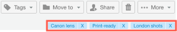

# Gérer les fichiers dans [!DNL Workfront Proof]

>[!IMPORTANT]
>
>Cet article fait référence à la fonctionnalité du produit autonome [!DNL Workfront Proof]. Pour plus d’informations sur la relecture dans [!DNL Adobe Workfront], voir [Relecture](../../../review-and-approve-work/proofing/proofing.md).

Vous pouvez gérer, partager et afficher des informations sur les fichiers (pas les épreuves) chargés sur Workfront Proof (voir [Charger des fichiers et du contenu web dans  [!DNL Workfront Proof]](../../../workfront-proof/wp-work-proofsfiles/create-proofs-and-files/upload-files-web-content.md)).

1. Cliquez sur la flèche vers le bas à droite de **[!UICONTROL Vues]** dans le panneau de navigation de gauche, puis cliquez sur **[!UICONTROL Fichiers]** dans le menu déroulant.

1. Cliquez sur le bouton **[!UICONTROL Plus]** du fichier, puis sur **[!UICONTROL Afficher les détails du fichier]** dans le menu qui s’affiche.\
   \
   Vous pouvez afficher et modifier les détails du fichier dans la fenêtre qui s’affiche. Par exemple, vous pouvez modifier le nom du fichier en haut de la fenêtre, le [!DNL Workfront Proof] **Dossier** qui stocke le fichier et la **Personne propriétaire** du fichier.\
   

1. (Facultatif) Si vous disposez des droits de modification du fichier, utilisez les boutons d’action dans le coin supérieur droit pour gérer et partager le fichier :

* **[!UICONTROL Balises]**. Gérez les balises appliquées au fichier.\
   \
   Sous les boutons d’action, vous pouvez voir toutes les balises appliquées au fichier. Vous pouvez supprimer une balise indésirable en cliquant sur le x situé à côté.\
   

* **[!UICONTROL Déplacer vers]**. Organisez vos fichiers en dossiers. Vous pouvez déplacer un fichier entre des dossiers existants ou le placer dans un nouveau dossier.\
   

* **[!UICONTROL Partager]**. Partagez des fichiers avec d’autres personnes. [!DNL Workfront Proof] envoie aux personnes destinataires une notification par e-mail comprenant un message personnalisé et des liens de téléchargement.\
   

* **[!UICONTROL Corbeille]**. Vous pouvez supprimer le fichier en le déplaçant vers la Corbeille. Veuillez noter que le fichier sera pris en compte dans votre limite de stockage jusqu’à ce que la corbeille soit vidée (voir [Restaurer et vider la corbeille dans  [!DNL Workfront Proof]](../../../workfront-proof/wp-work-proofsfiles/manage-your-work/restore-and-empty-trash.md)).\
   

* **[!UICONTROL Plus]**. Dans cette liste déroulante, vous pouvez cliquer sur **[!UICONTROL Convertir en épreuve]** pour créer une épreuve pour un fichier (voir [Créer des épreuves dans  [!DNL Workfront Proof]](../../../workfront-proof/wp-work-proofsfiles/create-proofs-and-files/generate-proofs.md)). Le fichier doit être conforme à nos exigences en matière de types de fichiers pour les épreuves (voir [Vue d’ensemble des types de fichiers d’épreuve pris en charge et des limites de taille](../../../review-and-approve-work/proofing/proofing-overview/supported-proofing-file-types.md)). Si le nom du fichier correspond au nom d’une épreuve existante, [!DNL Workfront Proof] affiche un message avec un lien vous permettant de convertir le fichier en une **[!UICONTROL Nouvelle version]** de cette épreuve.\
   

  >[!TIP]
  >
  >Pour les fichiers qui ont été partagés à partir d’un autre compte [!DNL Workfront Proof] (et non chargés sur votre propre compte), la conversion n’est disponible que pour les plans Entreprise.

  Vous pouvez également cliquer sur **[!UICONTROL Télécharger]** pour télécharger le fichier original sur votre ordinateur.

1. (Facultatif) Ouvrez la section **[!UICONTROL Partagé avec]** pour dresser la liste des utilisateurs et utilisatrices avec lesquels le fichier a été partagé.

   Vous pouvez envoyer un **[!UICONTROL Message]** ou **[!UICONTROL Supprimer]** un utilisateur ou une utilisatrice à partir de l’icône **[!UICONTROL Plus]** à droite.

   

   Si vous choisissez d’envoyer un message à un utilisateur ou une utilisatrice, la page **[!DNL Message all]** s’affiche et vous permet d’envoyer plusieurs messages à la fois.

1. Ouvrez la section **[!UICONTROL Activité]** pour répertorier toutes les activités sur le fichier, y compris l’heure, la date et la personne qui a effectué l’action. La section Activité comprend les éléments suivants :

   * Fichier chargé
   * Nouvelles personnes ajoutées
   * Personnes supprimées
   * Fichier téléchargé

1. Ouvrez la section **[!UICONTROL Messages]** pour retrouver les messages que les utilisateurs et utilisatrices ont envoyés en relation avec le fichier. Vous pouvez consulter le contenu d’un message en cliquant sur l’icône « i » à droite.
