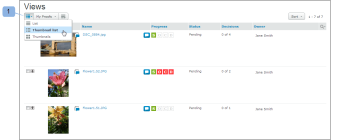

# Gestion des éléments dans [!UICONTROL Vues] Page dans [!DNL Workfront Proof]

>[!IMPORTANT]
>
>Cet article fait référence aux fonctionnalités du produit autonome. [!DNL Workfront Proof]. Pour plus d’informations sur la vérification à l’intérieur [!DNL Adobe Workfront], voir [Vérification](../../../review-and-approve-work/proofing/proofing.md).

Le [!UICONTROL Vues] vous permet d’afficher et d’utiliser tous vos bons à tirer, fichiers et dossiers au même endroit.

## Affichage de la variable [!UICONTROL Vues] Page

1. Cliquez sur **[!UICONTROL Vues]** dans la barre latérale gauche.
1. Dans le menu déroulant (2), cliquez sur la vue (3) que vous souhaitez afficher.

## Changement de la variable [!UICONTROL Vues] Disposition de page

La valeur par défaut [!UICONTROL Vues] La mise en page est la liste des miniatures. Dans cette disposition, vous pouvez voir une image miniature de chaque BAT, fichier (si possible à générer) et dossiers (s’il est défini), avec d’autres détails inclus dans des colonnes distinctes.

1. Cliquez sur le bouton **[!UICONTROL Disposition de page]** (1), puis choisissez la mise en page de votre choix.

## Changement de la variable [!UICONTROL Vues] Liste

Pour modifier ce que vous voyez dans la variable [!UICONTROL Vues] list :

1. Cliquez sur le bouton **[!UICONTROL Modifier la vue]** bouton .\
   Le nom affiché sur ce bouton dépend de la vue sélectionnée la dernière fois que vous l’avez utilisé.\
   

1. Cliquez sur une autre vue dans le menu déroulant :

   * **[!UICONTROL Tous les éléments]**: Inclut tous les bons à tirer, fichiers et dossiers que vous êtes autorisé à afficher. Il s’agit de la valeur par défaut lorsque vous ouvrez le [!UICONTROL Vues] page. Vous avez la possibilité d’inclure/exclure des BAT archivés dans cette vue.
   * **[!UICONTROL Principaux éléments]**: Tous les BAT, fichiers et dossiers principaux.
   * **[!UICONTROL BAT principal]**: Tous les BAT principaux (non archivés) que vous êtes autorisé à voir.
   * **[!UICONTROL BAT verrouillé]**: Seuls les bons à tirer verrouillés.
   * **[!UICONTROL BAT archivé]**: Seuls les BAT archivés (voir [Archiver dans [!DNL Workfront Proof]](../../../workfront-proof/wp-work-proofsfiles/organize-your-work/archive.md)).

   * **[!UICONTROL Mes Bons À Tirer]**: Affiche uniquement les bons à tirer pour lesquels vous êtes le propriétaire et qui vous ont été délégués. Pour plus d’informations, voir [Désignation des propriétaires temporaires de BAT dans [!DNL Workfront Proof]](../../../workfront-proof/wp-getstarted/personal-settings/designate-temp-proof-owners.md).

   * **[!UICONTROL Bons à tirer en attente de décision]**: Affiche uniquement les bons à tirer sur lesquels vous devez prendre une décision.
   * **[!UICONTROL BAT tardif]**: Affiche uniquement les bons à tirer pour lesquels la date limite a été dépassée
   * **[!UICONTROL Fichiers]**: Affiche uniquement les fichiers
   Dans chacune de ces vues, les colonnes suivantes sont incluses :

   * **Type**: Icône de l’élément avec l’icône de BAT, fichier ou dossier
   * **Nom**: Nom du BAT, du fichier ou du dossier
   * **Progression**: S=Envoyé, O=Ouvert, C=Commentaire, D=Décision (voir Barre de progression)
   * **État**: [!UICONTROL En attente, modifications requises, Approuvé]
   * **Décisions**: Nombre de décisions prises et nombre requis
   * **Propriétaire**: Nom de la personne propriétaire du BAT\

      Mes bons à tirer, BAT en attente de décision et les dernières vues des bons à tirer ont une colonne supplémentaire appelée Ma date limite. Cette colonne affiche vos propres échéances sur les bons à tirer pour lesquels vous êtes explicitement ajouté en tant que réviseur/approbateur.

      >[!NOTE]
      >
      >Si vous quittez la page Vues pour y revenir ultérieurement au cours de la même session, la dernière vue sélectionnée s’affiche.

      Vous pouvez également créer vos propres vues. Voir [Création et gestion des vues personnalisées dans [!DNL Workfront Proof]](../../../workfront-proof/wp-work-proofsfiles/manage-your-work/create-and-manage-custom-views.md) pour plus d’informations.

## Filtrage des éléments

Vous pouvez filtrer les informations répertoriées dans une vue.

1. Cliquez sur le bouton **Afficher les filtres** en haut à droite de la page (1).\
   

1. La barre de filtrage (2) apparaît et chaque catégorie dispose d’un menu déroulant de filtrage (3) pour sélectionner la valeur souhaitée. La valeur par défaut de chaque catégorie est Tous.
1. La barre de filtre ne s’affiche pas dans les vues personnalisées que vous créez. Pour ces vues, vous pouvez appliquer et modifier des filtres dans la variable [!UICONTROL Filtres] . Pour plus d’informations, voir [Création et gestion des vues personnalisées dans [!DNL Workfront Proof]](../../../workfront-proof/wp-work-proofsfiles/manage-your-work/create-and-manage-custom-views.md).
1. Pour appliquer tous les filtres sélectionnés, cliquez sur le bouton [!UICONTROL Filtrer] (4) à la fin de la barre de filtrage.\
   

Les valeurs de filtre que vous sélectionnez restent en vigueur jusqu’à ce que vous les modifiiez. Si vous souhaitez afficher et accéder à nouveau à la liste complète des éléments, vous devez rétablir toutes les valeurs de filtre par défaut, à savoir : **[!UICONTROL Tous]**.

>[!NOTE]
>
>Si vous définissez des options de filtrage, puis masquez la barre de filtrage en cliquant sur le bouton [!UICONTROL Masquer les filtres] (5), la barre s’affiche à nouveau automatiquement si vous changez de vue. Si vous masquez la barre de filtrage alors que tous les filtres sont définis sur l’option Tous par défaut, la barre de filtrage reste masquée lors du changement de vue.

## Tri des éléments

Lorsque vous créez un BAT (ou une version) ou téléchargez un nouveau fichier, celui-ci s’affiche dans la partie supérieure de votre [!UICONTROL Tous les éléments] liste. L’élément le plus ancien s’affiche au bas de la liste.

Pour afficher la liste dans un ordre de tri différent :

1. Utilisez l’une des méthodes suivantes :

   * Cliquez sur l’un des en-têtes de colonne de la liste : Type, nom, état, décisions ou propriétaire.\

      Par exemple, si vous souhaitez afficher les bons à tirer/fichiers dans l’ordre alphabétique, cliquez une fois sur l’en-tête Nom (1) pour trier la liste par nom dans l’ordre croissant (A - Z).\
      Vous pouvez à nouveau cliquer sur l’en-tête Nom du bon à tirer (2) pour inverser l’ordre et afficher les bons à tirer dans l’ordre décroissant (Z - A).

   * Cliquez sur la flèche vers le bas dans le coin supérieur droit de la [!UICONTROL Vues] pour trier par date de création (dernière ou plus ancienne) ou par type, nom, état, décisions ou propriétaire.\

      \
      Si votre colonne est triée par ordre croissant, l’en-tête de colonne affiche une flèche vers le haut en regard du nom de la colonne. Pour inverser l’ordre (vers le bas), cliquez sur l’en-tête de colonne correspondant (une flèche vers le bas s’affiche en regard du nom de la colonne).

   * Les modifications que vous apportez à l’ordre de tri des éléments ne durent que lorsque vous restez sur la page Tous les éléments . Si vous quittez la page Tous les éléments pour y revenir ultérieurement, les éléments sont de nouveau répertoriés dans l’ordre chronologique inverse par défaut.

## Affichage du résumé d’un bon à tirer

Pour afficher des informations plus détaillées sur un BAT :

1. Cliquez sur la flèche située à gauche de l&#39;image du BAT.\
   La flèche pointe vers le bas et le résumé du BAT s’affiche sous les informations de base sur le BAT. Le résumé du BAT affiche :

   * **Résumé du BAT**: Etat général du BAT
   * **Évaluation**: Indique la date limite du BAT et le nombre de décisions prises et requises
   * **Réviseurs**: Le nom, le rôle et l&#39;avancement de chaque validant seront répertoriés.
   * **Versions**: Version du BAT consulté et nombre total de versions disponibles
   * **Dossier**: Dossier dans lequel se trouve le BAT
   * **État**: Principal, verrouillé, brouillon ou envoyé

1. (Facultatif) Si vous disposez de droits d’édition sur le BAT et que celui-ci comporte des scènes, cliquez sur l’icône **[!UICONTROL Plus]** (trois points) à droite de l’étape pour accéder aux options suivantes :

   * **[!UICONTROL Message all]**: Envoyez un email à tous les réviseurs sur l&#39;étape.
   * **[!UICONTROL Partager]**: Ajouter de nouveaux opérateurs validants
   * **[!UICONTROL Supprimer l’étape]**

1. (Facultatif) Cliquez sur le **[!UICONTROL Plus]** (trois points) à droite de leur nom pour effectuer l’une des opérations suivantes :

   * Envoyez au réviseur un message de rappel.
   * Modifiez les paramètres du réviseur sur le BAT.\

      La boîte de dialogue Modifier le réviseur qui s’affiche vous permet de modifier non seulement les alertes par rôle et par e-mail, mais également le nom d’affichage du réviseur. Notez que le Nom d&#39;affichage ne peut être modifié que sur le BAT en particulier, et non dans les détails du validant dans la page Contacts. Voir [Contacts](https://support.workfront.com/hc/en-us/sections/115000920808-Contacts) pour plus d’informations.

   * Sélectionnez le validant à être le décideur Principal sur le BAT.
   * Supprimez le validant du BAT.
   * Vous pouvez également modifier les alertes Rôle et Email pour un réviseur ajouté au BAT.

## Inclusion et exclusion de BAT archivés

Le [!UICONTROL Tous les éléments] La vue par défaut affiche tous les BAT, fichiers et dossiers principaux et verrouillés. Il permet également d’inclure ou d’exclure des BAT archivés dans la vue.\
Pour inclure les BAT archivés :

1. Lorsque vous choisissez une vue, cliquez sur **[!UICONTROL Inclure les bons à tirer archivés]**.\
   \
   Les BAT archivés s’affichent avec une icône archivée pour les distinguer des autres BAT.\
   

## Ouverture d’un élément à partir d’un mode Liste

1. Utilisez l’une des méthodes suivantes :

   * Pour afficher les détails sur un BAT, un fichier ou un dossier, cliquez sur son nom.
   * Pour ouvrir un BAT dans la visionneuse de BAT, cliquez sur **[!UICONTROL Accéder à Bon à tirer]**.\

      Pour plus d’informations sur la visionneuse de vérification, voir [Vérification d’un BAT](../../../review-and-approve-work/proofing/reviewing-proofs-within-workfront/review-a-proof/review-a-proof.md).

## Exécution d’actions sur plusieurs éléments

Pour sélectionner plusieurs éléments :

1. Cochez la case située au-dessus de la liste.\
   

1. Dans les options supplémentaires qui apparaissent au-dessus de la liste Vues, effectuez l’une des opérations suivantes pour les fichiers que vous avez sélectionnés :

   * Cliquez sur **[!UICONTROL Balises]** pour ajouter une balise à ces éléments.
   * Cliquez sur **[!UICONTROL Déplacer vers]** pour déplacer les éléments sélectionnés vers un autre dossier (ou les déplacer hors du dossier si vous sélectionnez (Aucun dossier sélectionné).
   * Cliquez sur **[!UICONTROL Partage des éléments sélectionnés]** pour partager tous ces éléments avec des réviseurs supplémentaires.\

      

   * Cliquez sur **[!UICONTROL Supprimer]** pour déplacer les éléments sélectionnés vers la corbeille.\

      

   * Cliquez sur le bouton **[!UICONTROL Plus]** pour d’autres actions disponibles.

   * Les actions ne sont appliquées qu’à celles des éléments sélectionnés pour lesquels une option particulière est disponible. Par exemple, si vous sélectionnez des fichiers et des bons à tirer et choisissez [!UICONTROL Verrouiller], seuls les bons à tirer seront verrouillés (car vous ne pouvez pas verrouiller les fichiers).

## Déplacement d’un élément vers un dossier

Si vous disposez des droits d’édition nécessaires, vous pouvez déplacer des BAT, des fichiers et des dossiers vers des dossiers spécifiques sur la page [!UICONTROL Vues] page.

1. Ouvrez l’arborescence de dossiers dans la barre latérale en cliquant sur la flèche située à gauche du dossier le plus en haut.
1. Utilisez l’une des méthodes suivantes :

   * Pour déplacer un élément, cliquez dessus et maintenez-le enfoncé, puis faites-le glisser dans le dossier où vous souhaitez le placer.
   * Pour déplacer plusieurs éléments en même temps, vous pouvez cocher les cases à gauche des éléments, puis cliquer sur **[!UICONTROL Déplacer vers]**au-dessus de la liste, sélectionnez le dossier dans lequel vous souhaitez les placer ou créez un dossier pour eux.
