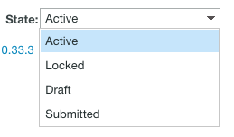

# Présentation de l’état du BAT dans le BAT Workfront

>[!IMPORTANT]
>
>Cet article fait référence aux fonctionnalités du produit autonome. [!DNL Workfront Proof]. Pour plus d’informations sur la vérification à l’intérieur [!DNL Adobe Workfront], voir [Vérification](../../../review-and-approve-work/proofing/proofing.md).

Dans [!DNL Workfront Proof], des bons à tirer existent dans différents états. Ces états déterminent les actions que vous pouvez entreprendre sur le BAT, comme des commentaires ou des décisions.

## Compréhension de l’état de preuve

Les quatre états sont les suivants :

* [Actif](#active)
* [Verrouillé](#locked)
* [Version préliminaire (zone de dépôt uniquement)](#draft-dropzone-only)
* [Envoyé (zone de dépôt uniquement)](#submitted-dropzone-only)

### Actif {#active}

Bons à tirer téléchargés vers [!DNL Workfront Proof] via la page Nouveau bon à tirer ou la zone de dépôt apparaît comme Principale une fois qu’elles ont été traitées. Lorsqu’un BAT est principal, les utilisateurs peuvent examiner, faire des commentaires et prendre des décisions sur le BAT.

>[!NOTE]
>
>Les BAT téléchargés via la zone de dépôt apparaissent comme Principaux uniquement si l’option Activer le BAT lors de l’envoi est activée. Si l’option n’est pas activée, vous devez activer manuellement le BAT.

Pour plus d’informations sur les paramètres de zone de dépôt, voir [Configuration de la zone de dépôt dans [!DNL Workfront Proof]](../../../workfront-proof/wp-acct-admin/account-settings/configure-dropzone-in-wp.md).

### Verrouillé {#locked}

Vous pouvez verrouiller un bon à tirer lorsque vous avez fini de le vérifier. Verrouiller un BAT signifie qu&#39;il n&#39;y a plus de commentaires ni de décisions à prendre sur le BAT, mais le BAT peut toujours être ouvert.

Tout utilisateur disposant de droits d&#39;édition sur le BAT peut le déverrouiller.

Pour plus d’informations sur les droits, voir [Profils d’autorisations de BAT dans [!DNL Workfront Proof]](../../../workfront-proof/wp-acct-admin/account-settings/proof-perm-profiles-in-wp.md).

>[!NOTE]
>
>Les notifications électroniques ne sont plus envoyées lorsqu’un BAT est verrouillé. Par exemple, si un BAT est verrouillé avant son expiration, aucun email de notification n’est envoyé à l’expiration du délai.

### Version préliminaire (zone de dépôt uniquement) {#draft-dropzone-only}

Lorsque vous envoyez un BAT via la zone de dépôt, il passe à l’état Brouillon avant que l’administrateur ne l’active. Lorsqu&#39;il se trouve dans la zone de brouillon, vous ne pouvez pas agir sur le BAT.

### Envoyé (zone de dépôt uniquement) {#submitted-dropzone-only}

Une fois qu’un brouillon est activé par l’administrateur, votre BAT apparaît comme Envoyé dans la zone de dépôt. Une fois envoyé, vous pouvez agir sur le BAT.

## Affichage et modification de l’état du BAT

Pour plus d’informations sur l’affichage d’une liste de tous les bons à tirer dans un état spécifique, comme l’affichage de tous les bons à tirer Principaux ou verrouillés, voir [Gestion des éléments sur la page Vues dans [!DNL Workfront Proof]](../../../workfront-proof/wp-work-proofsfiles/manage-your-work/manage-items-on-views-page.md) dans l’article [Gestion des éléments sur la page Vues dans [!DNL Workfront Proof]](../../../workfront-proof/wp-work-proofsfiles/manage-your-work/manage-items-on-views-page.md).

1. Accédez à [!DNL Workfront Proof] Tableau de bord.

   Pour plus d’informations, voir [Accès [!DNL Workfront Proof] depuis Adobe Workfront](../../../review-and-approve-work/proofing/managing-proofs-within-workfront/access-wf-proof-in-workfront.md).

1. Sur le **[!UICONTROL Tableau de bord]**, cliquez sur le bouton **[!UICONTROL Développer]** flèche en regard du BAT que vous souhaitez afficher ou modifier l’état de .

   

   Le **[!UICONTROL Processus]** s’affiche.

   

1. Afficher la variable **[!UICONTROL État]** dans le **[!UICONTROL Processus]**.

1. (Facultatif) Pour modifier l’état, placez le pointeur de la souris sur le **[!UICONTROL État]** puis cliquez sur le menu déroulant, puis sélectionnez un nouvel état.

   
