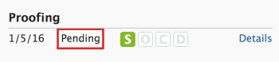

# Affichage de l’état et de l’avancement d’un BAT dans [!DNL Workfront Proof]

>[!IMPORTANT]
>
>Cet article fait référence à la fonctionnalité du produit autonome [!DNL Workfront Proof]. Pour plus d&#39;informations sur la vérification à l&#39;intérieur de [!DNL Adobe Workfront], voir [Proofing](../../../review-and-approve-work/proofing/proofing.md).

## Compréhension de la progression du BAT

La progression du BAT indique le travail effectué sur un BAT depuis le moment où vous envoyez le BAT aux validants jusqu&#39;au moment où ils prennent une décision sur le BAT.

* [Icônes de progression](#progress-icons)
* [Niveaux de progression de la preuve](#levels-of-proof-progress)

### Icônes de progression {#progress-icons}

Les icônes de progression, S, O, C et D, apparaissent dans la barre de progression pour indiquer la progression du BAT.

Ils indiquent les informations suivantes sur un BAT :

<table style="table-layout:auto"> 
 <col> 
 <col> 
 <thead> 
  <tr> 
   <td> 
<strong>Icône de progression</strong> 
 </td> 
   <td> 
<strong>Description</strong> 
 </td> 
  </tr> 
 </thead> 
 <tbody> 
  <tr> 
   <td> 
  
 </td> 
   <td> 
<strong>Envoyé</strong>. Le BAT a été envoyé aux réviseurs.
 </td> 
  </tr> 
  <tr> 
   <td> 
  
 
 
 </td> 
   <td> 
<strong>Ont ouvert</strong>. Un réviseur a ouvert la page Détails du BAT ou a ouvert le BAT lui-même dans la visionneuse de BAT.
 </td> 
  </tr> 
  <tr> 
   <td> 
  
 </td> 
   <td> 
<strong>Comments</strong>. Les validants (utilisateurs qui peuvent faire des commentaires) ont fait des commentaires sur le BAT.
 
Si aucun validant n'est désigné pour le BAT, cette icône ne s'affiche pas.
 </td> 
  </tr> 
  <tr> 
   <td> 
  
 </td> 
   <td> 
<strong>Décision</strong>. Un validant a pris une décision sur le BAT.
 
Si aucun approbateur (décideur) n’est désigné pour le BAT, cette icône ne s’affiche pas. 
 </td> 
  </tr> 
 </tbody> 
</table>

Ces icônes peuvent apparaître dans les couleurs suivantes pour indiquer certaines informations sur la progression du BAT :

* **Vert**. Terminé.
* **Blanc**. Non terminé.
* **Orange**. Non terminé et délai inférieur à 24 heures.
* **Rouge**. Ne pas terminer et dépasser la date limite.

### Niveaux de progression de la preuve {#levels-of-proof-progress}

Workfront Proof utilise les icônes de progression pour suivre la progression d’un BAT à chacun des niveaux suivants :

* Pour chaque validant, en fonction de l&#39;activité de cette personne sur le BAT.
* Pour chaque étape, en fonction de la progression du validant sur l’étape qui est le plus en retard dans le processus de vérification. Pour plus d’informations, voir [Présentation des étapes de workflow automatisées](../../../review-and-approve-work/proofing/proofing-overview/stages.md).
* Pour le BAT, basé sur l&#39;état d&#39;avancement de l&#39;étape (groupe de validants) qui est le plus en retard dans le processus de vérification.

Pour un exemple de la manière dont [!DNL Workfront Proof] détermine la progression à l’aide de l’opérateur validant ou de l’étape la plus en retard, supposons que trois opérateurs validants sur un BAT doivent prendre une décision. Si deux d&#39;entre eux ont pris leur décision mais que le troisième ne l&#39;a pas fait, la barre de progression du BAT n&#39;affiche pas le D en vert en raison de la décision en suspens.

Si le paramètre [!UICONTROL Principal Decision Maker] est sélectionné sur un BAT et que le décideur principal envoie une décision, le D dans la barre de progression du BAT devient vert pour tous les réviseurs, car aucune autre décision n’est requise.

De même, si le paramètre [!UICONTROL Une seule décision requise] est sélectionné sur un BAT et que tout validant envoie une décision, le D dans la barre de progression du BAT devient vert pour tous les réviseurs, car aucune autre décision n’est requise.

## Compréhension de l’état du BAT

Le statut du BAT affiche le statut des décisions requises pour le BAT.

\
Les options d’état standard sont les suivantes :

* En attente
* Approuvé
* Approuvé avec des modifications
* Modifications requises
* Non pertinent

Si des décisions personnalisées sont configurées dans votre compte, les options d’état reflètent vos paramètres de décision personnalisés.

Le statut du BAT dépend du participant au &quot;pire cas&quot;. Par exemple, supposons qu’il y ait trois décisions sur le BAT : deux ont le statut **Accepted** et l’un a le statut **Refusé**. La décision &quot;pire cas&quot; du Refusé annule les autres décisions et le statut global du BAT est affiché comme **Refusé**.

## Progression et état de l’affichage {#viewing-progress-and-status}

Vous pouvez afficher la progression et l’état des BAT, des étapes et des réviseurs à chaque étape.

* [Résumé du BAT](#proof-summary)
* [Menu Actions de l’étape](#stage-actions-menu)
* [Dans la section [!UICONTROL Résumé], vous pouvez également accéder aux menus des actions des réviseurs, à condition que vous disposiez des droits d&#39;édition sur le BAT. Pour plus d’informations, voir Profils d’autorisations de BAT dans Workfront Proof et Gestion des rôles de BAT dans Workfront Proof. Le menu [!UICONTROL Actions de réviseur] (1) s’affiche lorsque vous passez la souris sur les détails du réviseur et vous permet d’effectuer les opérations suivantes :](#in-the-summary-section-you-can-also-access-the-reviewer-actions-menus-provided-you-have-edit-rights-on-the-proof-for-more-information-see-proof-permissions-profiles-in-workfront-proof-and-manage-proof-roles-in-workfront-proof-the-reviewer-actions-menu-1-appears-when-you-hover-over-the-reviewer-s-details-and-allows-you-to)
* [Menu Actions de BAT](#proof-actions-menu)

### Résumé du BAT {#proof-summary}

Chaque BAT du dossier comporte un résumé extensible qui vous permet d’afficher et de modifier rapidement les détails du BAT.

Pour développer ou réduire la synthèse :

1. Cliquez sur la flèche située à gauche du BAT en mode Tableau de bord ou Liste.

Le résumé comprend les éléments suivants :

* Workflow (2)
* Version (3)
* Dossier (4)
* État (5)\
   

Dans le résumé, vous pouvez visualiser et modifier les détails suivants de votre BAT :

* Proof progress (1)
* Progression de chaque étape (2)
* Date limite de mise en service de la scène (3)
* Détails du réviseur :

   * Nombre de commentaires et de réponses de chaque réviseur (4)
   * Progression de chaque validant (5)
   * Décision (si une décision a inclus des signatures électroniques, une icône s’affiche en regard de la décision l’indiquant.) (6)
   * Rôle sur le BAT (7)
   * Paramètres des alertes par email (8)

>[!NOTE]
>
>La possibilité de modifier les détails du BAT dépend de vos droits sur le BAT (voir [Profils d’autorisations de BAT dans [!DNL Workfront Proof]](../../../workfront-proof/wp-acct-admin/account-settings/proof-perm-profiles-in-wp.md) et [Gérer les rôles de BAT dans [!DNL Workfront Proof]](../../../workfront-proof/wp-work-proofsfiles/share-proofs-and-files/manage-proof-roles.md)).

### Menu [!UICONTROL Actions intermédiaires]  {#stage-actions-menu}

Chaque étape de votre workflow comporte un menu distinct, qui vous permet d’effectuer des actions en bloc liées aux réviseurs de cette étape.

Le menu [!UICONTROL Actions dans l’environnement intermédiaire] s’affiche lorsque vous passez la souris sur la section dans l’environnement intermédiaire (1) et vous permet de

* [!UICONTROL Message all] (2)
* [!UICONTROL Partager] (3)
* [!UICONTROL Supprimer l’étape] (4)

>[!NOTE]
>
>La disponibilité de ces options dépend de vos droits sur le BAT (voir [Profils d’autorisations de BAT dans [!DNL Workfront Proof]](../../../workfront-proof/wp-acct-admin/account-settings/proof-perm-profiles-in-wp.md) et [Gérer les rôles de BAT dans [!DNL Workfront Proof]](../../../workfront-proof/wp-work-proofsfiles/share-proofs-and-files/manage-proof-roles.md)).

Dans la section Résumé, vous pouvez également accéder aux menus des actions des réviseurs, à condition que vous disposiez des droits d&#39;édition sur le BAT. Pour plus d’informations, voir [Profils d’autorisations de BAT dans [!DNL Workfront Proof]](../../../workfront-proof/wp-acct-admin/account-settings/proof-perm-profiles-in-wp.md) et [Gérer les rôles de BAT dans [!DNL Workfront Proof]](../../../workfront-proof/wp-work-proofsfiles/share-proofs-and-files/manage-proof-roles.md). Le menu Actions du réviseur (1) s’affiche lorsque vous passez la souris sur les détails du réviseur et vous permet d’effectuer les opérations suivantes :

* Envoyer un message au validant (2)
* Modifier les détails du validant (3) : permet de modifier le nom d’affichage, le rôle du BAT et l’alerte par e-mail de ce validant.
* En faire le propriétaire du BAT (4)
* En faire le principal décideur (5)
* Retirer du BAT (6)

>[!NOTE]
>
>La visibilité de ces options dépend de vos droits sur le BAT (voir [Profils d’autorisations de BAT dans [!DNL Workfront Proof]](../../../workfront-proof/wp-acct-admin/account-settings/proof-perm-profiles-in-wp.md) et [Gérer les rôles de BAT dans [!DNL Workfront Proof]](../../../workfront-proof/wp-work-proofsfiles/share-proofs-and-files/manage-proof-roles.md)).

### Menu Actions de BAT {#proof-actions-menu}

Chaque BAT dispose également d’un menu (1) qui vous permet d’effectuer les actions suivantes :

* Vous pouvez accéder à la page Détails du BAT (2)
* Partager le BAT avec d&#39;autres personnes (3)
* Envoyer un message aux réviseurs (4)
* Créer une nouvelle version du BAT (5)
* Copier le BAT (6)
* Télécharger le fichier d’origine (7)
* Partage de liens de BAT (8)
* Imprimer les commentaires (9)
* Demander un résumé Excel du BAT (10)
* Verrouiller le BAT (11)
* Supprimer le BAT (12)

>[!NOTE]
>
>La disponibilité de ces options dépend de vos droits sur le BAT (voir [Profils d’autorisations de BAT dans [!DNL Workfront Proof]](../../../workfront-proof/wp-acct-admin/account-settings/proof-perm-profiles-in-wp.md) et [Gérer les rôles de BAT dans [!DNL Workfront Proof]](../../../workfront-proof/wp-work-proofsfiles/share-proofs-and-files/manage-proof-roles.md)).

Pour plus d’informations sur l’affichage de la progression et de l’état du BAT dans [!DNL Workfront], voir [Affichage de la progression et de l’état](#viewing-progress-and-status).

Pour plus d’informations sur l’affichage de la progression et de l’état dans la visionneuse de vérification de l’appli de bureau, voir [Révision d’un workflow dans la visionneuse de vérification de l’orthographe](../../../workfront-proof/wp-work-proofsfiles/review-proofs-wpv/review-workflow.md).
