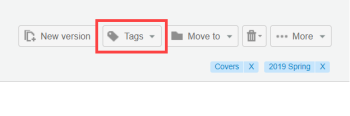

# Création et gestion des balises dans [!DNL Workfront Proof]

>[!IMPORTANT]
>
>Cet article fait référence aux fonctionnalités du produit autonome. [!DNL Workfront] Preuve. Pour plus d’informations sur la vérification à l’intérieur [!DNL Adobe Workfront], voir [Vérification](../../../review-and-approve-work/proofing/proofing.md).

Vous pouvez créer et modifier des balises et les appliquer à vos bons à tirer et fichiers. C&#39;est génial pour quand vous avez beaucoup de choses différentes. [!DNL Workfront Proof] éléments, tels que les projets, les divisions et les clients, et vous souhaitez les identifier et les trouver facilement.

Vous pouvez appliquer des balises à des BAT nouveaux ou existants, à de nouveaux fichiers, à de nouvelles versions et à des copies sur n’importe quelle page en mode Liste.

>[!TIP]
>
>Il peut s’avérer utile d’utiliser plusieurs balises lorsque plusieurs catégories s’appliquent à un seul élément. Vous pouvez appliquer un nombre illimité de balises à n’importe quel élément.

Votre profil et votre paramètre d’autorisation affectent la fonctionnalité de balise disponible :

* Les administrateurs de facturation, les administrateurs et les superviseurs peuvent utiliser toutes les fonctions décrites sur cette page.
* Les gestionnaires peuvent créer et modifier des balises uniquement pour leurs éléments.
* Les observateurs peuvent appliquer ou modifier des balises sur les éléments, mais ils peuvent afficher les balises appliquées aux éléments par d’autres utilisateurs et ils peuvent afficher l’onglet Balises dans les paramètres personnels.

Pour plus d’informations sur ces profils et autorisations, voir [Profils d’autorisations de BAT dans [!DNL Workfront Proof]](../../../workfront-proof/wp-acct-admin/account-settings/proof-perm-profiles-in-wp.md).

## Création, modification ou suppression d’une balise dans votre compte

1. Cliquez sur **[!UICONTROL Paramètres]** > **[!UICONTROL Paramètres personnels]**.

1. Ouvrez le **[!UICONTROL Balises]** dans la partie supérieure de l’objet **[!UICONTROL Paramètres personnels]** page.\
   Utilisez l’une des méthodes suivantes :

   * Pour créer une balise, cliquez sur **[!UICONTROL Nouvelle balise]**, saisissez le nom de la balise, puis appuyez sur **[!UICONTROL Entrée]**.\

      Les noms de balise doivent contenir au moins un caractère alphanumérique et pas plus de 30 caractères.\
      Pour modifier une balise existante, cliquez sur son nom, saisissez un nouveau texte, puis appuyez sur **[!UICONTROL Entrée]**.

   * Pour supprimer une balise, cliquez sur l’icône de corbeille située à la fin de la ligne où la balise est répertoriée.

## Affichage des informations sur vos balises

1. Cliquez sur **[!UICONTROL Paramètres]** > **[!UICONTROL Paramètres personnels]**.

1. Ouvrez le **[!UICONTROL Balises]** dans la partie supérieure de l’objet **[!UICONTROL Paramètres personnels]** page.\
   Le **[!UICONTROL Balises]** donne les informations suivantes sur vos balises :

   * **Nom**
   * **Nombre total d’éléments** à laquelle la balise a été appliquée
   * **Éléments que vous êtes autorisé à voir** auquel la balise a été appliquée

1. (Facultatif) Si vous souhaitez afficher tous les éléments auxquels une balise particulière a été appliquée, cliquez sur le numéro en regard de cette balise sous **Éléments que vous êtes autorisé à voir**.\
   La page Résultats de la recherche qui s’affiche répertorie tous les éléments auxquels la balise est appliquée.

## Création de balises pour un ou plusieurs éléments

1. En mode Liste ou Tableau de bord, sélectionnez le ou les éléments pour lesquels vous souhaitez créer ou gérer des balises.
1. Cliquez sur **[!UICONTROL Balises]** > **[!UICONTROL Nouvelle balise]** juste au-dessus de la liste, saisissez le nom de la balise, puis cliquez sur **[!UICONTROL Créer]**.

1. Sélectionnez la nouvelle balise, puis cliquez sur **[!UICONTROL Ajouter une ou plusieurs balises]**.

## Gestion des balises d’un ou de plusieurs éléments

1. En mode Liste ou Tableau de bord, sélectionnez le ou les éléments pour lesquels vous souhaitez créer ou gérer des balises.
1. Cliquez sur **[!UICONTROL Balises]** > **[!UICONTROL Gestion des balises]** juste au-dessus de la liste.

1. Sur le [!UICONTROL Balises] qui s’affiche, gérez vos balises comme décrit ci-dessus dans la section [Création, modification ou suppression d’un onglet.](https://support.workfront.com/knowledge/articles/115004379508/en-us?brand_id=662728&amp;return_to=%2Fhc%2Fen-us%2Farticles%2F115004379508#CreatingEditingDeletingTag)\
   Une balise est appliquée à tous les éléments sélectionnés lorsque la case à cocher située en regard de la balise est grise foncée. S’il est gris clair, seuls certains éléments d’un lot sélectionné sont balisés avec. Si vous souhaitez supprimer une balise de tous les éléments sélectionnés, assurez-vous que la case à cocher située en regard de la balise est vide.\
   

## Gestion des balises à partir des détails du BAT ou des détails du fichier

Les balises appliquées à un BAT ou à un fichier s’affichent respectivement sur les pages Détails du BAT et Détails du fichier . Sur cette page, vous pouvez afficher, modifier et supprimer des balises. Pour plus d’informations, voir [Gérer les détails du BAT dans [!DNL Workfront Proof]](../../../workfront-proof/wp-work-proofsfiles/manage-your-work/manage-proof-details.md) et [Gestion des fichiers dans [!DNL Workfront Proof]](../../../workfront-proof/wp-work-proofsfiles/manage-your-work/manage-files.md).

1. Ouvrez la page Détails du BAT pour un BAT, comme décrit dans la section [Gérer les détails du BAT dans [!DNL Workfront Proof]](../../../workfront-proof/wp-work-proofsfiles/manage-your-work/manage-proof-details.md).\
   Ou\
   Ouvrez la page Détails du fichier d’un fichier, comme décrit dans la section [Gestion des fichiers dans [!DNL Workfront Proof]](../../../workfront-proof/wp-work-proofsfiles/manage-your-work/manage-files.md).\
   Toutes les balises appliquées à l’élément apparaissent près du coin supérieur droit.\
   

1. (Facultatif) Pour supprimer des balises du BAT ou du fichier, cliquez sur le x en regard de celui-ci.
1. Dans le coin supérieur droit, cliquez sur **[!UICONTROL Balises]**.\
   

1. Dans la zone qui s’affiche, sélectionnez les balises à appliquer à l’élément (ou désélectionnez les balises à supprimer), puis cliquez sur **[!UICONTROL Ajouter une ou plusieurs balises]**.

## Recherche d’un élément à l’aide d’un nom de balise

Vous pouvez rechercher un élément à l’aide du nom d’une balise qui, vous le savez, est appliquée à l’élément. Si vous partagez un élément avec quelqu’un, il pourra rechercher cet élément de la même manière. Pour afficher la liste de tous les éléments auxquels la balise a été appliquée :

1. Dans n’importe quelle vue de liste ou de tableau de bord, ouvrez le **[!UICONTROL Balises]** dans la barre latérale gauche, puis cliquez sur la balise dans la liste des balises qui s’affichent.\
   \
   Le nom de la balise s’affiche dans le champ de recherche dans le coin supérieur droit de [!DNL Workfront Proof]. Vous pouvez affiner votre recherche en sélectionnant des balises supplémentaires ou en saisissant d’autres mots-clés dans le champ de recherche. Vous pouvez supprimer une balise du champ de recherche en cliquant sur l’icône x en regard du nom de la balise.
