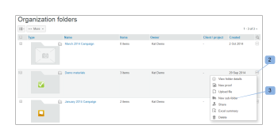

# Créer des dossiers dans [!DNL Workfront Proof]

>[!IMPORTANT]
>
>Cet article fait référence à la fonctionnalité du produit autonome [!DNL Workfront Proof]. Pour plus d’informations sur la relecture dans [!DNL Adobe Workfront], voir [Relecture](../../../review-and-approve-work/proofing/proofing.md).

## Créer un dossier de niveau supérieur {#creating-a-new-top-level-folder}

1. Dans la barre latérale, cliquez sur la flèche déroulante (1) située à côté du bouton vert **[!UICONTROL Nouvelle épreuve]**.
1. Sélectionnez **[!UICONTROL Nouveau dossier]**. (2)\
   La page [!UICONTROL Nouveau dossier] s’affiche.

1. Continuez avec [Configurer le nouveau dossier](#configuring-the-new-folder).\
   

## Créer un sous-dossier {#creating-a-new-sub-folder}

Vous pouvez créer des sous-dossiers de l’une ou l’autre des manières suivantes :

* [Créer un sous-dossier à partir de la page Détails du dossier](#creating-a-sub-folder-from-the-folder-details-page)
* [Créer un sous-dossier à partir de la page Dossiers du compte](#creating-a-sub-folder-from-the-account-folders-page)

>[!NOTE]
>
>Lorsque vous créez un nouveau sous-dossier, la liste de partage est héritée du dossier parent.

### Créer un sous-dossier à partir de la page [!UICONTROL Détails du dossier] {#creating-a-sub-folder-from-the-folder-details-page}

Pour plus d’informations sur la page [!UICONTROL Détails du dossier], voir [Gérer les dossiers et leur contenu dans Workfront Proof](../../../workfront-proof/wp-work-proofsfiles/organize-your-work/manage-folders-and-contents.md).

Pour créer un sous-dossier à partir de la page [!UICONTROL Détails du dossier] :

1. Dans la barre latérale, cliquez sur le nom du dossier dans la liste [!UICONTROL Mes dossiers] (1) pour accéder à la page de détails du dossier.

1. Cliquez sur le bouton Nouveau sous-dossier (2) en haut de la page.\
   Un nouveau dossier apparaît dans la liste des éléments du dossier.
1. Saisissez un nom pour le nouveau sous-dossier. (3)
1. Appuyez sur **[!UICONTROL Entrée]**.\
   Ou\
   Cliquez en dehors du champ du nom du dossier.

1. (Facultatif) Modifiez les détails du nouveau sous-dossier sur la page Détails du dossier.
1. Continuez avec [Configurer le nouveau dossier](#configuring-the-new-folder).

### Créer un sous-dossier à partir de la page Dossiers du compte {#creating-a-sub-folder-from-the-account-folders-page}

1. Cliquez sur les dossiers [Votre nom de compte] dans la barre latérale pour accéder à la page Dossiers du compte (1).\
   

1. Recherchez le dossier auquel vous souhaitez ajouter un sous-dossier et ouvrez le menu [!UICONTROL actions] (2).
1. Sélectionnez [!UICONTROL Nouveau sous-dossier] dans le menu (3).\
   La page [!UICONTROL Nouveau dossier] s’affiche.
1. Continuez avec [Configurer le nouveau dossier](#configuring-the-new-folder).

## Configurer le nouveau dossier {#configuring-the-new-folder}

Après avoir commencé à créer un nouveau dossier (comme décrit dans [Créer un nouveau dossier de niveau supérieur](#creating-a-new-top-level-folder) ou [Créer un nouveau sous-dossier](#creating-a-new-sub-folder)), vous pouvez définir les options de configuration comme décrit dans cette section.

* [Navigation par chemin de navigation](#breadcrumb-navigation) (1)
* [Détails du dossier](#folder-details) (2)
* [Coordonnées du client ou de la cliente](#client-details) (3)
* [Partager](#share) (4)

### Navigation par chemin de navigation {#breadcrumb-navigation}

La navigation par chemin de navigation vous indique si vous créez un dossier ou un sous-dossier de niveau supérieur) (1)

### Détails du dossier {#folder-details}

Dans cette section, vous pouvez ajouter (et vérifier) les informations suivantes au dossier que vous créez :

* Nom du dossier : ce champ est obligatoire (1).
* En cliquant sur le lien [!UICONTROL Voir la liste] (2), vous ferez apparaître une fenêtre pop-up contenant la liste des personnes avec lesquelles ce dossier est partagé. Cette information est particulièrement utile lorsque vous créez des sous-dossiers, car les sous-dossiers seront automatiquement partagés avec les mêmes personnes que le dossier parent.
* Description (3) : vous pouvez ajouter ici une brève description du dossier, qui sera visible sur la page Détails du dossier.
* Rendre le dossier privé (4) : en cochant cette case, vous rendrez ce dossier privé (donc visible uniquement par les personnes avec lesquelles vous partagez explicitement le dossier et les utilisateurs et utilisatrices de votre compte ayant des [profils d’autorisation d’épreuve dans  [!DNL Workfront Proof]](../../../workfront-proof/wp-acct-admin/account-settings/proof-perm-profiles-in-wp.md), des [profils d’autorisation d’épreuve dans  [!DNL Workfront Proof]](../../../workfront-proof/wp-acct-admin/account-settings/proof-perm-profiles-in-wp.md) ou des [profils d’autorisation d’épreuve dans  [!DNL Workfront Proof]](../../../workfront-proof/wp-acct-admin/account-settings/proof-perm-profiles-in-wp.md)). Pour en savoir plus sur les dossiers privés et publics dans Workfront Proof, veuillez consulter [Comprendre les autorisations de dossiers dans  [!DNL Workfront Proof]](../../../workfront-proof/wp-work-proofsfiles/organize-your-work/folder-permissions.md).

### Détails du client ou de la cliente {#client-details}

Dans cette section, vous pouvez remplir les détails de votre client ou cliente : cela vous permettra de trier la page Mes dossiers par nom de client ou cliente/projet :

* Nom du client ou de la cliente (1)
* Nom du projet (2)

### Partager {#share}

Dans la section [!UICONTROL Partager] vous pouvez effectuer les opérations suivantes :

* Attribuer une nouvelle personne propriétaire au dossier (1) : la personne ayant créé le dossier sera toujours inscrite dans le dossier et ne pourra pas être supprimée, mais vous pouvez désigner une autre personne de votre compte comme propriétaire, ce qui lui donnera des droits de modification sur le dossier.
* Partager le dossier avec d’autres utilisateurs et utilisatrices de [!DNL Workfront Proof] en saisissant leur adresse e-mail (2) : notez que les dossiers ne peuvent être partagés qu’avec des personnes disposant de leurs propres identifiants [!DNL Workfront Proof].
* Définir les autorisations pour les personnes avec lesquelles vous partagez le dossier (3). Cette fonction est utile pour partager des dossiers privés avec des personnes de votre compte : vous pouvez décider si les personnes ayant des [profils d’autorisation d’épreuve dans  [!DNL Workfront Proof]](../../../workfront-proof/wp-acct-admin/account-settings/proof-perm-profiles-in-wp.md) doivent être autorisées à créer, modifier et supprimer des éléments dans le dossier.
* Supprimer une personne de la liste des partages de dossiers en cliquant sur l’icône de la corbeille (4) à droite du nom de la personne.
* Supprimer toutes les personnes de la liste de partage du dossier en cliquant sur l’icône de corbeille la plus haute (5) : notez que vous ne pourrez pas supprimer la personne ayant créé le dossier ou qui en est propriétaire.

Voir également [Partager des dossiers dans  [!DNL Workfront Proof]](../../../workfront-proof/wp-work-proofsfiles/organize-your-work/share-folders.md).

