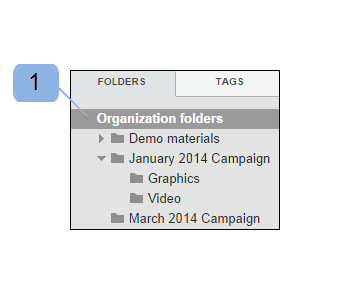

# Création de dossiers dans [!DNL Workfront Proof]

>[!IMPORTANT]
>
>Cet article fait référence à la fonctionnalité du produit autonome [!DNL Workfront Proof]. Pour plus d&#39;informations sur la vérification à l&#39;intérieur de [!DNL Adobe Workfront], voir [Proofing](../../../review-and-approve-work/proofing/proofing.md).

## Création d’un dossier de niveau supérieur {#creating-a-new-top-level-folder}

1. Dans la barre latérale, cliquez sur la flèche déroulante (1) en regard du bouton vert **[!UICONTROL New BAT]** .
1. Sélectionnez **[!UICONTROL Nouveau dossier]**. (2)\
   La page [!UICONTROL Nouveau dossier] s’affiche.

1. Poursuivez en [configurant le nouveau dossier](#configuring-the-new-folder).\
   

## Création d’un sous-dossier {#creating-a-new-sub-folder}

Vous pouvez créer des sous-dossiers de l’une des manières suivantes :

* [Création d’un sous-dossier à partir de la page Détails du dossier](#creating-a-sub-folder-from-the-folder-details-page)
* [Création d’un sous-dossier à partir de la page Dossiers de comptes](#creating-a-sub-folder-from-the-account-folders-page)

>[!NOTE]
>
>Lorsque vous créez un sous-dossier, la liste de partage est héritée du dossier parent.

### Création d’un sous-dossier à partir de la page [!UICONTROL Détails du dossier] {#creating-a-sub-folder-from-the-folder-details-page}

Pour plus d’informations sur la page [!UICONTROL Détails du dossier], voir [Gestion des dossiers et de leur contenu dans Workfront Proof](../../../workfront-proof/wp-work-proofsfiles/organize-your-work/manage-folders-and-contents.md).

Pour créer un sous-dossier à partir de la page [!UICONTROL Détails du dossier] :

1. Dans la barre latérale, cliquez sur le nom du dossier dans la liste [!UICONTROL Mes dossiers] (1) pour accéder à la page des détails du dossier

1. Cliquez sur le bouton Nouveau sous-dossier (2) en haut de la page.\
   Un nouveau dossier apparaît dans la liste des éléments du dossier.
1. Saisissez le nom du nouveau sous-dossier. (3)
1. Appuyez sur **[!UICONTROL Entrée]**.\
   Ou\
   Cliquez en dehors du champ du nom du dossier.

1. (Facultatif) Modifiez les détails du nouveau sous-dossier sur la page Détails du dossier .
1. Poursuivez en [configurant le nouveau dossier](#configuring-the-new-folder).

### Création d’un sous-dossier à partir de la page Dossiers de comptes {#creating-a-sub-folder-from-the-account-folders-page}

1. Cliquez sur [Votre nom de compte] dossiers dans la barre latérale pour accéder à la page Dossiers de comptes (1)\
   

1. Recherchez le dossier auquel vous souhaitez ajouter un sous-dossier et ouvrez le menu [!UICONTROL actions] (2)
1. Sélectionnez [!UICONTROL Nouveau sous-dossier] dans le menu (3)\
   La page [!UICONTROL Nouveau dossier] s’affiche.
1. Poursuivez en [configurant le nouveau dossier](#configuring-the-new-folder).

## Configuration du nouveau dossier {#configuring-the-new-folder}

Après avoir commencé à créer un dossier (comme décrit dans [Création d’un dossier de niveau supérieur](#creating-a-new-top-level-folder) ou [Création d’un nouveau sous-dossier](#creating-a-new-sub-folder)), vous pouvez définir les options de configuration comme décrit dans cette section.

* [Navigation dans le chemin de navigation](#breadcrumb-navigation) (1)
* [Détails du dossier](#folder-details) (2)
* [Détails du client](#client-details) (3)
* [Partager](#share) (4)

### Navigation dans le chemin de navigation {#breadcrumb-navigation}

La navigation dans le chemin de navigation vous indique si vous créez un dossier de niveau supérieur ou un sous-dossier) (1)

### Détails du dossier {#folder-details}

Dans cette section, vous pouvez ajouter (et vérifier) les informations suivantes au dossier que vous créez :

* Nom du dossier : ce champ est obligatoire (1)
* Cliquer sur le lien [!UICONTROL Voir la liste] (2) affiche une fenêtre contextuelle avec une liste de personnes avec lesquelles ce dossier est partagé. Cette information est particulièrement utile lorsque vous créez des sous-dossiers, car les sous-dossiers sont automatiquement partagés avec les mêmes personnes que le dossier parent.
* Description (3) : ici, vous pouvez ajouter une brève description du dossier, qui sera visible sur la page Détails du dossier.
* Rendez le dossier privé (4) : si vous cochez la case, ce dossier sera privé (donc visible uniquement pour les personnes avec lesquelles vous partagez explicitement le dossier et les utilisateurs de votre compte avec les profils des [Profils d’autorisations de BAT dans [!DNL Workfront Proof]](../../../workfront-proof/wp-acct-admin/account-settings/proof-perm-profiles-in-wp.md), [ Profils d’autorisations de BAT dans  [!DNL Workfront Proof]](../../../workfront-proof/wp-acct-admin/account-settings/proof-perm-profiles-in-wp.md) ou [Profils d’autorisations de BAT dans  [!DNL Workfront Proof]](../../../workfront-proof/wp-acct-admin/account-settings/proof-perm-profiles-in-wp.md) ). Pour en savoir plus sur les dossiers privés et publics dans Workfront Proof, consultez la section [Comprendre les autorisations de dossier dans [!DNL Workfront Proof]](../../../workfront-proof/wp-work-proofsfiles/organize-your-work/folder-permissions.md).

### Détails du client {#client-details}

Dans cette section, vous pouvez renseigner les détails de votre client. Vous pourrez ainsi trier la page Mes dossiers par nom de client/projet :

* Nom du client (1)
* Nom du projet (2)

### Partager {#share}

Dans la section [!UICONTROL Partager] , vous pouvez :

* Attribuer un nouveau propriétaire du dossier (1) : le créateur du dossier reste répertorié dans le dossier et ne peut pas être supprimé. Cependant, vous pouvez faire d’un autre utilisateur de votre compte le propriétaire, ce qui lui donnera des droits d’édition sur le dossier.
* Partagez le dossier avec d’autres utilisateurs [!DNL Workfront Proof] en saisissant leur adresse électronique (2). Notez que les dossiers ne peuvent être partagés qu’avec les personnes qui disposent de leur propre connexion [!DNL Workfront Proof].
* Définissez les autorisations pour les personnes avec lesquelles vous partagez le dossier (3). Cela s’avère utile pour partager des dossiers privés avec des utilisateurs de votre compte. Vous pouvez décider si les utilisateurs disposant du profil [Proof Permissions Profiles in [!DNL Workfront Proof]](../../../workfront-proof/wp-acct-admin/account-settings/proof-perm-profiles-in-wp.md) doivent être autorisés à créer, modifier et supprimer des éléments du dossier.
* Supprimez un utilisateur de la liste de partage de dossiers en cliquant sur l’icône de corbeille (4) à droite du nom de l’utilisateur.
* Supprimez tout le monde de la liste de partage de dossiers en cliquant sur l’icône de la corbeille la plus élevée (5). Notez que vous ne pourrez pas supprimer le créateur ou le propriétaire du dossier.

Voir aussi [Partager des dossiers dans [!DNL Workfront Proof]](../../../workfront-proof/wp-work-proofsfiles/organize-your-work/share-folders.md).

