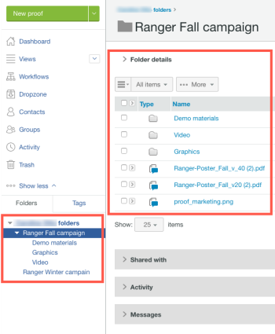

# Dossiers dans [!DNL Workfront Proof]

>[!IMPORTANT]
>
>Cet article fait référence à la fonctionnalité du produit autonome [!DNL Workfront Proof]. Pour plus d&#39;informations sur la vérification à l&#39;intérieur de [!DNL Adobe Workfront], voir [Proofing](../../../review-and-approve-work/proofing/proofing.md).

Les dossiers constituent le meilleur moyen d’organiser votre travail dans votre compte [!DNL Workfront Proof]. Vous pouvez créer une structure de dossiers reflétant la manière dont les dossiers sont organisés sur votre ordinateur, avec des structures de dossiers distinctes pour chaque client, tâche ou campagne.

L’utilisation de dossiers offre les avantages suivants :

* **Limitation de l’accès aux données client confidentielles** : si vous ne souhaitez pas que certains de vos utilisateurs voient certains de vos bons à tirer, vous pouvez rendre les dossiers dans lesquels ils sont stockés privés. Pour plus d’informations, voir [Comprendre les autorisations de dossier dans [!DNL Workfront Proof]](../../../workfront-proof/wp-work-proofsfiles/organize-your-work/folder-permissions.md).

* **Exécution d’actions en bloc sur des bons à tirer et des fichiers** : vous pouvez facilement gérer les bons à tirer et les fichiers regroupés dans des dossiers en y exécutant des actions en bloc. Vous pouvez, par exemple, partager plusieurs éléments en une seule action. Pour plus d’informations, voir [Gestion des dossiers et de leur contenu dans [!DNL Workfront Proof]](../../../workfront-proof/wp-work-proofsfiles/organize-your-work/manage-folders-and-contents.md).

* **Partage de dossiers avec d’autres utilisateurs de Workfront Proof** : lorsque vous partagez un dossier, il apparaît dans la barre latérale de l’autre utilisateur et il dispose d’un accès en lecture seule à tous les éléments du dossier. Si vous coopérez étroitement avec un autre compte Workfront Proof, il peut être judicieux de configurer une relation de partenaire entre vos comptes Workfront Proof. Ainsi, vous pourrez partager vos dossiers avec l’ensemble de l’entreprise en une seule fois, ce qui signifie que les dossiers seront automatiquement partagés avec de nouveaux utilisateurs à partir du compte Partner . Pour plus d’informations, voir [Partage de dossiers dans [!DNL Workfront Proof]](../../../workfront-proof/wp-work-proofsfiles/organize-your-work/share-folders.md).

* **BAT de groupe sur lequel vous souhaitez travailler ensemble ou sur lequel vous souhaitez que les réviseurs travaillent ensemble** : lorsque vous ou un autre réviseur ouvrez l’un des BAT, en lançant la visionneuse de BAT, tous les BAT du dossier sont également disponibles. Sans quitter la visionneuse de vérification, vous pouvez afficher les autres bons à tirer, les trier, les rechercher et les comparer. Pour plus d’informations, voir &quot;Utilisation de plusieurs bons à tirer dans la visionneuse de BAT&quot;.

Vous pouvez créer vos dossiers un par un. Pour plus d’informations, voir [Création de dossiers dans [!DNL Workfront Proof]](../../../workfront-proof/wp-work-proofsfiles/organize-your-work/create-folders.md).
