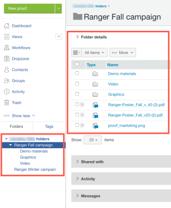

# Dossiers dans [!DNL Workfront Proof]

>[!IMPORTANT]
>
>Cet article fait référence aux fonctionnalités du produit autonome [!DNL Workfront Proof]. Pour plus d’informations sur la relecture dans [!DNL Adobe Workfront], voir [Relecture](../../../review-and-approve-work/proofing/proofing.md).

Les dossiers constituent la meilleure façon d’organiser votre travail dans votre compte [!DNL Workfront Proof]. Vous pouvez créer une structure de dossiers reflétant la manière dont les dossiers sont organisés sur votre ordinateur, avec des structures de dossiers distinctes pour chaque client et cliente, tâche ou campagne.

L’utilisation de dossiers offre les avantages suivants :

* **Limitation de l’accès aux données client confidentielles** : si vous ne souhaitez pas que certains de vos utilisateurs et utilisatrices voient certaines de vos épreuves, vous pouvez rendre privés les dossiers dans lesquels elles sont stockées. Pour plus d’informations, voir [Comprendre les autorisations des dossiers dans  [!DNL Workfront Proof]](../../../workfront-proof/wp-work-proofsfiles/organize-your-work/folder-permissions.md).

* **Exécution d’actions en masse sur des épreuves et des fichiers** : vous pouvez facilement gérer les épreuves et les fichiers regroupés dans des dossiers en y exécutant des actions en masse. Vous pouvez, par exemple, partager plusieurs éléments en une seule action. Pour plus d’informations, voir [Gérer des dossiers et leur contenu dans  [!DNL Workfront Proof]](../../../workfront-proof/wp-work-proofsfiles/organize-your-work/manage-folders-and-contents.md).

* **Partage de dossiers avec d’autres utilisateurs et utilisatrices Workfront Proof** : lorsque vous partagez un dossier, il apparaît dans la barre latérale de l’autre utilisateur ou utilisatrice et la personne dispose d’un accès en lecture seule à tous les éléments du dossier. Si vous coopérez étroitement avec un autre compte Workfront Proof, il peut être judicieux de configurer une relation de partenariat entre vos comptes Workfront Proof. Ainsi, vous pourrez partager vos dossiers avec l’ensemble de l’entreprise en une seule fois, ce qui signifie que les dossiers seront automatiquement partagés avec de nouveaux utilisateurs et nouvelles utilisatrices à partir du compte de partenariat. Pour plus d’informations, voir [Partager des dossiers dans  [!DNL Workfront Proof]](../../../workfront-proof/wp-work-proofsfiles/organize-your-work/share-folders.md).

* **Regrouper les épreuves sur lesquelles vous souhaitez travailler ensemble ou sur lesquelles vous souhaitez que les réviseurs et réviseuses travaillent ensemble** : lorsque vous ou une autre personne chargée de la révision ouvrez l’une des épreuves, en lançant la visionneuse de relecture, toutes les épreuves du dossier sont également disponibles. Sans quitter la visionneuse de relecture, vous pouvez afficher les autres épreuves, les trier, les rechercher et les comparer. Pour plus d’informations, voir « Travailler sur plusieurs épreuves dans la visionneuse de relecture ».

Vous pouvez créer vos dossiers un par un. Pour plus d’informations, voir [Créer des dossiers dans  [!DNL Workfront Proof]](../../../workfront-proof/wp-work-proofsfiles/organize-your-work/create-folders.md).
