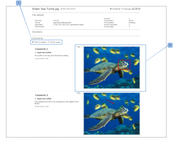

# Imprimer et exporter des commentaires dans [!DNL Workfront Proof]

>[!IMPORTANT]
>
>Cet article fait référence aux fonctionnalités du produit autonome. [!DNL Workfront Proof]. Pour plus d’informations sur la vérification à l’intérieur [!DNL Adobe Workfront], voir [Vérification](../../../review-and-approve-work/proofing/proofing.md).

## Impression de commentaires

La synthèse des commentaires est accessible directement à partir des zones suivantes :

* [Visionneuse de BAT](#the-proof-viewer)
* [Page Détails du BAT](#the-proof-details-page)
* [La variable [!DNL Proof] Menu Actions](#the-proof-actions-menu)

### Visionneuse de BAT {#the-proof-viewer}

Vous pouvez imprimer la synthèse des commentaires du BAT, y compris les miniatures ou l’image complète du BAT, en cliquant sur le **[!UICONTROL Imprimer]** dans la visionneuse de BAT. (1)

### Page Détails du BAT {#the-proof-details-page}

Vous pouvez imprimer la synthèse des commentaires du BAT en cliquant sur le bouton **[!UICONTROL Imprimer]** sur la page Détails du BAT. (2)

### La variable [!DNL Proof] Menu Actions {#the-proof-actions-menu}

Vous pouvez imprimer la synthèse des commentaires du BAT en cliquant sur le bouton **[!UICONTROL Imprimer]** dans le [!UICONTROL Actions de BAT] .

Pour accéder au [!UICONTROL Résumé des commentaires] d’une vue de liste :

1. Cliquez sur le bouton **[!UICONTROL Actions]** . (3)
1. Sélectionner **[!UICONTROL Imprimer les commentaires]**. (4)

\
Sur la page de résumé des commentaires, vous avez le choix entre les options d’impression suivantes :

* Vignette (1)
* Pleine page vue (2)
* Imprimer la page (3)
* Exporter le BAT avec des commentaires dans un fichier de PDF (4)
* Exportez les commentaires du BAT dans une [!DNL Excel] fichier (5)

### Mode Miniature

La vue Miniature affiche chaque commentaire dans l’ordre, ainsi que le thread complet de chaque commentaire. Vous pouvez également trier les commentaires et afficher la miniature de chaque commentaire avec des balises ajoutées.

Pour imprimer la vue miniature, cliquez sur le bouton **[!UICONTROL Printer]** dans le coin supérieur droit de la page, puis sélectionnez l’une des options suivantes :

* Tri par identifiant de commentaire ou page (1)
* Miniature de chaque commentaire auquel des annotations ont été ajoutées (2)

### Affichage page complète

La vue de page entière affiche chaque page dans l’ordre, ainsi que les commentaires sur cette page et une épingle indiquant l’emplacement des balises du commentaire sur la page.

Pour imprimer la page vue complète, cliquez sur le bouton **[!UICONTROL Printer]** dans le coin supérieur droit de la page.

## Exporter un [!DNL Excel] Résumé

Pour télécharger le [!DNL Excel] summary:

1. Ouvrez le menu d’actions du BAT à droite du BAT, puis cliquez sur **[!UICONTROL [!DNL Excel]summary]**. (1)\
   

Pour télécharger le [!DNL Excel] résumé de la page Détails du BAT :

1. Cliquez sur Exporter pour **[!DNL Excel]** Icône (2)
1. 

## Export vers PDF

Pour exporter un BAT vers PDF, ainsi que tous les commentaires et annotations, procédez comme suit :

1. Accédez à **[!UICONTROL Vues]** sur le côté gauche de l’écran.
1. Cliquez sur le bouton **[!UICONTROL Plus]** icône intégrée avec un BAT, puis cliquez sur **[!UICONTROL Imprimer les commentaires]**.

1. Cliquez sur l’icône Exporter vers le PDF dans le coin supérieur droit de la page.

   Lorsque le PDF est prêt, vous recevrez un courrier électronique contenant un lien de téléchargement.

Tous les commentaires sont affichés dans le lecteur du PDF. Si un commentaire est associé à plusieurs balises, celui-ci apparaît plusieurs fois dans la liste des commentaires (une fois pour chaque balise).

>[!IMPORTANT]
>
>La fonction Exporter vers le PDF est disponible uniquement pour les fichiers statiques.
