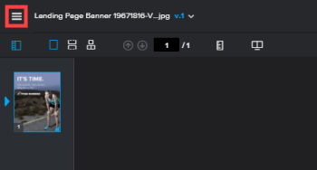

# Vérification d’un workflow dans la visionneuse de vérification

>[!IMPORTANT]
>
>Cet article fait référence aux fonctionnalités du produit autonome. [!DNL Workfront Proof]. Pour plus d’informations sur la vérification à l’intérieur [!DNL Adobe Workfront], voir [Vérification](../../../review-and-approve-work/proofing/proofing.md).

Le [!UICONTROL Workflow] Le panneau affiche le workflow de votre BAT tel qu’il apparaît sur la page Détails du BAT et dans vos notifications électroniques.\
Pour plus d’informations sur les détails du BAT, voir [Gérer les détails du BAT dans [!DNL Workfront Proof]](../../../workfront-proof/wp-work-proofsfiles/manage-your-work/manage-proof-details.md).\
Tous les réviseurs affectés, y compris les utilisateurs et les invités, peuvent afficher la variable [!UICONTROL Workflow] du panneau.

Pour accéder au [!UICONTROL Workflow] panel :

1. Si le menu de l’icône de gauche n’est pas affiché, cliquez sur le bouton **[!UICONTROL Menu]** dans le coin supérieur gauche de la visionneuse de vérification.

   

1. Cliquez sur le bouton **[!UICONTROL Workflow]** icône .

   Le **[!UICONTROL Workflow]** s’affiche.

   

   Chaque section du panneau Processus affiche la progression et l’état du BAT, des étapes et des réviseurs.

   * Afficher l’ensemble **État du BAT** comme déterminé par les décisions et les actions prises sur le BAT par tous les opérateurs validants à chaque étape.

      

   * Cliquez sur la flèche de liste déroulante en regard des étapes individuelles pour afficher la progression de l’étape, l’état, l’échéance et les informations sur les réviseurs.

      

   * Dans chaque étape, affichez la liste des opérateurs validants et leurs rôles de BAT spécifiques à l&#39;étape, ainsi que l&#39;état et l&#39;état d&#39;avancement de chaque opérateur validant.

      

      Pour plus d’informations sur la compréhension de l’avancement et de l’état d’un BAT, voir [Afficher l’état et l’état d’avancement d’un BAT dans [!DNL Workfront Proof]](../../../workfront-proof/wp-work-proofsfiles/manage-your-work/view-progress-and-status-of-proof.md).
