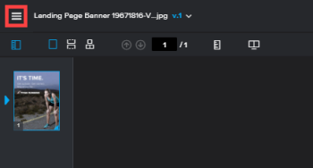

# Afficher l’activité sur une épreuve dans la visionneuse de relecture

>[!IMPORTANT]
>
>Cet article fait référence aux fonctionnalités du produit autonome [!DNL Workfront Proof]. Pour plus d’informations sur la relecture à l’intérieur d’[!DNL Adobe Workfront], voir [Relecture](../../../review-and-approve-work/proofing/proofing.md).

Vous pouvez afficher l’activité récente d’une épreuve donnée. Cela inclut toutes les activités et décisions prises par toute personne affectée à l’épreuve.

1. Si la barre d’outils de gauche n’est pas affichée, cliquez sur l’icône **[!UICONTROL Menu]** dans le coin supérieur gauche de la visionneuse de relecture.

   

1. Dans la barre d’outils située à gauche de la visionneuse de relecture, cliquez sur le bouton **[!UICONTROL Détails de l’épreuve]**.

   

1. Sur la page **[!UICONTROL Détails de l’épreuve]** qui s’affiche, avec **[!UICONTROL Détails de l’épreuve]** sélectionné, affichez les détails, le satut et la progression de l’épreuve.

1. Pour plus d’informations sur le statut de l’épreuve, voir [Comprendre le statut de l’épreuve dans  [!DNL Workfront Proof]](../../../workfront-proof/wp-work-proofsfiles/manage-your-work/proof-state.md).

1. Pour plus d’informations sur la progression de la relecture, voir [Afficher la progression et le staut d’une épreuve dans  [!DNL Workfront Proof]](../../../workfront-proof/wp-work-proofsfiles/manage-your-work/view-progress-and-status-of-proof.md).
1. Cliquez sur **[!UICONTROL Activité de l’épreuve]** pour afficher les informations suivantes :

   * **Date** : heure et date auxquelles l’action a eu lieu.
   * **Action** : action qui s’est produite sur l’épreuve.
   * **Détails** : personne qui a effectué l’action.
