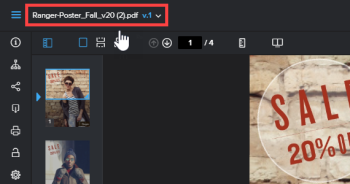

# Afficher les versions précédentes d’une épreuve dans la visionneuse de relecture web

>[!IMPORTANT]
>
>Cet article fait référence aux fonctionnalités du produit autonome [!DNL Workfront Proof]. Pour plus d’informations sur la relecture à l’intérieur d’[!DNL Adobe Workfront], voir [Relecture](../../../review-and-approve-work/proofing/proofing.md).

>[!NOTE]
>
>Les informations décrites dans cette section ne sont disponibles qu’avec la visionneuse de relecture web et uniquement lorsque vous révisez des épreuves vidéo ou statiques (non interactives).

Vous pouvez afficher une version précédente d’une épreuve, le cas échéant. Les versions précédentes sont verrouillées par défaut. Vous ne pouvez pas ajouter de commentaires ni modifier une décision sur une version verrouillée.

Pour afficher une version précédente :

1. Ouvrez l’épreuve.
1. Dans le coin supérieur gauche de la visionneuse de relecture, cliquez sur le nom de l’épreuve.

   

1. Dans la liste qui apparaît, cliquez sur la version que vous souhaitez afficher.
1. (Facultatif) Pour déverrouiller la version si vous souhaitez que les utilisateurs et utilisatrices puissent ajouter des commentaires ou modifier une décision, si vous en disposez les droits, cliquez sur l’icône **[!UICONTROL Déverrouiller]** dans le panneau de gauche, puis sur **[!UICONTROL Oui, déverrouiller]**.
