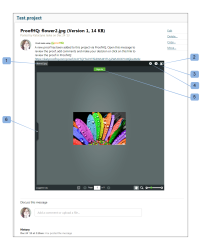

# Intégrer une mini-épreuve

>[!IMPORTANT]
>
>Cet article fait référence aux fonctionnalités du produit autonome [!DNL Workfront Proof]. Pour plus d’informations sur la relecture dans [!DNL Adobe Workfront], voir [Relecture](../../../review-and-approve-work/proofing/proofing.md).

Le widget de mini-épreuve permet d’intégrer une épreuve dans une page web, un blog ou un wiki. La mini-épreuve affiche l’épreuve, ainsi que tous les commentaires et annotations existants. Vous pouvez l’utiliser pour travailler sur l’épreuve comme si vous étiez dans [!DNL Workfront Proof].

Voici un exemple d’intégration d’une mini-épreuve dans un projet Basecamp :

* Nom de l’épreuve (1)
* Plein écran (2) : l’application ouvre l’épreuve dans la visionneuse d’épreuve (en dehors de l’environnement dans lequel la mini-épreuve a été intégrée).
* Liens d’aide (3)
* Menu Actions (4)
* Affichage des commentaires dans la barre latérale (5)

Pour intégrer une mini-épreuve dans une page web, un blog ou un wiki, procédez comme suit :

1. Accédez à la page **[!UICONTROL Détails de l’épreuve]** d’une épreuve (voir « Page des détails de l’épreuve » dans [Gérer les détails de l’épreuve dans  [!DNL Workfront Proof]](../../../workfront-proof/wp-work-proofsfiles/manage-your-work/manage-proof-details.md)).

1. Cliquez sur **[!UICONTROL Autres options de partage]** pour développer cette section.
1. À côté de **[!UICONTROL Code intégré]**, assurez-vous que **[!UICONTROL Activer]** est sélectionné.

1. Cliquez sur **[!UICONTROL Copier le code]** pour copier le code intégré dans votre presse-papiers.
1. Collez le code dans le site web, le blog ou le wiki où vous souhaitez intégrer la mini-épreuve.
